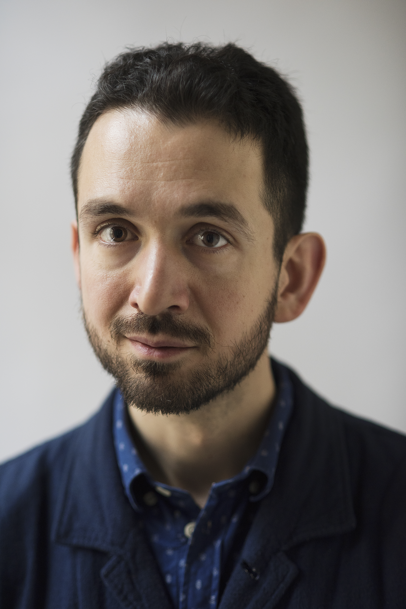

Photograph by [Antony Sojka](http://www.tonysojka.com/).

### Bio

Alper Çuğun-Gscheidel M.Sc. is an engineer working on the leading edge of software, leadership and strategy.

Alper graduated with a Master of Sciences in [Media and Knowledge Engineering](http://www.mke.msc.tudelft.nl/) from [Delft University of Technology](http://tudelft.nl) with a minor in Management of Technology.

He's worked as a startup founder, open government program director, board member, agency principal, game developer, iOS engineer, security expert, director of engineering and design consultant.

Based on experiences building chat applications, in 2016 he wrote and published the book [“Designing Conversational Interfaces”](http://www.convbook.com/) about the conception and creation of chatbots. He called chat the “UI for AI” which became true 10 years later.

Alper is currently based in Berlin and employed as a platform engineering manager.

[LinkedIn profile](https://www.linkedin.com/in/alper)
