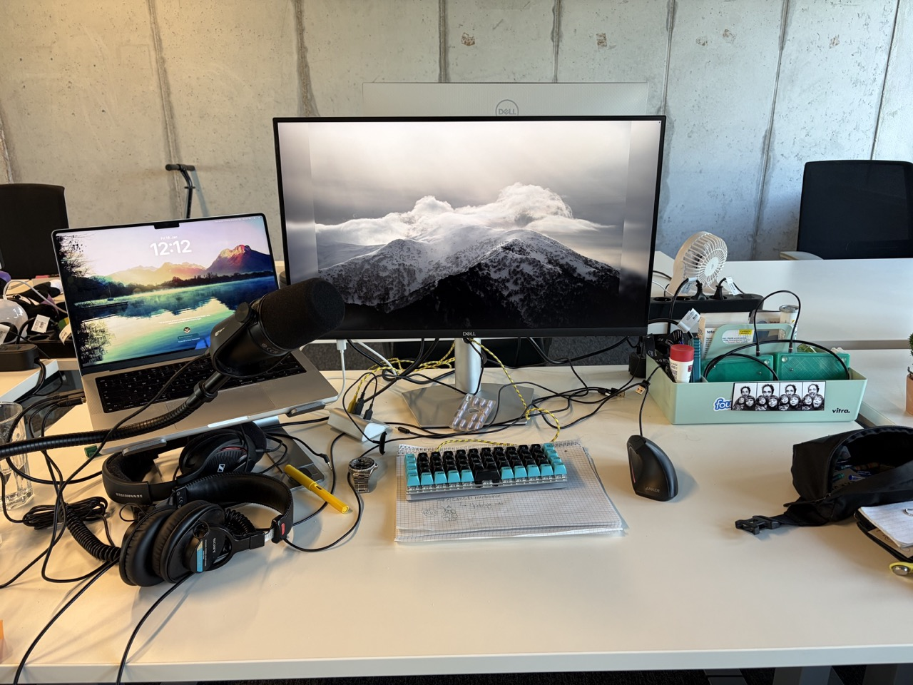

## Hardware

- Macbook Pro M4 (work)
- Macbook Air M1 (private)
- iPhone 17
- Sony MDR-7506
- Sennheiser gaming headset
- Shure microphone
- Airpods Pro 2
- [Cartel Contra](https://keebd.com/en-de/products/contra-40-keyboard-kit?srsltid=AfmBOooqNezSQbMuVWv6GYUgDvihPV4m9C3Jmi_go0wQP1Bg49I9izsa) 40% keyboard with Kailh box navy switches running QMK with [my custom layout](https://keymapdb.com/keymaps/alper/) and [Mito Mt3 Pules keycaps](https://drop.com/buy/drop-mito-mt3-pulse-keycap-set)
- [Let's Split](https://mechboards.co.uk/products/lets-split-kit?variant=41563745648845) 40% keyboard
- Dell Monitor as a USB hub
- Anker wired vertical mouse
- IKEA standing desk
- Orient Kamasu Mako III
- Vitra desk organizer
- Lamy Safari fountain pen

### Home

- Cartel Contra 40% keyboard
- Logitech m500s mouse

## Software

- [Obsidian](https://obsidian.md)
- Code & [Zed](https://zed.dev) & [Helix](https://helix-editor.com)
- [Ghostty](https://obsidian.md)
- Claude Code
- [Fantastical](https://flexibits.com/fantastical)
- [Things](https://culturedcode.com/things/)
- [Bear](https://bear.app)
- [Homebrew](https://brew.sh)
- [Aerospace](https://github.com/nikitabobko/AeroSpace)
- [John's Background Switcher](https://johnsad.ventures/software/backgroundswitcher/)
- [Hex](https://hex.kitlangton.com)
- [Maccy](https://maccy.app)
- [Raycast](https://www.raycast.com)
- [Amphetamine](https://apps.apple.com/de/app/amphetamine/id937984704?l=en-GB&mt=12)
- [CleanShot X](https://cleanshot.com)
- [gg](https://github.com/gulbanana/gg)