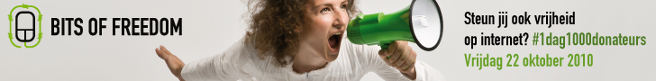

Vandaag voert Bits of Freedom de actie om in één dag 1000 donateurs binnen te halen: [https://www.bof.nl/1dag1000donateurs/](https://www.bof.nl/1dag1000donateurs/) 

Bits of Freedom is de burgerrechten organisatie voor het internet die ervoor zorgt dat we allemaal kunnen internet zoals we dat willen zonder beperkingen en verboden opgelegd door machtswellustige politici of op geld azende bedrijven, dat we in niet teveel databases worden gestopt —die dan toch weer uitlekken— en dat de dingen waarvan je wilt dat ze privé zijn dat ook blijven in de toekomst.

Alles wordt digitaal maar vaak is daardoor niet direct duidelijk waar de controle ligt en wie de macht heeft. We kunnen Bits of Freedom als waakhond dan ook goed gebruiken.

Dus ga naar [Bits of Freedom](http://www.bitsoffreedom.nl/) en [doneer](https://www.e-cumlaude.com/secure/d/fondsenorg2/donate.php?charity=Bits_of_Freedom)!
