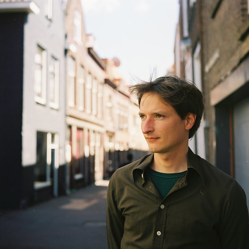

I had my [Yashica D](http://www.flickr.com/photos/alper/2226513597/) repaired and also recently acquired [a lightmeter](http://www.flickr.com/photos/alper/3628509161/) to make the process of shooting easier and now I'm slowly but surely shooting stuff with it.

[Mony](http://www.flickr.com/photos/straboh) is helping me out scanner-wise and I must say I'm amazed at the quality, the vibrance and sharpness this ‘old piece of junk’ shoots and this archaic process returns.

And added to that I'm completely untrained and have hardly any experience with this stuff, so who knows how much improvement is still possible. Here's to film in a digital age.
