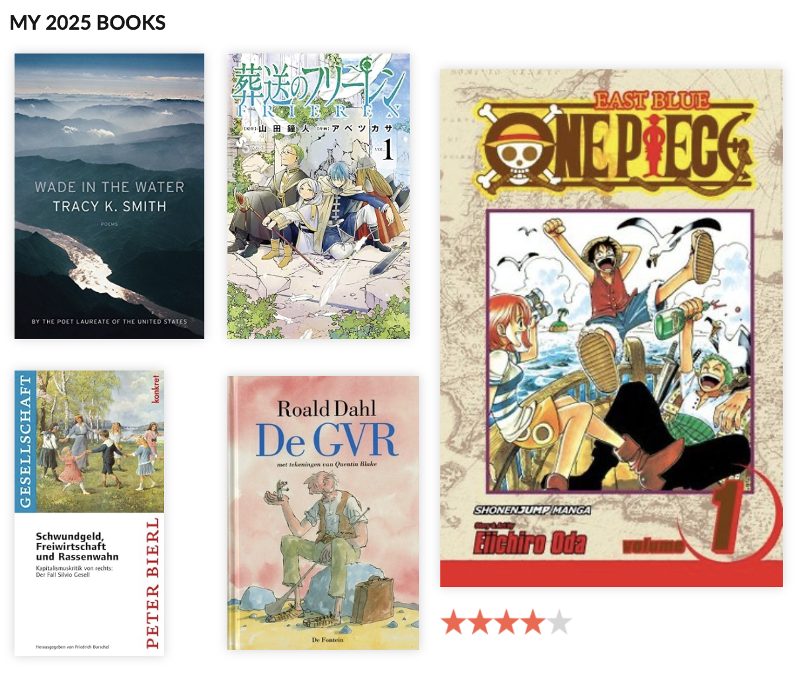

That's my year in books. Shameful after [years of reading dozens of books](/blog/reading-2017/) to be reduced to five.[^1]

[^1]: And well, they're not even real books. The Roald Dahl book I read in Dutch, the One Piece I bought in German to see if my kids would be interested and Frieren I read in Japanese to see how hard it would be.

Being very busy takes its toll. I don't really know when I would have the time to read at the moment and it's not that I consume much more entertainment other than the occasional game and a couple of episodes of some series in a week.

A lot of time goes into kids, work, sports (going to the gym, road cycling and some swimming) and learning Japanese.

Going through [the archives of my old blog](/categories/reading/), I did use to read *a lot* and got a lot out of it. Maybe I don't read that much anymore because I don't get that much out of it anymore?

I've looked and struggled to find books that would really level me up in software engineering, leadership or strategy. For instance what I'm reading now from [Stafford Beer on operations](https://www.wiley-vch.de/de/fachgebiete/finanzen-wirtschaft-recht/decision-and-control-978-0-471-94838-4) is nice, but there's very little in there that I don't already know. The same for [Fredmund Malik about leadership](https://de.wikipedia.org/wiki/Führen_Leisten_Leben).

One book that would really move the needle and which I have on order, is the classic [Types and Programming Languages](https://www.cis.upenn.edu/~bcpierce/tapl/). But at that point I'm dipping into academic territory.

I don't mind academic reading. It's the focus of the [“advanced-studies”](https://www.goodreads.com/review/list/841048-alper-u-un?ref=nav_mybooks&shelf=advanced-studies) shelf I maintain on Goodreads and the papers that I read occasionally in distributed systems, resilience engineering and AI. It's just that reading stuff like that requires a whole different level of commitment in time and focus.

There is the wider trend of de-reading in society but reading seems to be over *for me* for different reasons.