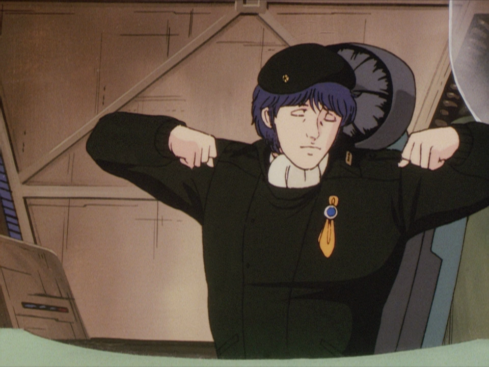
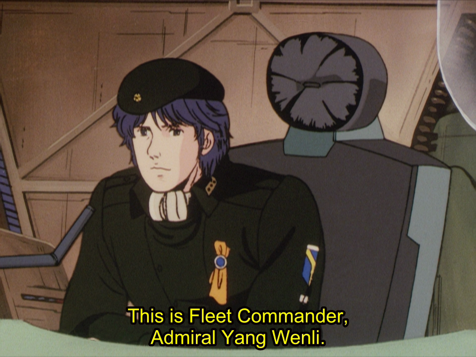
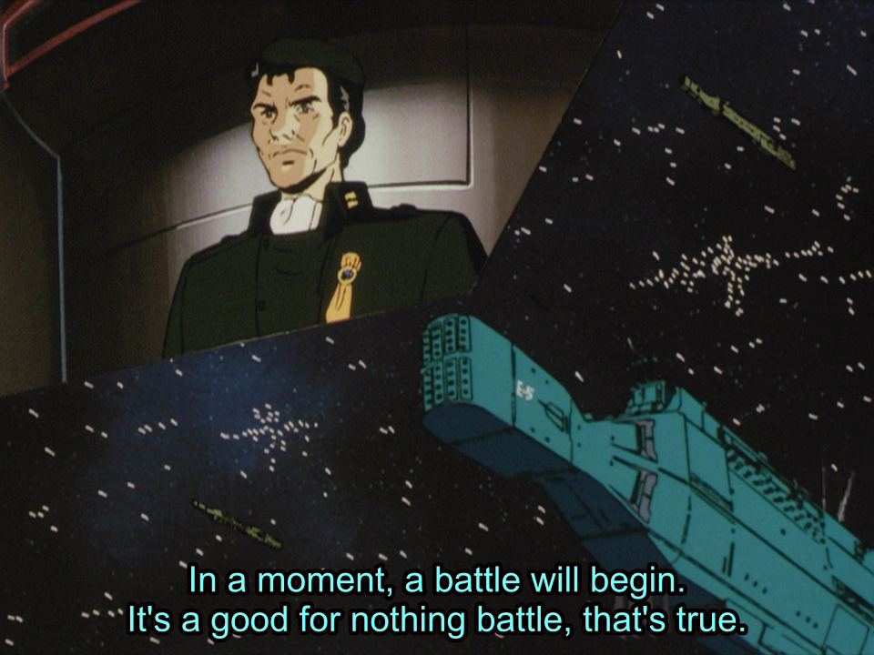
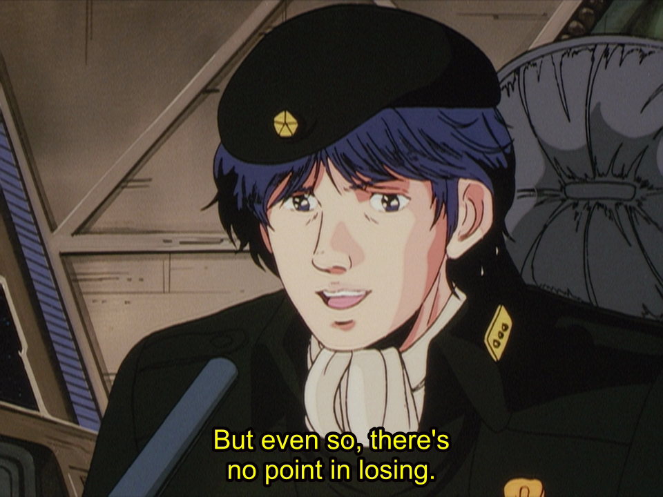
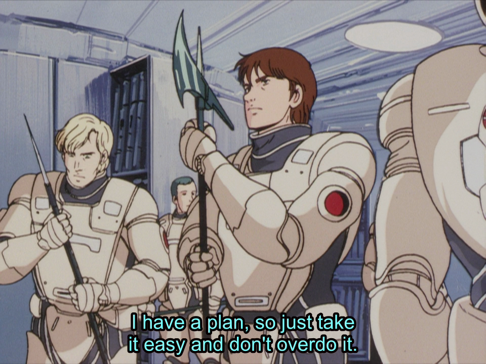
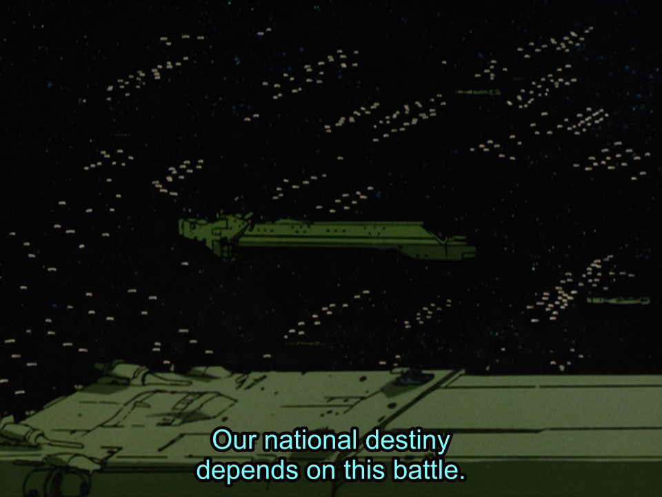
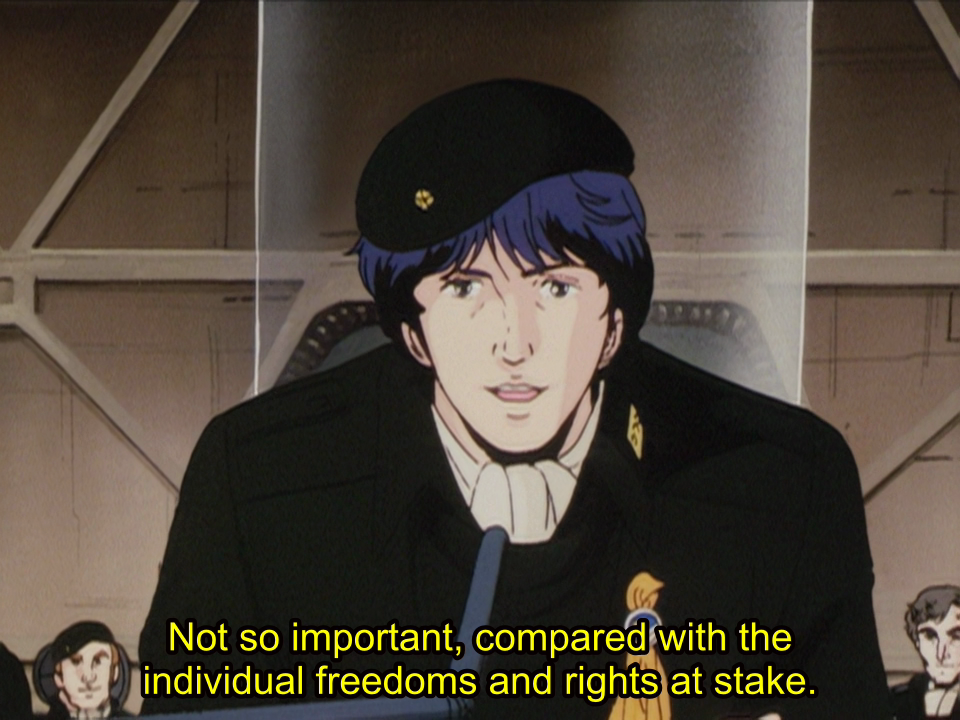
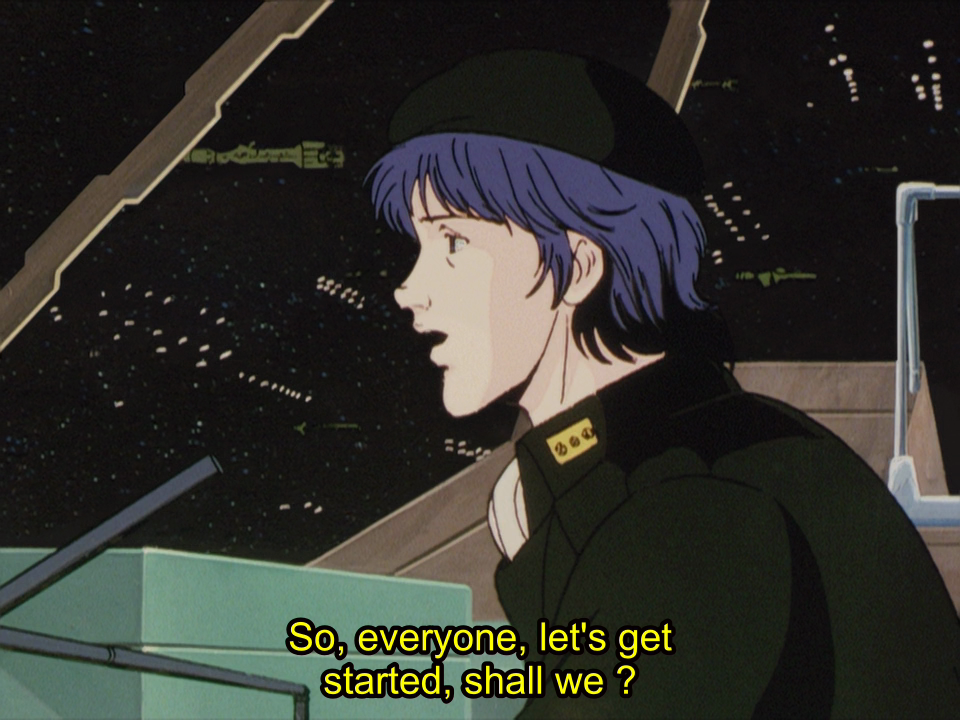

[Yang Wenli](https://gineipaedia.com/wiki/Yang_Wen-li) has a very particular approach to leadership. It's exemplified in this sequence where he embodies the thing that Jocko always calls ‘The Dichotomy of Leadership’. The leader is always in conflict needing to reconcile the demands from above with the realities and attitudes below.

I noticed this on my watch through and thought it would be good to go back and capture it.

This phrase is it:

> "It's a good for nothing battle, that's true. But even so, there's no point in losing."

Here's the complete sequence from season 1 episode 21:

>　司令官のヤン・ウェンリー

>　間も無く戦いが始まる
>　碌でもない戦いだが

>　それだけに勝たなくては意味がない

>　勝つための算段はしてあるから、無理せず気楽にやってくれ

>　かかっているのは、たかだか国家の存亡だ

>　個人の自由と権利に比べれば、大した価値のあるものじゃあない。

>　それではみんな。
>　そろそろ始めるとしようか？