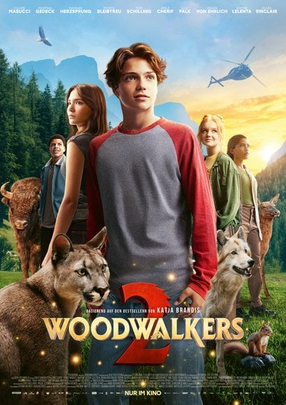

Woodwalkers 2 is an entertaining enough kids movie. The conceit of beastwalkers (human/animal shapeshifters) is worth exploring despite the disbelief around diet and clothing logistics it requires. The special effects are very weak but not to the point that it makes the movie unwatchable.

The movie pretends to have representation but both the black supporting characters are done dirty. The black girl Lou seems to be the Carag's girlfriend in the beginning but then disappears for half the movie while he gets it on with a wolf girl Tikaani. The black boy Brandon is relegated to such a passive role that another character remarks that buffalos do nothing but eat and shit.

From a theory of change point of view I would say the movie is commendable. It teaches kids that standing in a field with only the power of your convictions against men with machines and guns does not achieve very much. The main antagonist Andrew Milling demonstrates that it's preferable to acquire political power by any means and then use that power to drive through your will.
