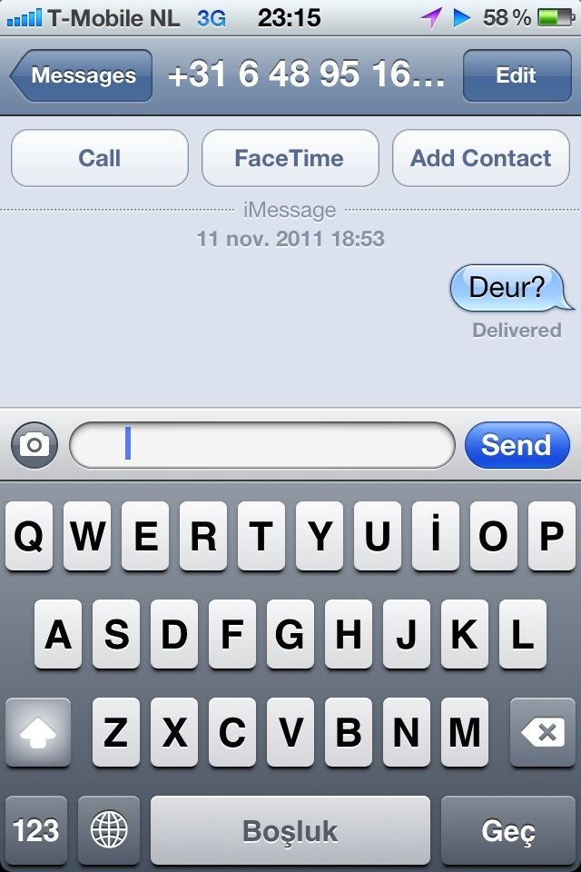

That moment where you're texting somebody for the first time and the Send button turns blue. The expectations conveyed with that small indicator about the time to response as well as the type of person on the other side.

