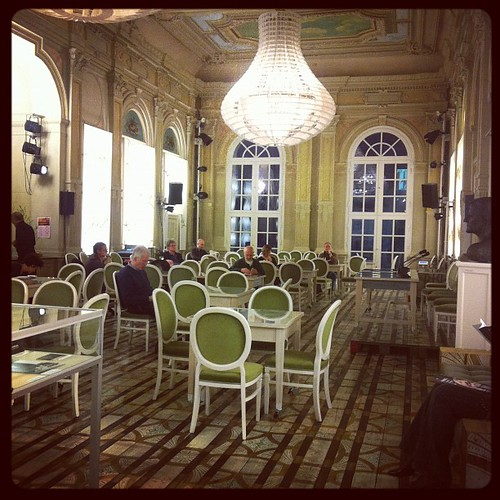

A week or two ago I attended a discussion at the Deutsches Theater [‘Holland in Not’](http://www.deutschestheater.de/spielplan/spielplan/holland_in_not/) that was organized because of [a recently published book “Der Kulturinfarkt, vom Allem zu viel und überall das Gleiche”](http://www.spiegel.de/spiegel/vorab/0,1518,820528,00.html) that proposed to close half of all theaters in Germany.

That prompted quite [a bit of debate](http://www.spiegel.de/kultur/gesellschaft/0,1518,822606,00.html) in the German cultural scene as well as the discussion at the DT. The event hosted by the Deutsches Theater brought together notables from the German theater scene and invited Alize Zandwijk (head of the [Ro Theater](http://www.rotheater.nl/)) and Johan Simons (intendant of the [Münchner Kammerspiele](http://www.muenchner-kammerspiele.de/)) to explain the Dutch situation to the gathered Germans.

What had to be laid out again for the audience is that German and Dutch theater are organized very differently. In Germany the theaters have their own ensembles that play a broad range of repertoire in their own house but seldom or never visit other houses in Germany. That means that in a certain area you know what you will get, but you will also never get anything else. In the Dutch situation, groups are separate from theaters (though some have their home venues) and each play is performed on tour through the Netherlands. Theaters are free to program whatever they want. When it comes to funding and entrepreneurship, the Dutch systems is already operating quite lean with a lot of free groups and experiments creating a lively theater scene (most of which is going to disappear). In Germany theater is concentrated in monolithic houses that are endowed lavish budgets.

Explaining just those differences, which some panelists also had to come to terms with, took a lot of time. The rest was filled with rallying the known entities against the barbarians outside of the gates. No amount of misrepresentation or reassurance was spared to achieve that goal. Alize Zandwijk and Johan Simons played their role of cultural asylums seekers well [^1] supported by the Germans proclaiming loudly that they will never let it go so far.

What happened in the Netherlands ( [the Times has also picked it up](http://www.nytimes.com/2012/03/25/world/europe/the-euro-crisis-is-hurting-cultural-groups.html?_r=2&pagewanted=all)) was inevitable in retrospect. I wonder if none of our artists have ever read [The Art of War](http://en.wikipedia.org/wiki/Sun_Tzu). It stands to reason that if you neglect your allies, let your supply lines wither and do not maintain your fortresses, you open yourself up to attack from any rag-tag band of marauders that happen to be in the area (or in government). That is what has happened to an arts sector that had become utterly complacent and lax thinking that they were beyond dispute. Such arrogance will and should be punished.

Things move much more slowly in Germany and abrupt cuts will probably not happen. Some budgetary restrictions and reorganizations might well benefit the theater landscape here if employed with vision but even that seems unlikely. The Dutch example is useful to scare off critical discussion of the scene here.

Alize Zandwijk made a defeated impression and was quite incoherent. Simons remarked that as an intendant he enters into a dialogue with the city, develops a discourse and as such has a lot of authority but if he has to leave, his institution will not be diminished. The intendant of the Deutsches Theater showed that he is on the ball and wants to nip sentiments such as the ones in the book in the bud.

However well intentioned the debate was, it did at no point leave the realm of cliché and touch the real issue at hand: the devaluation of authority everywhere in society. Authority that intendants in Germany are used to having and will probably have for decades to come because of inflexibilities built into German society. In the Netherlands that same authority has evaporated and none of our culture heads know what to do without it.

One panelists said the audience based grants that are planned in the Netherlands will be the purest form of commercialization of the arts. You could call it that, but you may just as well call it a democratization that has been long overdue. Not trusting people to be able to make the right choices is rarely a good idea. Telling them that you know what is best for them based on an authority that is no longer justified in this day and age is a sure fire recipe for disaster.

As if to emphasize that notion, the gathered audience —having listened to over an hour of turgid debate— was not allowed to interject afterwards. With such an attitude the fortresses of high culture in Germany may be stormed as well.

### Post Scriptum

The last couple of years I have seen an insane amount of theater compared to everybody I know. I should be one of theater's staunchest defenders but having seen so much with so little change, risk and openness I find myself being their biggest detractor. Simons mentioned that the [Brandhaarden](http://www.ssba.nl/brandhaarden) they played in Amsterdam had been fully booked [^2]. If anywhere in the Netherlands there is still a market for the arts and left liberal politics it is indeed there.

From that same festival I had recommended the Kane trilogy to a friend but given it's rather high ticket price and the fact that theater is a hit and miss affair, I found myself advising spending that time and money playing [Mass Effect 3](http://masseffect.com/) (at the price of two theater tickets) as a better investment overall.

It is no secret that I think games are the most important cultural carrier of our age but my issues run deeper. A sector that says it creates culture of societal importance, but that cannot mount a viable defense for itself refutes the premise. It shows that what you pay for as a spectator and a tax payer is not much more than self-importance.

[^1]: Though it remains to be seen whether the German theater professionals should be happy with the Dutch coming to take their jobs.
[^2]: I had tickets to a show myself which I happily passed on to a friend because of logistics issues.
