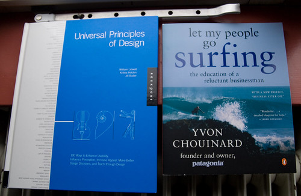

Het leuke aan klaar zijn met studeren is dat je dingen kunt gaan leren die jí­j belangrijk vindt. En ik leer sneller als ik zelf mag bepalen hoe en hoe snel. Dus hier twee boeken in een serie voor het komende jaar:

Veel designboeken uit de usability-, interaction- en experience-hoek met daarbij een grote stapel non-fictie: filosofie, politiek, geschiedenis, economie, nieuwe media en meer. Breed ge-orienteerd zoals altijd, [t-shaped](http://www.wordspy.com/words/T-shaped.asp) noemen ze dat geloof ik.
