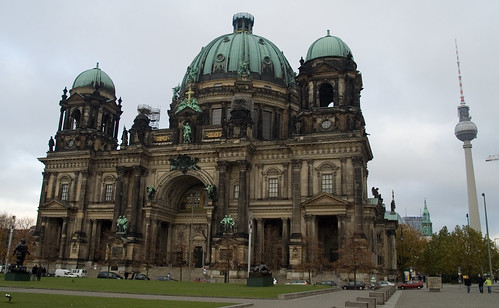
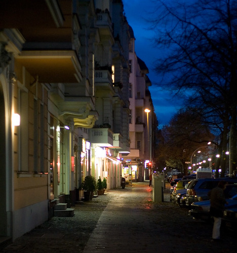

Na in Berlijn aangekomen te zijn, heb ik:

- Turks gegeten (meermalen)
- Heerlijke Libaneze [kibbe](http://en.wikipedia.org/wiki/Kibbe) gegeten (eindelijk weer)
- Currywurst gegeten (eerste van velen)
- Met bier over straat gelopen (vaak zat)
- Hardgelopen en geklommen (een beetje)
- [Werewolf](http://en.wikipedia.org/wiki/Mafia_%28game%29) gespeeld (iets te weinig)
- Prenzlauerberg 's nachts verkend (meermalen)
- In akelig hippe Wohnzimmer gelegen (eenmalig)
- €80 kwijtgeraakt (één keer teveel)
- [Jeff Wall](http://en.wikipedia.org/wiki/Jeff_Wall)'s foto's gezien in het [Guggenheim](http://www.deutsche-guggenheim-berlin.de/) (smaakt naar meer)

Wat ik nog wil doen voor zaterdag:

- Capoeira spelen
- Live optreden bijwonen
- Rondhangen op de Weihnachtsmarkt
- Door het holocaust monument lopen
- King Faad de hand schudden

