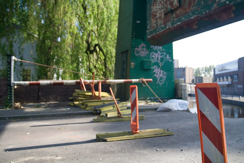
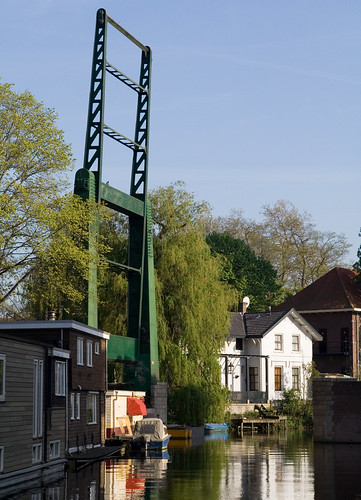
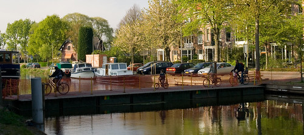

Gisteren wat door Delft gelopen en [gefotografeerd](http://www.flickr.com/photos/alper/archives/date-taken/2007/04/21/). Ik had net de [presentatie van James Nachtwey](http://www.ted.com/index.php/talks/view/id/84) gezien wat redelijk indrukwekkend was.

Een tijdje geleden tijdens het hardlopen was me al opgevallen dat de brug naar de Calvé was opengebroken. Aangezien ik nog geen [hele gave mobiele telefoon](http://fourstarters.com/2007/04/21/my-free-n95/) met fototoestel heb, kon ik er toen geen foto's van maken.

Dus nu dan:

