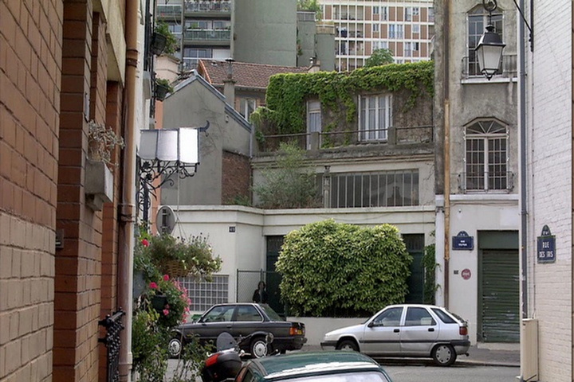

In my newly rekindled love for movies, this weekend I finally watched [Caché](http://letterboxd.com/film/cache/) ((I seem to be the only person I know who watches a lot of French movies.)). As expected the movie is excellent and I should watch more movies by Haneke. It plays out like a reverse and more refined version of the [Dinner](http://www.nytimes.com/2013/03/10/books/review/the-dinner-by-herman-koch.html?pagewanted=all&_r=0).

I was however stupefied to learn about the [Paris massacre of 1961](http://en.wikipedia.org/wiki/Paris_massacre_of_1961) from this movie. The French culture we learned in school did not really touch on colonial history instead focusing on the more touristic aspects.

This leads me to believe that Dutch kids are the happiest in the world (a widely [cited statistic](http://www.nltimes.nl/2014/08/28/dutch-children-longer-worlds-happiest/)) because in school they don't learn how fucked up the world was and is. It is however a very Dutch thing to be proud of being oblivious.
