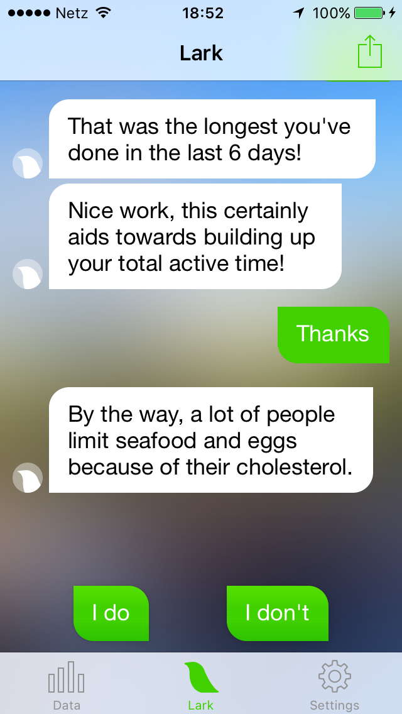

Talk about this is increasing all around us (see this [piece by Cennyd](http://www.cennydd.com/blog/ai-and-future-user-experience)) and I think it's time for me to share some of our recent thinking on the topic as well. We believe that conversational user interfaces will be the way that most people will interact with digital systems from the near future on. That can be chat or voice or something else constrained to offer only specific responses or fully freeform. Natural language processing has improved to a point to make this workable and will continue to improve further.

Chat apps are the sine qua non of mobile devices. They are essential, they are everywhere and many of them are cross-platform. People use chat to connect to people but increasingly chat applications are used to interface with non-humans. Chat apps can offer a flat channel to a digital system or facilitate any and all kinds of [persistent bots](https://api.slack.com/slackbot) and application logic to be deployed. A great example is this [a16z piece](http://a16z.com/2015/08/06/wechat-china-mobile-first/) on the wide applications of [WeChat](http://www.wechat.com/) in China.

The fact that chat apps are cross-platform creates a new smallest common denominator on which you can build applications that are guaranteed to work on all the devices the app runs on. This is a new OS. That people are used to these interactions and normally use them to connect to other people also creates a convenient habituation.

I argue that the bits of conversational logic deployed through chat can be called applications and do most things that apps do.

Most apps allow you to retrieve information or to perform an action. This is glued together with some chrome filled with awkward ever-changing (hamburger menu in or out?) architectures. They need to conform to stringent visual design guidelines while looking recognizably the same across lots of different devices.

Information retrieval and performing actions can be done via chat as well where an AI/bot counterparty will keep track of your context and give you the right cues at the right time. “Slackbot give me a GIF.”“ [Domoticz](https://www.domoticz.com/wiki/Telegram_Bot) turn off the light.”

I am the purveyor of a small app to find good coffee called [Cuppings](http://cuppin.gs/). There is no reason why that same experience could not be delivered through a chat interface. No reason in fact why it could not be delivered better through a chat interface.

Add to that that making good apps is becoming an increasingly difficult endeavour because of device proliferation (mainly on Android), API bloat (on all platforms) and increasingly high visual and interaction design standards. Increasingly making a pixel perfect app that feels nice and works well is something that only larger companies can afford.

Most of the effort we spend right now into user interfaces could be moot if the experience would be delivered through a chat interface. That every app has a different UI and information architecture and that it has to be learned anew is a huge impediment to its adoption. [We](http://hubbub.eu/) have recently built several chat based apps & games inspired partially by [Lark](http://lark.com/). During testing we found that users don't need to be explained anything because they are so familiar with the paradigm.

Chat is here to stay and I'm incredibly excited to see how far we can push this new medium.
