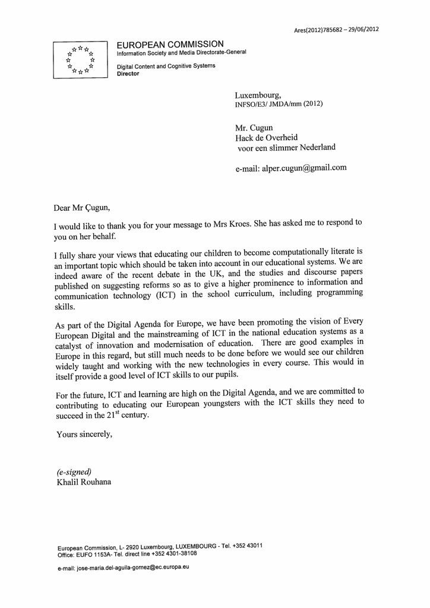

A couple of days ago I got an answer on behalf of Ms. Neelie Kroes with regards to my inquiry about computational literacy (which I asked during [her visit to Berlin during re:publica](/dingen/2012/05/week-268-presenting-on-transit-and-work-talking-with-neelie-kroes/)):

OCR'd it says:

> Dear Mr. Çugun,
>
> I would like to thank you for your message to Mrs. Kroes. She has asked me to respond to you on her behalf.
>
> I fully share your views that educating our children to become computationally literate is an important topic which should be taken into account in our educational systems. We are indeed aware of the recent debate in the UK, and the studies and discourse papers published on suggesting reforms so as to give a higher prominence to information and communication technology (ICT) in the school curriculum, including programming skills.
>
> As part of the Digital Agenda for Europe, we have been promoting the vision of Every European Digital and the mainstreaming of ICT int he national education systems as a catalyst of innovation and modernisation of education. There are good examples in Europe in this regard, but still much needs to be done before we would see our children widely taught and working wit the new technologies in every course. This would in itself provide a good level of ICT skills to our pupils.
>
> For the future, ICT and learning are high on te Digital Agenda, and we are committed to contributing to educating our European youngsters with the ICT skills they need to succeed in the 21st century.
>
> Yours sincerely,
> Khalil Rouhana

We have a long way to go, but we need to push this in every way possible.

Also if you haven't read it yet, [Maurits Martijn](http://twitter.com/mauritsmartijn) has written [a very good interview (in Dutch) with Neelie Kroes](http://www.vn.nl/Archief/Politiek/Artikel-Politiek/Breedband-Neelie-1.htm) in a recent Vrij Nederland.
