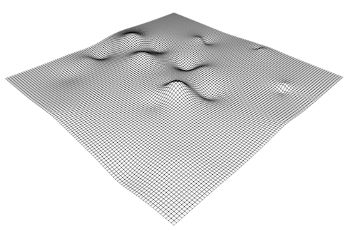
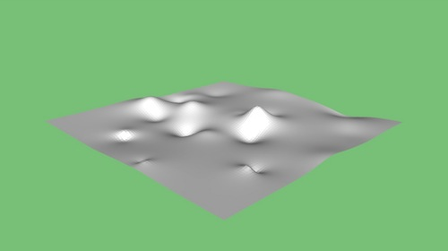
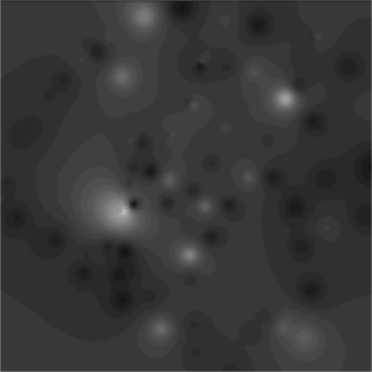
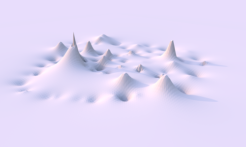

Recently I worked together with longtime professional friend [Kars Alfrink](http://leapfrog.nl/) on a small side project. Now that we've finished it, it is time to show what we have done.

### Brief

The brief was by a friend of a friend for [Sarah van Sonsbeeck](http://www.sarahvansonsbeeck.com/), artist in residence at the Amsterdam [Rijksakademie](http://www.rijksakademie.nl/). Sarah does a lot of work in making sound —its presence and its absence— visible, tangible and experience-able in unexpected ways.

For a recent project she was going to walk through part of [Monickendam](http://maps.google.nl/maps?f=q&source=s_q&hl=nl&q=Monnickendam,+Waterland,+Noord-Holland&sll=52.469397,5.509644&sspn=3.935848,8.206787&ie=UTF8&cd=1&geocode=FZp3IAMdZdZMAA&split=0&hq=&hnear=Monnickendam,+Waterland,+Noord-Holland&t=h&z=14) with some people while both discussing their experience of the sounds and also simultaneously measuring sound levels and recording GPS coordinates. For the sake of simplicity we ignored measurement error and interference. This was not an attempt to make a scientifically accurate measurement of the dB levels (though such attempts do exist).

\[caption id="attachment\_1333" align="alignnone" width="500" caption="Map of the various walk paths through the area"\] \[/caption\]

\[caption id="attachment\_1335" align="alignnone" width="500" caption="Silence Area picture by Sarah van Sonsbeeck"\] \[/caption\]

We would then take the data generated from these walks and plot them into a computer representation of the area and generate visualisations from that. Building an audiogeography superimposed on the physical landscape with the sound levels as experienced by somebody who would walk through the area.

A small project, limited in scope and budget, we took the challenge to see what we could make.

### Background

 [CabSpotting](http://cabs.lightmoves.net/) was the original very conceptual brief for this project where the streets are defined with data from a derivative activity providing a skeleton landscape similar to the physical world. Adding intensity to this mix would naturally lead to something like a physical intensity (= height) map of a landscape:

Or a suitable realistic representation of a landscape such as the Moon would already display visual indications of its height:

Sound and its different representations are treated more often in art. Sarah pointed us towards work of [Simon Elvins](http://www.simonelvins.com/noise.html) and [Justin Bennett](http://www.bmbcon.demon.nl/justin/) curated on the weblog [“Displaced Sounds”](http://www.displacedsounds.com/).

In computers, representation of sound usually is in the form of jagged edges like these found in professional audio systems and music visualizers:

We didn't look very much into the treatment of sound and its perception in architecture, but [previous work by the artist](http://audioculture.org/sarahvansonsbeeck/) and brief inquiries with friends would suggest that it is a niche and often ignored part of that field.

### Methods

The first task at hand was to find a dB value for the entire area based on the samples given to us by Sarah. She had made some circumnavigations and cross sections of the area, but she (of course) hadn't been everywhere.

After some tries we found out that this is a non-trivial problem which is not solved well by a naive approach. It is a common problem and its solution is similar to a simple sum of squares linear regression of a set of data points in two dimensions.

The best way (according to GIS people) to do this is called [Kriging](http://en.wikipedia.org/wiki/Kriging) and it's implemented in proprietary GIS packages. The open source implementations in [R](http://www.r-project.org/) and C are quite hard to use and figure out in terms of input and output values.

We found [a post on Stack Overflow](http://stackoverflow.com/questions/557496/heightmap-generation-algorithm/557687) with a fairly thorough discussion of this problem and a set of approaches which led us finally to [an Inverse Distance Weighted interpolation](http://www.ems-i.com/smshelp/Data_Module/Interpolation/Inverse_Distance_Weighted.htm) of the data points which was fairly straight forward to implement and performant enough.

This method yielded the following interpolation which we could corroborate with the area and some of its features:

After the interpolation we would have a matrix of arbitrary detail with a smooth set of values for the entire measurement area. It is easy to color these values based on a scale to show ‘height’. Transforming these values into a 3D mesh as a landscape based representation turned out to be somewhat more complex. Kars took most of this work upon himself emulating the properties of a seasoned 3D programmer.

Processing turned out to have a library called [unlekkerlib](http://workshop.evolutionzone.com/unlekkerlib/) which can be used to create and output 3D models based on generated data for visual display and output into formats suitable for re-use in other 3D modelling packages or to put straight to a fablab.

\[caption id="attachment\_1340" align="alignnone" width="500" caption="Generated mesh"\] \[/caption\]

Some of the work Watz himself has made with unlekker are in [this Flickr set](http://www.flickr.com/photos/watz/sets/72157594387603246/).

We then exported this mesh into a DXF file which could be read by [Google SketchUp](http://sketchup.google.com/) and re-exported into something renderable by [Sunflow](http://sunflow.sourceforge.net/), a high performance raytracer written in Java.

\[caption id="attachment\_1341" align="alignnone" width="500" caption="Render from Sketchup"\] \[/caption\]

### Results

The end results were 2D and 3D versions of the silence landscape both from straight interpolation with some filters added to it to make it resemble a heightmap:

\[caption id="attachment\_1342" align="alignnone" width="412" caption="Remapped silence landscape"\] \[/caption\]

And a high quality raytrace of the same landscape:

\[caption id="attachment\_1343" align="alignnone" width="500" caption="Sunflow render"\] \[/caption\]

Delivered to the artist to be repurposed and recontextualized in her own work for the project [Een Dijk van een Kust](http://www.eendijkvaneenkust.nl/algemeneinformatie.htm) with [this map](http://www.eendijkvaneenkust.nl/stiltekaart_01.pdf).

The 3D and 2D models can also be fablabbed into various forms which was one of our recommendations. By changing the medium of the data and therefore the modality of the experience alternative insight may follow. We are very curious how that is going to turn out and how this will add tangibility to the data.

### Reflection

This was a fun project to do because of its limited scope and free form. It gave Kars and myself a good reason to work together (which worked out quite well). We took it far and wide to see what we could create using our skills and ready-to-use tools and we think the end results are pleasing.

One of our limitations is that both of us are not graphic designers. This means we may not be the best fit for a mostly aesthetically driven visualization project. Given our [Tuftean sensibilities](http://www.edwardtufte.com/tufte/), we like to let the data speak for itself with integrity and without overmuch visual embellishment ((We can't _nay won't_ do the bubblegum variety of infovis where visual elements are added for their own sake.)).

Our focus as interaction designers and our skills in programming the [Processing](http://processing.org/) visual environment, would direct us towards more dynamic and interactive visualizations where our iterative interaction with the data builds up layers of meaning and we add controls and affordances to the final product so a user can interact with the data themselves and find their own meaning.

Collaborating with an artist is very interesting because the story and the context of her art imbue your work directly with more depth. Aligning technical possibilities and visual output with an artistic vision is however difficult and probably served better by more attunement and iteration than we could invest in this project.
