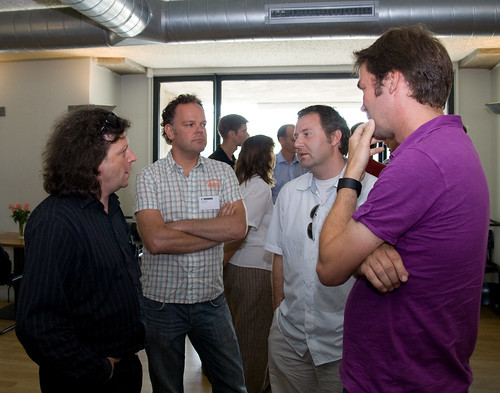
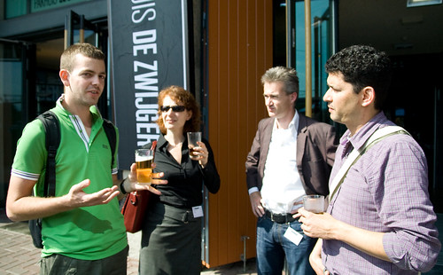

Vorige week dinsdag gaf ik een presentatie op [de Barcamp Webrichtlijnen](http://barcamp.overheid20.nl/) over waar wat mij betreft de prioriteit moet liggen in het ontwikkelen met het oog op [de webrichtlijnen](http://www.webrichtlijnen.nl/).

Ik kwam er terecht via [Ferry](http://www.den-dopper.com/) en [het widgetproject](http://www.overheid20.nl/workspaces/index/72) wat ik voor [Tam Tam](http://www.tamtam.nl/) heb gedaan en het evenement werd georganiseerd door de vriendelijke mensen van [Cinnamon](http://www.cinnamon.nl/). Een grote vraag is of veel Web 2.0 technieken zoals AJAX en crowdsourcing etc. wel compatibel zijn met de webrichtlijnen, zoals ook [beschreven in Ferry's verslag](http://www.den-dopper.com/2009/07/03/kan-web-20-conform-de-webrichtlijnen/).

Zoals [ik al zei](http://twitter.com/alper/statuses/2400943634), ging ik in tegen de heersende orthodoxie dat de huidige praktijk dat alleen maar XHTML opleveren goed is.

Mijn argumentatie betreft twee stellingen en ik hoop niet dat die zo vaag was als [Don schrijft](http://doncrowley.blogspot.com/2009/07/barcamp-webrichtlijnen-web-20-lowdown.html):

1. De webrichtlijnen die het beste (automatisch) te meten zijn, zijn niet de belangrijkste. Mensen zijn geneigd om zich blind te staren op wat makkelijk meetbaar is en verliezen uit het oog waar het echt om gaat [^1].
1. We hebben meer dan genoeg te doen om de user experience op het internet te verbeteren zonder ons per se te conformeren aan elke webrichtlijn. Het maken van een standaarden-gebaseerde website is niet het moeilijkste. Moeilijker is het om een site te maken met mooi design, heldere tekst en goed interactieontwerp waar mensen op zitten te wachten.

Die twee punten zijn terug te vinden in mijn presentatie (op Slideshare kun je de notities uit de Keynote teruglezen):

[De Geest van de Webrichtlijnen](http://www.slideshare.net/alper/de-geest-van-de-webrichtlijnen "De Geest van de Webrichtlijnen")

View more [documents](http://www.slideshare.net/) from [alper](http://www.slideshare.net/alper).

De webrichtlijnen zijn wat mij betreft een goed middel voor zover ze je helpen om betere user experiences te creëren, maar ze zijn bij lange na niet het enige waar je naar moet kijken.

Binnen de kleine organisaties waarin ik gewend ben te werken is al veel kennis aanwezig zowel bij opdrachtgevers als uitvoerders over wat goede webervaringen zijn. Het maken van standaarden-gebaseerde website is daar verondersteld en ik denk niet dat de webrichtlijnen daar veel toegevoegde waarde bieden.

Bij grotere organisaties met minder kennis over de techniek van de materie, kunnen webrichtlijnen een goed (of het enige) middel zijn om te af te lezen wat wel en wat niet goed is, wie een goede uitvoerder is en wie niet. Maar dan nog is het een illusie om te denken dat als je organisatie-kennis niet op niveau is, je met de webrichtlijnen alleen een goede website kunt neerzetten.

### De Heilige Graal

Bij Tam Tam is later die week ook [Michèlle Thonen afgestudeerd](http://www.den-dopper.com/2009/07/02/de-heilige-graal-van-de-webrichtlijnen/) op hetzelfde onderwerp en ik kan haar aanbevelingen alleen maar van harte ondersteunen:

- Focus op de doelen
- Stichting Webrichtlijnen: niet alleen de overheid, maar iedereen
- Andere indeling Webrichtlijnen
- Andere toetsingsregeling
- Campagne (voeren)
- Community (of practice opbouwen)

Met daarbij de opmerking dat ik niet denk dat kleine snel bewegende bedrijven zich kunnen conformeren aan de webrichtlijnen of dat ook maar willen doen. Het lijkt me beter als de webrichtlijnen zich langzamerhand conformeren aan hen. De webrichtlijnen zijn een serie bests practices voor het internet in het algemeen, dat internet wordt uitgevonden door de kleine innovatieve bedrijven. Daarna kan dat vastgelegd worden en kan de rest navolgen.

### XHTML is dood — lang leve (X)HTML5!

Op de barcamp had ik nog een discussie over de toekomst van HTML en het gebrek daaraan bij XHTML. Het is wat mij betreft al enkele jaren apert duidelijk dat XHTML een doodlopend spoor is en dat [de HTML5 werkgroep](http://www.whatwg.org/specs/web-apps/current-work/) de ontwikkeling van het internet vooruit drijft.

Het toeval wil dat twee dagen later [de W3 aankondigde](http://www.w3.org/News/2009#item119) de ontwikkeling van XHTML2 af te bouwen en zich te richten op HTML5. Dit nieuws was de bron van nogal wat discussie hier en daar over wat de gevolgen zullen zijn, of we dit hadden kunnen zien aankomen en wat we met al die oude troep moeten doen.

Mark Pilgrim heeft een [goed overzicht van de issues](http://diveintomark.org/archives/2003/08/29/semantics) en legt weer uit waarom validerende XHTML niet het belangrijkste is, zoek maar op ‘snake oil’ in de tekst voor de misverstanden. Een kort stukje [vraag en antwoord](http://hsivonen.iki.fi/xhtml2-html5-q-and-a/) over XHTML vs. HTML en [wat](http://simonwillison.net/2009/Jul/4/alan/) [discussie](http://simonwillison.net/2009/Jul/6/xhtml/) bij Simon Willison over het onderwerp.

Webpagina's zullen nog steeds blijven werken, maar het is zonde dat we op dit moment een industrienorm hebben waar XHTML standaard maar achterhaald is. Standaard is goed, nu nog even zien hoe we dat achterhaalde op kunnen lossen.

[^1]: Waarom deden we dit ook alweer?
