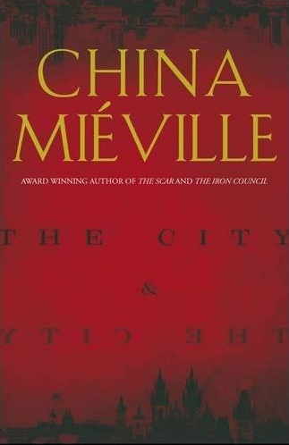

Ik probeer mijn [literaire vrienden](http://literaturfest.nl/) aan het verstand te brengen dat door de technologisering van de samenleving science-fiction een niet meer te negeren onderdeel van de cultuur aan het worden is.

Boeken zoals [‘Super Sad True Love Story’](http://en.wikipedia.org/wiki/Super_Sad_True_Love_Story) van Shteyngart en [‘De kaart en het gebied’](http://www.vn.nl/boeken/fictie/de-kaart-en-het-gebied-michel-houellebecq/) van Houellebecq zijn feitelijk al science-fiction. Aan de andere kant is er science-fiction die de rand van het nu mogelijke bewandelt en ons laat zien hoe de nabije toekomst eruit zou kunnen zien.

Die ‘edge’ science-fiction is de leukste en elk jaar is er wel een boek te vinden dat precies het nu vangt. Vorig jaar was dat Zero History (mijn [recensie op de Republiek](http://www.vn.nl/boeken/fictie/zero-history-william-gibson/), [fragmenten](/dingen/2010/12/zero-history-excerpts/)) en dit jaar is het dankzij de Londense rellen [The City & the City](http://en.wikipedia.org/wiki/The_City_%26_the_City) van China Miéville ((China is een man in tegenstelling tot wat een schrijver in de boeken van NRC afgelopen week ook dacht.)).

Kars heeft er voor zijn [praatje op dConstruct](http://whatsthehubbub.nl/blog/2011/09/the-transformers-at-dconstruct-2011/) ook stevig uit geput. Ik moest het toen nog lezen maar heb hem vorige week in anderhalve dag (3 uur en 35 minuten [volgens Readmill](http://readmill.com/alper/reads/the-city-the-city)) doorgeknald.

Het boek gaat over twee steden Besźel en Ul Qoma die gescheiden worden niet door fysieke barrières maar door conventie. Beide steden liggen op dezelfde plek waar sommige delen grond bij de Besźel horen, en andere bij Ul Qoma.

Waar het ingewikkeld wordt is dat er delen grond zijn die gearceerd zijn, die bij allebei horen ((En delen die betwist zijn, de _dissensi_, en ook misschien delen waarvan de ene stad denkt dat ze bij de andere horen en andersom, maar daarover meer in het boek.)). In Miéville's boek negeren mensen die zich op zulke gebieden bevinden de inwoners van de andere stad. Dit is geen keuze, maar een sociale conventie die diep geworteld is van kinds af aan en ook bekrachtigd wordt door een speciale politie-eenheid genaamd ‘Breach’.

Mensen zien de inwoners van de andere stad lang genoeg om niet met ze te botsen maar ontzien ze dan direct (letterlijk). Bewust zijn van wat er in de andere stad gebeurt is een strafbaar sociaal taboe. Beide steden zijn uit elkaar te houden door hun eigen kleuren, architectuur en lichaamstaal die je wel mag zien maar toch ook weer niet.

Wat dat betreft is het een dankbare achtergrond waar allerhande allegorieën zich opdringen. Maar we hoeven niet terug te grijpen op Berlijn of Baarle. We leven effectief al in de meeste grote steden op de manier zoals beschreven door Miéville. The City & the City is een amusante detective-roman met samenzweringen à la de Illuminati en het verlies van één man. Maar belangrijker nog zet het zoals goede science-fiction hoort te doen aan tot denken over de wereld waarin we leven.

_Nu aan het lezen [Rule 34](http://en.wikipedia.org/wiki/Rule_34_(novel)) van Stross (naar [het meme](http://www.urbandictionary.com/define.php?term=Rule%2034)) en daarna [Reamde](http://en.wikipedia.org/wiki/Reamde) van Stephenson._
