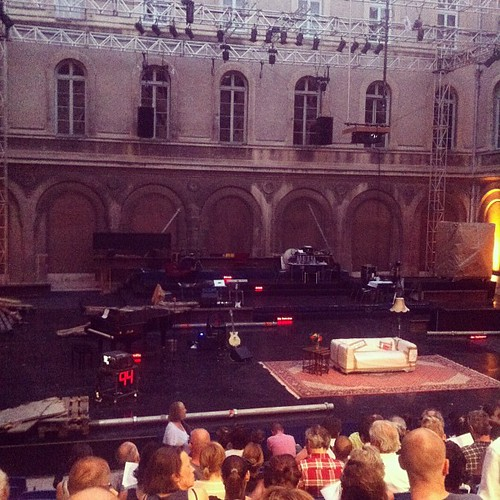

Ever since [the recent re-enactment of Hamlet](http://www.thalia-theater.de/h/repertoire_33_de.php?play=243) by Luk Perceval, I have wanted to see something by the Hamburg Thalia theater. Last year I saw Luk Perceval stage [Disgrace at TA](http://www.tga.nl/voorstellingen/in-ongenade) which was a good display by itself, but still the Thalia remained elusive.

 by illustir, on Flickr")

Yesterday night then finally, I saw [Die Kontrakte des Kaufmanns](http://www.festival-avignon.com/en/Spectacle/3376) at the Festival d'Avignon in the courtyard of a French Lycée. A play treating the world financial crisis based on a recent text by Elfride Jelinek. This is a topic whose absurdity and scale are still baffling and which has not seemed to reach a reasonable conclusion, even though everybody thought things would change (read [this interview of an employee of a ratings agency](http://www.guardian.co.uk/commentisfree/joris-luyendijk-banking-blog/2012/jul/24/rating-agency-worker-voice-of-finance) by Joris Luyendijk).

Instead of a headlong approach that bored us to death (like [Ten Billion](/dingen/2012/07/ten-billion-by-katie-mitchell-and-stephen-emmott/)), yesterday's ensemble was very well aware of the challenges brought forth by such a complex theme and a vague but terse text by Jelinek. We were encouraged by Nicolas Stemann to step in and out during the play to get a drink at the bar in the garden. That made the entire ordeal of three and a half hours rather bearable.

The play progressed through all the stages we have gone through with the financial system. The naiveté, the promises made, the excuses, the horror at capital evaporating, the shamelessness and reach-arounds, the hope of a united Europe, the anger, so much anger.

The actors perform pornographic routines, confidence tricks, laments and lullabies. They tell us that we didn't have a lot of money but that it did make them so happy when it burned. That our insecurity is their security. That they don't know what to make from the flesh of our children. Shall they turn it into sausages? That the money may come back but that it will be too small to recognize. That it may come back to somebody else. That the most important part of making money is believing. That we need to keep the faith. We have to believe. That that is what is important about money.

We, the audience, have to sing that we are all so very individual. We sing that the rest of us is the bank. There is more music. Post-rock instrumental soundscapes combine with chorals lyricizing about the state of our finances. Gainsbourg's song turned into: _J'achète. Non, je n'achète rien_. _Heal the banks, make them a better place, for you and for me and the entire European race._ That may be the best summary of the play: it is an elongated _Ne me quitte pas_ for the capital that has forsaken us.

At the beginning along with introductions we are given a countdown very similar to the progress indicators in ebooks. It starts at 99 and shows the number of pages left in the script. This was a very useful aid to pace visits to the bar with. At the end of it those who have sticked around —with some pride for having accomplished that— have witnessed a tour de force that makes twisted sense of the capitalist experience.
