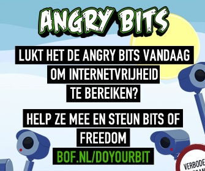

Mensen die mij kennen weten dat ik nooit echt dingen retweet en me bezig hou met goede doelen. Alleen één keer per jaar maak ik een uitzondering voor [Bits of Freedom](https://www.bof.nl/2011/10/06/doyourbit-here-we-go-wie-zijn-toch-die-angry-bits/) omdat ik wat ze doen echt heel belangrijk vind en omdat ik weet dat ze het heel goed doen.

Bits of Freedom komt op voor een open en vrij internet in Nederland en Europa en ze doen dat buitengewoon effectief. Als je je privacy wilt bewaren en een ongefilterde toegang tot het internet wilt houden ga je vandaag naar [“Do Your Bit!”](https://www.bof.nl/do-your-bit/) en doneer je €5 in vijf minuten. Je krijgt een t-shirt en een goed gevoel.

