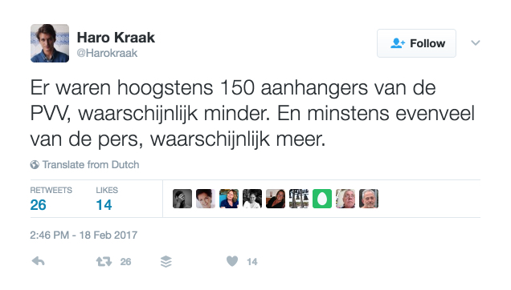

[Geert Wilders](https://en.wikipedia.org/wiki/Geert_Wilders), leader of the PVV —the far right Dutch Freedom Party— had his campaign start today for the upcoming parliamentary elections in Spijkenisse, one of his traditional strongholds.

The eight o'clock news of the [NOS](http://www.nos.nl/) (the Netherlands' state broadcaster) [opened with this](http://nos.nl/artikel/2158914-voor-wilders-breekt-nu-een-cruciale-periode-aan.html) and their reporter [Michiel Breedveld](https://twitter.com/MBreedveld) on the scene in the video below said it had attracted ‘an unbelievable crowd of people’.

\[video width="1520" height="856" mp4="/dingen/wp-content/uploads/2017/02/ongelofelijke-mensenmassa.mp4"\]\[/video\]

Other reporters who were on the scene today ( [1](https://twitter.com/SBouchtaoui/status/832892352356352001), [2](https://twitter.com/Harokraak/status/832949481511514112)) said the number of people Wilders had attracted was somewhere between 80 to 200 and that the ratio of supporters and press was about 1:1.

Salima Bouchtaoui: ‘Spijkenisse this Saturday morning. Lots of press. And lots of police. Few people.’

Haro Kraak: ‘There were at most 150 supporters of the PVV, probably fewer. And at least as much press, probably more.’

There seems to have been so much press that this was what it looked like most of the time.

This incident is oddly reminiscent of Trump's inauguration where the actual number of people present was much lower than was claimed by the administration.

But the crucial difference is that Trump was the liar. Wilders could spread the lie that his campaign start ‘had the most people ever’ but why should he if the state broadcaster does it for him?

**Update:** Dutch newspaper the Volkskrant (a newspaper [I've given some grief](/dingen/2017/02/dutch-newspapers-dont-do-their-jobs/) before) calls the NOS's coverage [bad and harmful](http://www.volkskrant.nl/media/nos-item-over-wilders-in-spijkenisse-was-schadelijk-en-kwalijk~a4464619/).

**Update:** De NOS have posted [a rectification on their single page](http://nos.nl/herstel/#herstel-98) hard to link they use for this.

It's not the opening of the evening news, but it will have to do. Notably they say they have used ‘wrong words’ to describe the event and they still put the number of supporters at several hundred.
