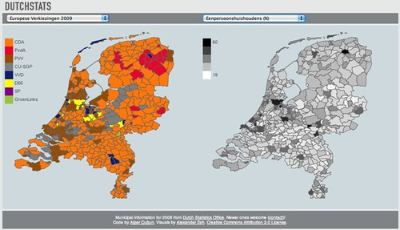

Last weekend we released [Dutchstats](http://bit.ly/dutchstats/), an online interactive datavisualization of election results and local statistics for Dutch municipalities by [Monster Swell](http://monsterswell.com), an Amsterdam dataviz agency.

### What?

 **[Dutchstats](http://bit.ly/dutchstats/)** — an application to view Dutch election results and statistics collected by the [CBS](http://www.cbs.nl/) [^1] side by side.

[**http://bit.ly/dutchstats**](http://bit.ly/dutchstats)

 

A video demo:
[Dutchstats](http://vimeo.com/12122480) from [Alper Çugun](http://vimeo.com/illustir) on [Vimeo](http://vimeo.com).

### Who?

Dutchstats has been made by [Monster Swell](http://monsterswell.com/) with [Alper Cugun](http://twitter.com/alper/) and [Alexander Zeh](http://twitter.com/dmos/).

### Which data?

The CBS [publishes Shapefiles](http://www.cbs.nl/nl-NL/menu/themas/dossiers/nederland-regionaal/publicaties/geografische-data/archief/2007/2006-wijk-en-buurtkaart.htm) with the boundaries of the municipalities, burroughs and neighborhoods of the Netherlands with a [legend of the statistics they bundle](http://www.cbs.nl/NR/rdonlyres/79BFE8EC-3328-463E-AED6-EB867CBC9307/0/2006b68pub.pdf). The tools that the CBS themselves provide to view this data are not very user friendly, see both: [Statline](http://statline.cbs.nl/) and [CBS in uw buurt](http://www.cbsinuwbuurt.nl/#pageLocation=index).

The election results for the European Elections of 2009 came from [nlverkiezingen.com](http://www.nlverkiezingen.com). We entered the results for the 2010 Municipality Elections ourselves. Parliamentary Election results are provided by the [Kiesraad](http://www.verkiezingsuitslagen.nl/) ( _electoral council_).

### Why?

This project started as a foray into drawing municipal boundaries on the screen. No easy to use tool [^2] to plot statistics at that level existed yet, so we thought that would be an interesting and useful problem to tackle. After some [attempts](/dingen/2010/03/municipal-boundaries-of-the-netherlands/) we created a proof of concept in [Processing](/dingen/2010/03/verkiezingsuitslagen-gevisualiseerd/), but we did not think a Java applet is ‘distributable’ enough. We then rewrote the entire thing in [Processing.js](http://processingjs.org).

A logical consequence of having an easy way to draw local statistics was to create a tool to visualize the statistics that were already bundled in the provided Shapefile. We think the result is quite interesting.

### Wat is so interesting about it?

There are tons of stories in this data waiting to be told just like there used to be in any old atlas. Instead of paging through the graphics and charts in one of those, Dutchstats allows you to compare statistics for the same area side by side. It makes the social geography that the CBS collects directly tangible with as little jargon as possible.

Some interesting views on the data:
[The decimation of VVD and PvdA by LPF in 2002](http://monsterswell.com/projects/dutchstats/#tk1998,tk2002) [The dissolution of LPF in 2003](http://monsterswell.com/projects/dutchstats/#tk2002,tk2003) [The location of the Dutch Bible Belt](http://monsterswell.com/projects/dutchstats/#ep2009,) [The prevalence of PVV compared to the amount of non-Western immigrants](http://monsterswell.com/projects/dutchstats/#ep2009,P_N_W_AL) [Crop farms compared to cattle farms](http://monsterswell.com/projects/dutchstats/#P_GEWASSEN,P_VEETEELT)

But there are dozens more interesting stories waiting to be told in these numbers and that is exactly what makes them so interesting. You can keep clicking through, changing the selections, viewing local results etc. That is exactly what we think a good datavisualization should provide.

### What's next?

The source code is [available on github](http://github.com/alper/dutchstats). An open source release geared towards making it easy to plot your own data on the map —even for non-programmers— is forthcoming. Also we only discovered [a more recent Shapefile](http://www.cbs.nl/nl-NL/menu/themas/dossiers/nederland-regionaal/publicaties/geografische-data/archief/2010/2010-wijk-en-buurtkaart-2009.htm) on the CBS site [^3] after the public launch of this project. We will integrate that as soon as possible.

Some other stuff we are considering:

- Speed optimizations, the visualization is near unusable in Firefox. Recent versions of Webkit and especially Chromium perform much better. I would be interested in hearing if this works in IE9 and how it performs.
- Zooming display, the same statistics are provided on lower levels as well. Adding those shapefiles and enabling drilling down to the very local level could be very interesting.
- Showing all of the data displays in small multiples.
- We're always interested in displaying more data that can be aggregated at the municipal level. [Get in touch](http://monsterswell.com/).

[^1]: Not the television network, but the Dutch Central Bureau for Statistics.
[^2]: GIS tools do not qualify as easy to use.
[^3]: Though we had looked for it ourselves several times on that same site.
