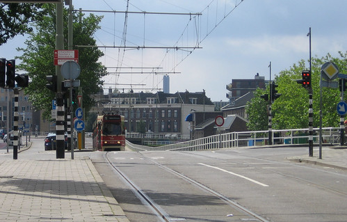

Maandag al een poging gewaagd om mijn allerlaatste practicum af te laten tekenen en er toen niet in geslaagd. Met mijn uitgestelde afstuderen heb ik wat vrienden de kans gegeven om toch nog eerder dan ik af te studeren. Daarnaast heb ik voor mezelf wat tijd uitgespaard om op adem te komen, te surfen en [de andere dingen](http://www.flickr.com/photos/alper/843852209/) te doen die gedaan moeten.

Het practicum schoot maandag niet op en niet een klein beetje niet op maar het zat echt muurvast. Na nog een poging vandaag hebben we de handdoek maar in de ring gegooid en het toch afgetekend. Storend dat je na zoveel werk, zo dichtbij het antwoord blijft steken, maar op dit moment kan het me niet zo heel veel meer schelen.

Het lijkt erop dat ik nu ben afgestudeerd, maar na zoveel keer een valse finish geloof ik het pas als ik mijn bul in handen heb. Ik moet nu nog even wachten op een tentamenuitslag [^1] en dan kan ik de tickets gaan boeken voor mijn vakantie.

Vakantieplannen: Er is nog niet heel veel zeker, maar het culmineert 5 september in Londen waarna vrijdag 7 september in Brighton [^2] voor ik dat weekend weer terugreis naar Nederland. De bocht door Turkije maken en Istanbul aandoen lijkt me nog steeds leuk, maar daar beslis ik deze week verder over.

**Update:** Ik heb een 8 voor het tentamen!

[^1]: Die uitslagen schijnen gisteren of vandaag gepost te zijn op Blackboard maar dat is nu juist deze hele week in een testopstelling vanwege de upgrade.
[^2]: Voor dConstruct 2007 "Designing the User Experience"
