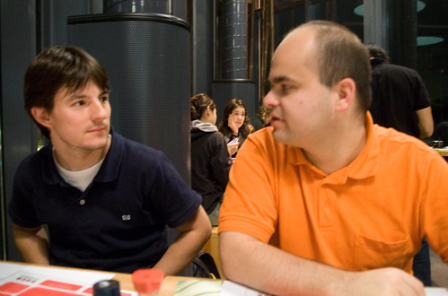
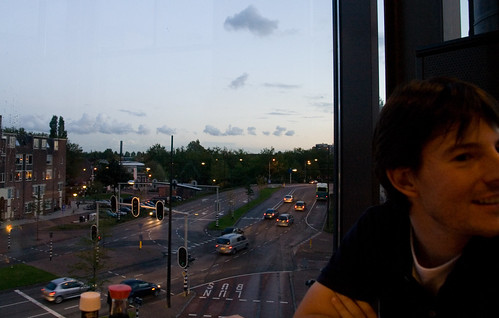
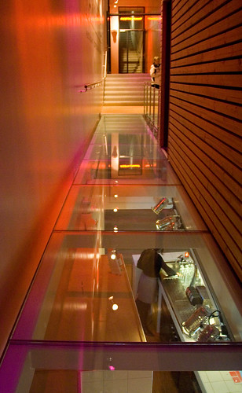

Gisteren een nieuw fusion restaurant/coffee-corner/danscafé/concept hier in Delft uitgeprobeerd: [Yamamoto](http://www.yamamoto.nl/). Het ziet er aardig uit maar een ingewikkelde menukaart die niet veel toevoegt ( [mijn recensie](http://www.yelloyello.com/nl/delft/yamamoto/a7P9e-zo0r3jg3adbiDtP6)).

Wokgerechten kun je fijner bij de Daily Wok kopen, Dim Sum beter in Den Haag [^1], sushi beter bij Happy Sushi of een andere conveyor belt en Thai het liefste bij snackbar Bird. Bij elk van die plaatsen krijg je significant meer voldoening voor €24.

De aankleding, locatie en het uitzicht zijn wel erg mooi, dus als dat je ding is moet je vooral een keer gaan kijken. Het danscafé is nog niet open, maar dat zou nog weleens iets kunnen worden. Delft is op het gebied van uitgaan zwaar ondergeserveerd.

[^1]: Denk ik. Ik moet nog een keer gaan Dim Summen.
