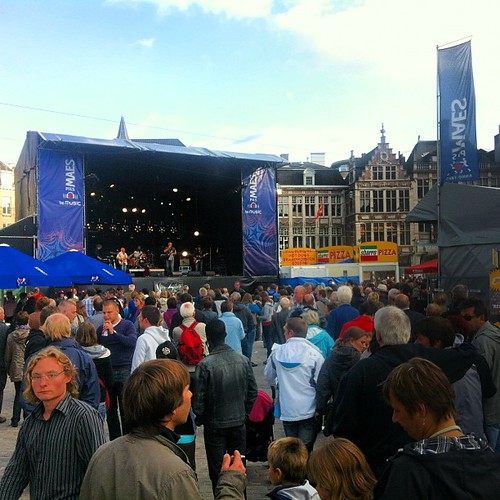
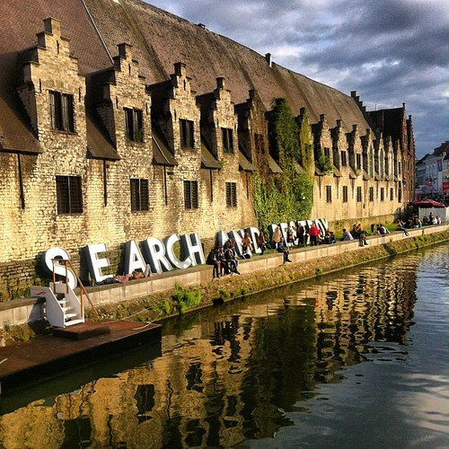
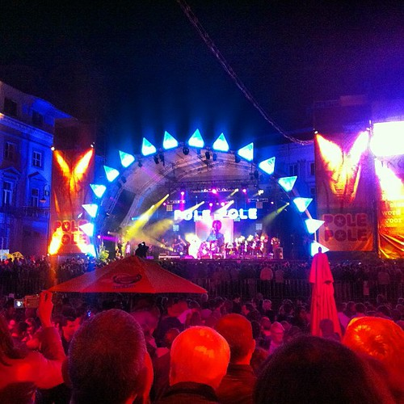

I spent two days in Ghent a Belgian city that is lovely in its own right, but really shines for a long week every summer when it has its own festival: the Gentse Feesten. I'd been there once before some ten years ago and had a lot of fun there. So [Tourism Flanders](http://www.visitflanders.com/) gave me the chance to revisit.

Gentse Feesten is probably my favorite city festival / large scale celebration around. It manages to string together a wildly varied program in a nice city in a convivial atmosphere. It is nice to see how a festival can offer something for many ages and tastes and be an all round positive experience.

This visit was marred a bit by the rainfall plaguing most of Northern Europe this summer which put something of a damper on visitor numbers, but even in the pouring rain, many stages drew crowds and the after hours celebrations on the Vlasmarkt were as special as promised.

