I spent last week in Athens because [Lea](http://fraulea.tumblr.com/) was at work at the [Athens & Epidaurus festival](http://www.greekfestival.gr/en/) where [the Schaubühne](http://www.schaubuehne.de/) staged two plays. I spent the week relaxing, working and taking in the Athens air.

[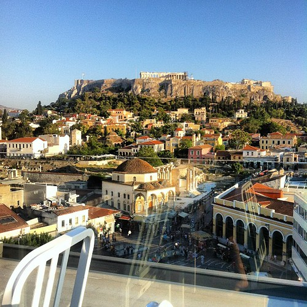](http://www.flickr.com/photos/alper/7433234262/ "Rooftop drink watching the Acropolis by illustir, on Flickr")

### Athens Terrace Life

The temperature of 32-36C during the entire week was a good reason to spend all my time outdoors in the shade. Athens, being accustomed to this weather, has ample options to choose from to spend your time, from garden patios, terraces all over the place, drink and food stands and lots and lots of iced cappucini and espressi.

[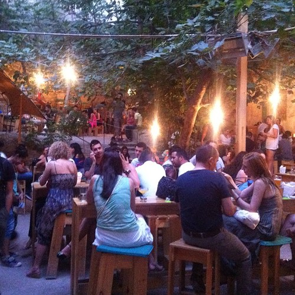](http://www.flickr.com/photos/alper/7415265434/ "Garden patio by illustir, on Flickr")

Interestingly almost every restaurant, café and terrace in the city has WiFi. One place near the hotel where we went regularly, [Ambrosia](https://foursquare.com/v/amvrosia/4c7fb3d0fb13a1cd9451a1a4), excused themselves for not having it saying ‘they were old.’ Given the proliferation of internet, I hardly saw any laptops in the various cafés neither during the day or night time. I'm guessing the WiFi is being used by smart phone users to supplement their limited data plans.

[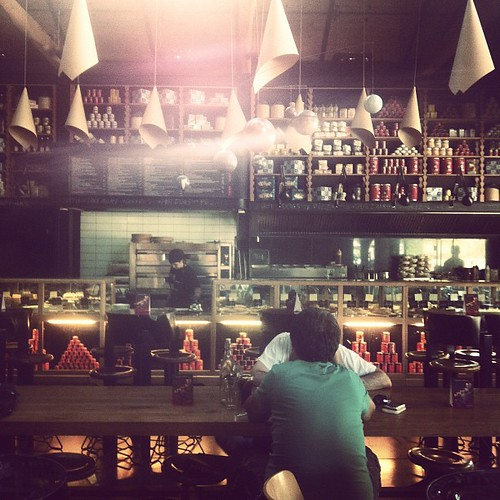](http://www.flickr.com/photos/alper/7414314790/ "Nice cafe by illustir, on Flickr")

Oddly during the so-called economic crisis, almost everything at terraces was still pretty expensive (Amsterdam prices). Iced coffees went for €4 and cocktails from €9 upwards also beers were definitely not cheap. I didn't see a lack of visitors either. Many of the very upmarket establishment where I was rubbing shoulders with the Athens 1% were bustling. Those that have managed to set aside enough savings (wherever they got the money) look to be casually riding out the current storm. I have no idea how those who are less well off are weathering this.

[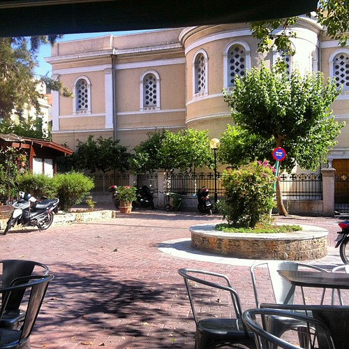](http://www.flickr.com/photos/alper/7407849994/ "Athens square life by illustir, on Flickr")

A lot of real estate around town looked to be for let with [“Enoikiazetai”](http://www.guardian.co.uk/world/2011/aug/04/athens-to-let-signs-are-everywhere) plastered on too many buildings to count. This seems to stem from a similar price locking where property owners will not cut their prices even though the market cannot support it.

[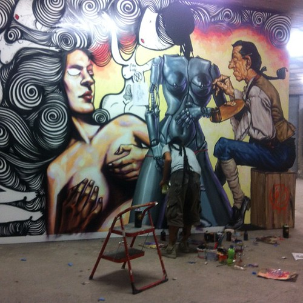](http://www.flickr.com/photos/alper/7415282292/ "The artist at work by illustir, on Flickr")

Strolling around the city I saw parties and preparations happening everywhere. A party would consist of a DJ, a couple of speakers, electricity tapped from a nearby distributing box and a couple of coolers filled with beer. The best of these was one evening in a derelict construction site where in a gallery space artists were at work and downstairs a rave was taking place. Tons of people were drinking and partying on the street. At least crises are good for parties.

[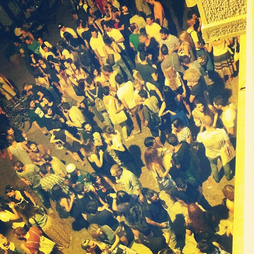](http://www.flickr.com/photos/alper/7415718648/ "Crazytown by illustir, on Flickr")

### The Theater Festival

I dropped by the theater festival after the opening night to have a drink. This festival like so many others was located on the location of evaporated industry. Where there once were jobs, there now are cultural venues. The [Peiraeus 260](http://www.greekfestival.gr/en/venue10-peiraios----.htm) complex was a rather successful example of this development. High profile theater festivals such as this one are almost exclusively frequented by a kind of elite who have an old-fashioned and status sensitive cultural taste. I briefly skimmed the program, but I could not find anything I wanted to spend my time on.

[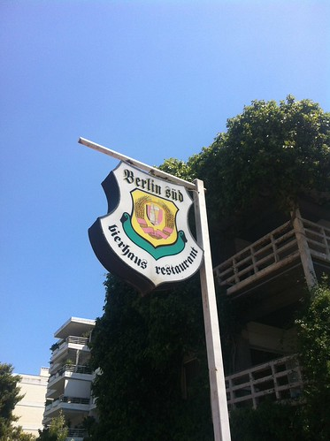](http://www.flickr.com/photos/alper/7420936650/ "photo 2.JPG by illustir, on Flickr")

On that opening night, the location served Berlin beer, locally brewed but with a proper [bear logo](http://en.wikipedia.org/wiki/Coat_of_arms_of_Berlin) on it. All of the Schaubühne shows at this festival (and at the previous one in Athens a couple of weeks ago) had sold out even on the night that Germany was playing Greece in the EC. Greek people even were boastfully demonstrating their German language skills at anybody they could find. It looked to me as if the ruling class of Athens —fully aware where their money comes from— was cozying up to their new German masters.

This all is a bit surreal if you read reports about Greek ressentiment against Germans. We did not see anything of the sort here. If anything, in parts of Greek society Germany seems to be an aspirational value.

### The Engaged

At the port of Peiraeus I saw a banner by [SYRIZA](http://en.wikipedia.org/wiki/SYRIZA) claiming that the necessary changes in Greece have been made. I hope they don't believe it themselves.

[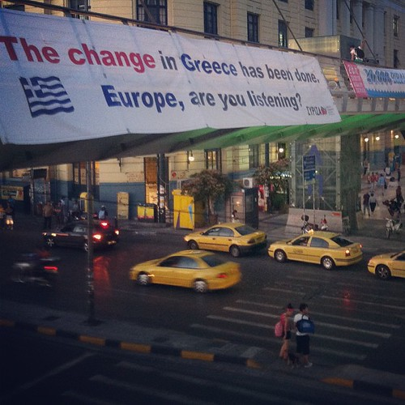](http://www.flickr.com/photos/alper/7409239810/ "“The change in Greece has been done. Europe, are you listening?”—SYRIZA by illustir, on Flickr")

Then at the local Ruby programmers meetup they were discussing organization of the next [Euroku](http://euruko.org/), a rather large event in this scene. And like anywhere in the world programmers are in such short supply that they cannot lift their heads for the amount of work on their plate. This is good for them, but that same short supply means that they will not be able to change a lot.

[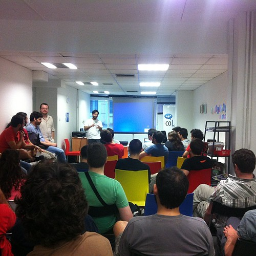](http://www.flickr.com/photos/alper/7421455074/ "Hacker event discussing Ruby now by illustir, on Flickr")

Near the end of my stay I found Exarcheia square which seems to be the focus of the counter-cultural movement. No riots to be found, just a bunch of banners obscuring the square and a collection of nice cafés and restaurants that are a bit less glossy than those in city center. Probably the place where normal Athenians hang out. At night a large group of people gathered on the square. Music from a DJ and banners professing sympathy for Turkish anarchists accompanied the revelers who were mostly occupied trying to deplete the beer supply of the local drink stand.

[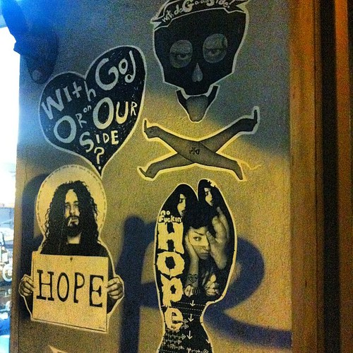](http://www.flickr.com/photos/alper/7427250456/ "Street art by illustir, on Flickr")

Whatever you may think of it, the protestors, the politicians, the programmers are all busy doing things. At least they do not spend their days idling on terraces sipping pricy beverages.

### The End

My final impression is that of a country locked in a strange kind of socio-economical stasis, very much resigned to the current situation and deeply divided on many levels. Change looks to be far away either going to require a long time or the breaking of a great many things. However difficult the Greek relationship with Europe may be, it has been the source of a lot of the local prosperity.

[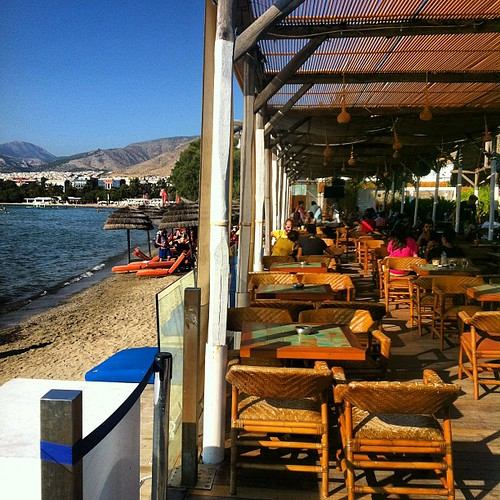](http://www.flickr.com/photos/alper/7420205440/ "I should work in beachside clubs more often. by illustir, on Flickr")

On my last day there I had my wallet pick-pocketed from me while returning from the beach. This is a common enough occurrence in the tourist centers of the mediterranean. Fortunately I suffered no worse damage than having to replace a stack of plastic, having no money on me to donate to the Greek cause.
