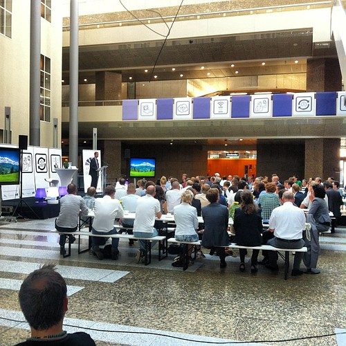
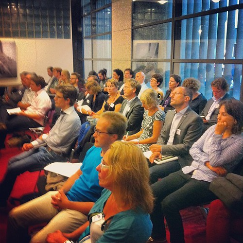
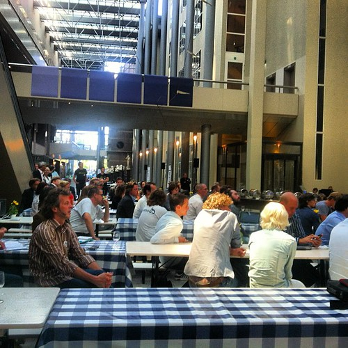

I just pulled out this stuff from [my weeknote](http://wp.me/pfcwg-105) into a separate post because I think it merited it.

I was already in the Hague Saturday when the event that prompted my visit happened: we held [Apps voor Democratie](http://appsvoordemocratie.nl/), a [Hack de Overheid](http://www.hackdeoverheid.nl/) hackathon in the Dutch parliament building on invitation by the chairwoman Gerdi Verbeet of our parliament. For this event they also for the first time [opened most parliamentary proceedings](http://appsvoordemocratie.nl/datasets/).

I cannot stress how nice it was to be welcomed into the highest institution of the Netherlands and then hear that institution say that they realize now that openness with their data is the way to go. The atmosphere of the entire day was incredibly positive and uplifting. This event has been a world premier and has set a high bar. But don't let that stop ups from doing even better.

https://twitter.com/Lisadichtbij/status/244398354044440576

https://twitter.com/AlexanderNL/status/244443168869851136
