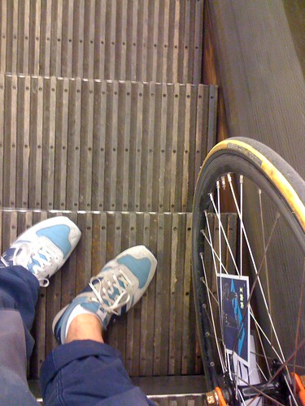
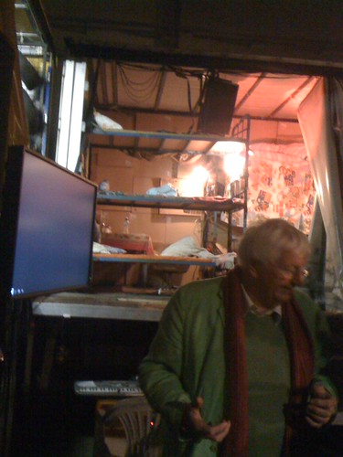

Wednesday I went to a performance by a Hungarian theater group showing [“Hard to be a God”](http://www.deinternationalekeuze.nl/programma/4020/Kornel_Mundrucz_/Hard_To_Be_A_God/) by Kornél Mundruczó a famous Hungarian director after the story by the Soviet Russian brothers science-fiction writers [Arkady and Boris Strugatsky](http://en.wikipedia.org/wiki/Boris_and_Arkady_Strugatsky).

I brought my bike with me to Rotterdam because I figured it was only slightly cheaper to store my bike at central station and get an [OV-fiets](http://www.ov-fiets.nl), while having my orange fixie with me in Rotterdam would be a lot more fun.

It's always a pleasure to take the Maastunnel to the South part of town:

And I seemed to have grossly misjudged the time it would take to bike out to the venue so I had to blast full speed for fifteen minutes to make it in the nick of time. Glad I brought my race bike at that moment.

The venue is the same of the [Onderzeebootloods](http://www.onderzeebootloods.nl/), our new Dutch gallery hall which I'd still planned to visit, but which seems to close its current exhibition tomorrow. Pro-tip: tomorrow is also the yearly testing of the [Maeslantkering](http://en.wikipedia.org/wiki/Maeslantkering), so you should be able to see both if you're headed that way (which I'm not).

The play was great. Hyperrealistic: no. Shocking: only slightly (anybody with a modicum of exposure to the internet has seen much much viler stuff). Touching: yes after a while. Our performance was heckled by some senile old bastard who did seem to think it was shocking. Interesting use of a second stage and video transmission as a way to mediate the action to the audience.

Biking through the port of Rotterdam during night time is a pleasure and I would like to repeat it, further out up to the [Maasvlakte](http://en.wikipedia.org/wiki/Maasvlakte) would be nice. I'd planned on doing it while I still lived in the area, but never got around to it.

I wrote a quick [mini review in Dutch](http://www.moose.nl/?q=minirecensies/hard-be-god/16691) at our great theater site Moose.
