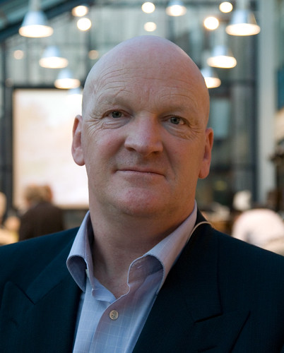
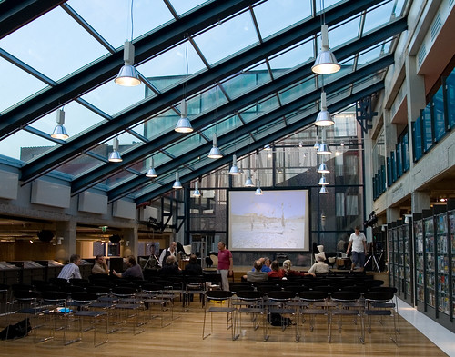

Gisteren een [lezing bijgewoond van Arnold Karskens](http://www.dok.info/index.php?cat=actief&pagina_id=50&agenda_id=271) in DOK Delft. Interessant omdat Karskens grote thema's aanhaalt, bijna samenzweringen aan de kaak stelt en een beroep doet op de morele verantwoordelijkheid van het Nederlandse volk en journaille ( [‘Halve journalistiek bestaat niet’](http://www.denieuwereporter.nl/?p=1574)).

Karskens begon met uit te vallen tegen de laksheid van de regering in het vervolgen van oorlogsmisdadigers terwijl tegelijkertijd op de 4 mei herdenkingen mensen de mond vol hebben van ‘nooit meer’.

Verder had hij het over de nutteloosheid van de missie in Uruzgan en de mogelijk oorlogsmisdaden die daar gepleegd worden door onze troepen en de haat die gezaaid wordt [^1]. Ons kabinet doet zijn best om dit soort incidenten in de doofpot te stoppen maar het deksel zal er binnenkort toch wel vanaf vliegen. En dat in de laatste plaats door de Nederlandse journalisten die niet kritisch durfen te zijn [^2] laat staan zonder bescherming en censuur van Defensie [^3] naar Afghanistan durven te reizen [^4].

En met uiteindelijk de conclusie dat de missie in Afghanistan zinloos is. De Russen waren daar al achter. Het is de vraag hoeveel Nederlandse doden er nodig zijn (Afghanen boeien zoals gezegd niet) voordat wij daaracher komen en met de staart tussen de benen afdruipen.

Hij stipte ook nog kort de affaire met Joris Luyendijk ( [‘Joris is bang’](http://sargasso.nl/archief/2008/05/08/joris-is-bang/), [‘Joris over de kritiek op Joris’](http://www.nrcnext.nl/achtergrond/article1078682.ece)) aan. Ik denk dat ze allebei meer gelijk hebben dan de rest en ik weet nu nog beter waarom ik geen Nederlandse geschreven pers lees.

**Update:** Een kleine discussie nog over waarom embedded journalisten informatie die ze verzamelen niet gewoon toch publiceren. In ieder geval als mensen hulp nodig hebben om verborgen partities op hun laptop te maken, laat het maar weten.

[^1]: Grotendeels onopzettelijk natuurlijk.
[^2]: Vergelijk dit ook met het onvermogen van de Amerikaanse journalistiek om tijdens ruim 7 jaar Bush een keer een kritische vraag te stellen ( _‘Confusing dissent with disloyalty.’_).
[^3]: En tijdens DWDD maar bewonderend zeggen hoe goed Defensie de media fallout van die dode soldaten heeft afgehandeld. Dode Afghanen zijn niks waard.
[^4]: Letterlijke quote omdat er een gebrek is aan ‘testikels’.
