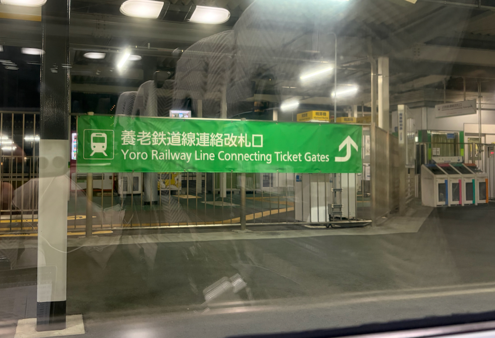
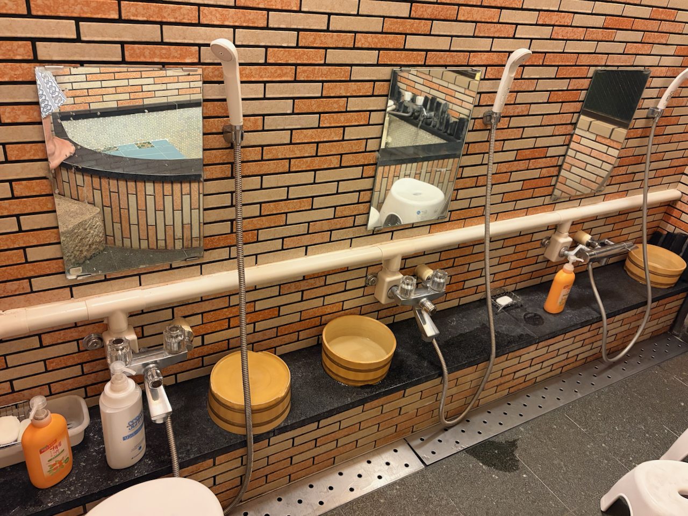
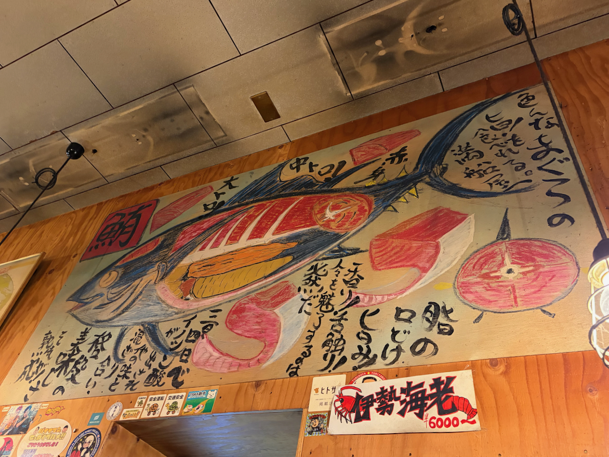
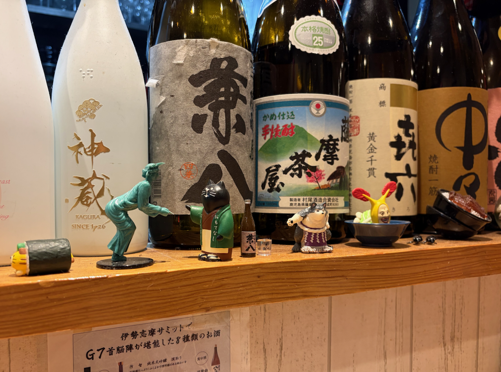

I wanted to write how I got to Ise in the first place and why that was such a terrible experience.

After landing at Narita at around 11:00 JST, I fumble around and manage to buy myself a sandwich and a [Skyliner](https://www.keisei.co.jp/keisei/tetudou/skyliner/us/skyliner/index.php) ticket. So far everything seems to be fine.

Then getting into town at Tokyo Station, I quickly find out none of the ATMs will give me money. I try a bunch of them. I try all my cards credit and debit.

Throngs of people rush past me as I walk around forlorn frantically trying things and coming up with scenarios. Mostly I'm just waiting for Germany to wake up. At the same time I continue to amass a stack of "issuer declined" notices from different banks and teller machines.

What is working:

- I took €150 out at BER airpport which I exchange for yen at random money exchange counters.
- I get on some public WiFi outside Tokyo station and buy a Shinkansen ticket online with my credit card. Their website is bad and hard to use but not broken enough thankfully.

What isn't working:

- I have a hard time paying for stuff with my credit card. It seems I changed the PIN and forgot to put the new one into my password manager.
- I'm out of practice using a credit card. In Berlin I usually tap my phone at the terminal. In Japan phone payments are not widely accepted.
- I learn later that in Japan they don't like to give cash out against a credit card generally.

The main choice now before me is whether to stay put here or get myself to my accomodation. My next five days of sleeping are already booked and I just bought a train ticket online. That means I still have most of the money I exchanged, but the part of Japan that I'm going to is very very rural.

I figure that if need be, €150 can last me for a week or more if I only eat FamiChicki and other convenience store foods. So I hop on the Shinkansen passing through the gates with the QR-code of my digital ticket.

At Nagoya station I try some more machines. Support at the German bank says they've reset a bunch of things. None of them work.

At this point I'm tired and fully resigned. I buy a train ticket to [Iseshi](https://maps.app.goo.gl/DoiUL8Q7NHeVCk4z8) and stare out the window for two hours. After I arrive, I get word from Germany that there's been a payment system malfunction with my bank and that lots of people had issues with their cards.

That also means the malfunction is over. I rush to the nearest ATM and take out a bunch of cash. I'm super elated and with the money I just got I buy myself dinner twice, to celebrate.

I go back to the hotel and lie down on the tatami floor. Happy that it is over and that my real undertaking can start properly now. After six very stressful hours, I've arrived.

Major lessons learned:

- Bring cash on holidays. If I had brought twice as much, I would not have stressed out that much about this.
- Have more than one bank. This episode has made me regret closing my Dutch “real” bank account a lot.
