I get started late after jetlag keeps me up between 2-5am. Then when I finally catch sleep, it's time to rise and leave. The Fitbit clocks me at 3h47m of sleep.

I quickly walk over from the lovely [Mizuhokan](https://maps.app.goo.gl/jPwVTpBdEucQciL5A) to the Ise outer shrine. The site is beautiful. I learn that the empty lot next to the shrine is where they build the building anew every 20 years. A tradition, _shikinen sengu_, I had heard about before but didn't think it would be here. They started [the 63rd rebuilding](https://www.iseshima-kanko.jp/en/highlights/sengu_eg) this year.

[My inspiration for this walk](https://walkkumano.com/iseji/)—the amazing [Craig Mod](https://craigmod.com)—gives his permission to skip this section, so I go to Iseshi station, grab some breakfast and wait for the train to Tamaru near the edge of the city. I'm walking [Craig Mod's GPS trail](https://walkkumano.com/iseji/gpx/iseji-ise_to_shingu-full_170km_walk.gpx) following it sometimes even including the exact road crossings. Having a ghost whose trail you walk in is uncanny but also the only way I can swing this in the first place. The wayfinding this provides and the research it saves are indispensable.

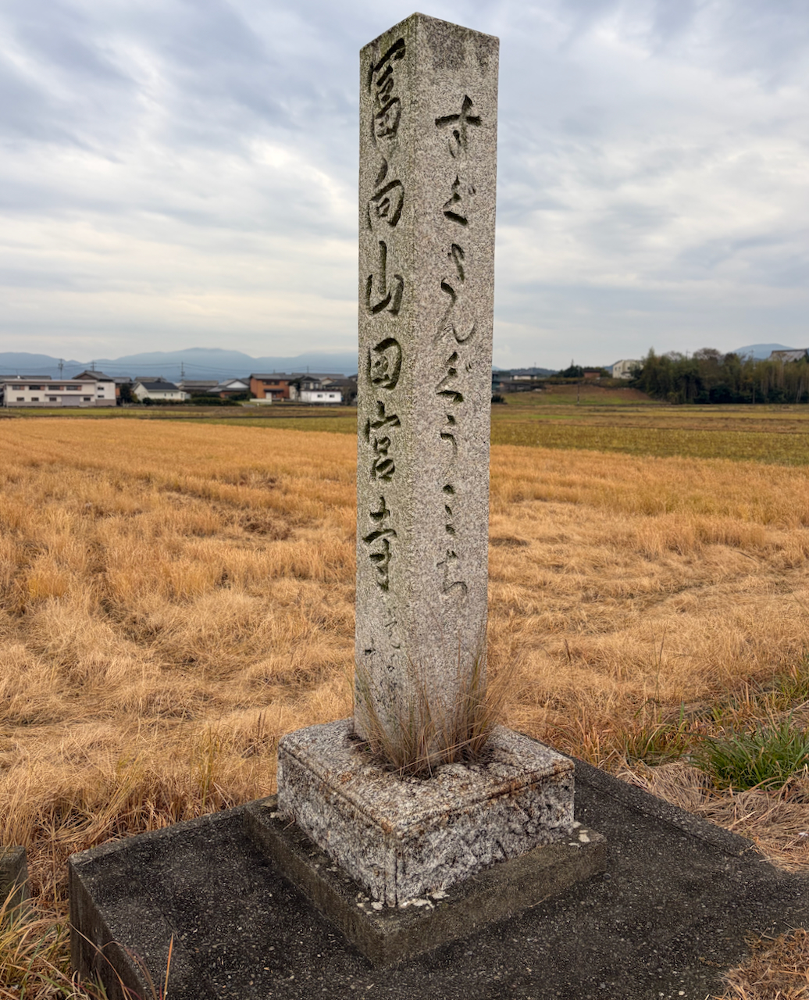

I drop by the [Higashitokida shrine](https://maps.app.goo.gl/7Yz8W4StCLSnFREC9) and am seriously impressed by the sense of space it creates nestled in the trees, accessible through its gated gravel path. Leaving the shrine feels like coming back to the real world.

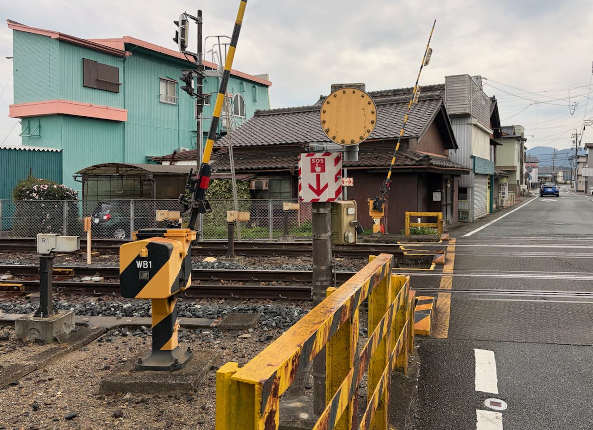

The rain is a permanent fixture which could explain why I see so few people out and about. In my first hour of walking lots of kids cross my path on their way to school wearing their uniforms and helmets.

I take shelter at [the local post office](https://maps.app.goo.gl/M8bjJ97pLK4wj7TH7) to wait out the worst of the rain. A jovial old man jumps out of his car and asks me where I'm going. Misedani he feels is beautiful but I'm too early because the leaves haven't turned yet. It's been way too hot this year. He goes in to do his business. I go on with my walk.

The Japanese weather forecasts report on the colors of the leaves. I wonder why Germany doesn't do this given how nice autumn colors here can be.

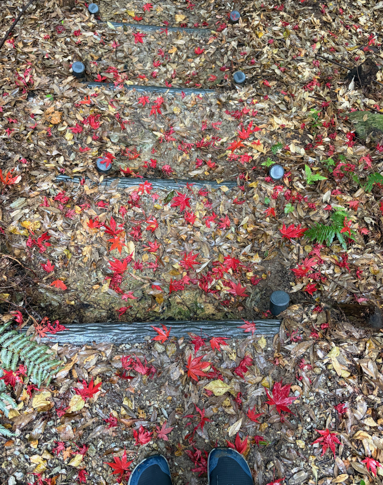

Making my way from one provincial road to another, I arrive at the first pass, [Misesaka Toge](https://www.kodo.pref.mie.lg.jp/en/course/02.html). It's hardly challenging with just a couple of steep segments and switch backs. Moving off the road and making your way over the mountain is beautiful and feels secluded even if civilization is only a couple of hundred meters away.

At the guardian deity there is a box with a trail booklet. Even though it's quite thin, it goes back years because there are so few people on this trail. The person signing in before me did so three days ago.

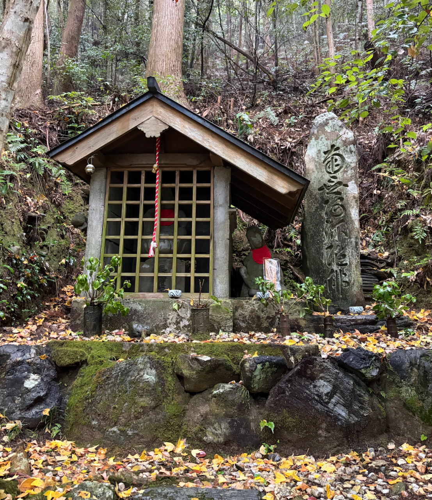

Then comes a long uninspiring stretch along the main road. At this point I'm hungry and sick of the rain and the cars. I cut around the route to make my way to [Cafe de Touhenvoku](https://maps.app.goo.gl/GmwR3n93pkfF595i8) which with its funky interior and pizza toast on the menu reveals itself to be a genuine [Kissa](https://shop.specialprojects.jp/products/kissa-by-kissa-4th-ed?variant=42844316762267). I order the Katsu Curry and scarf it down. How excellent it is to eat something warm after a whole day of walking through the rain.

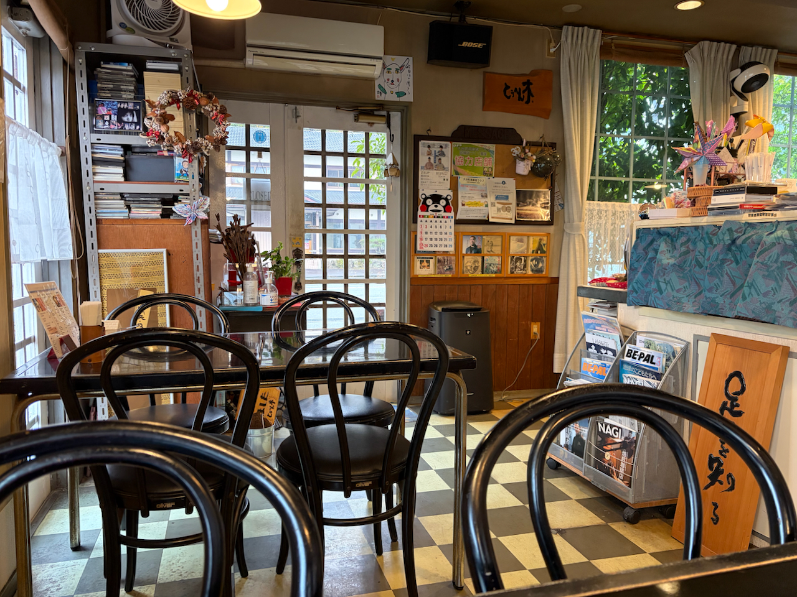

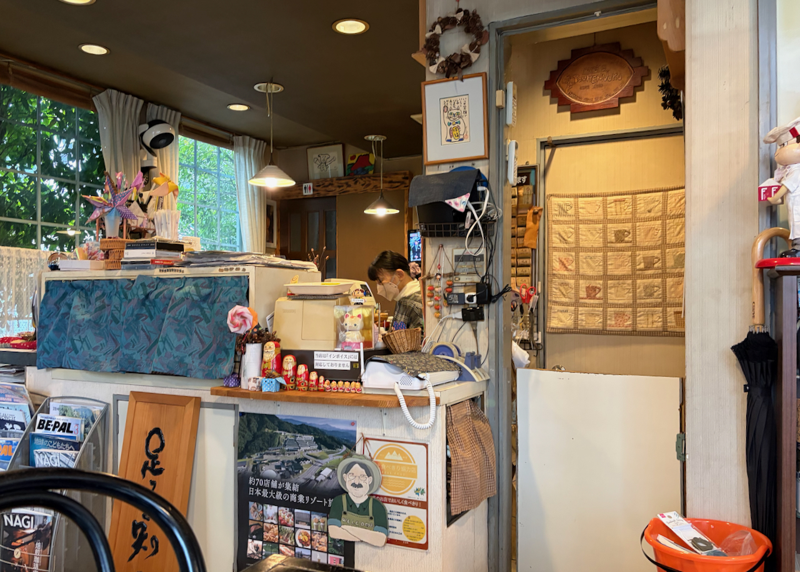

I consider taking the train at Tochihara to skip to the end but my legs still being good, I loop back to the track and continue along the route. Good that I did, because otherwise I'd have missed a romp through the riverbed and a bamboo forest.

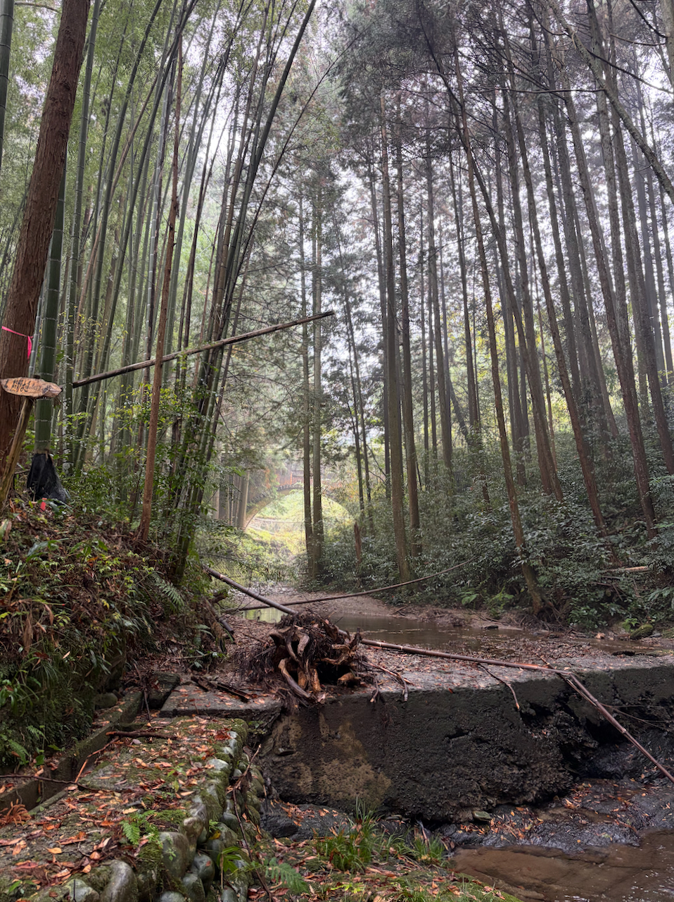

From what is already a quiet road behind the rail tracks I go down to the river. It feels like another portal into a different world. The trail carries me along the stream which is reduced to the point where a small makeshift bridge gets me over it.

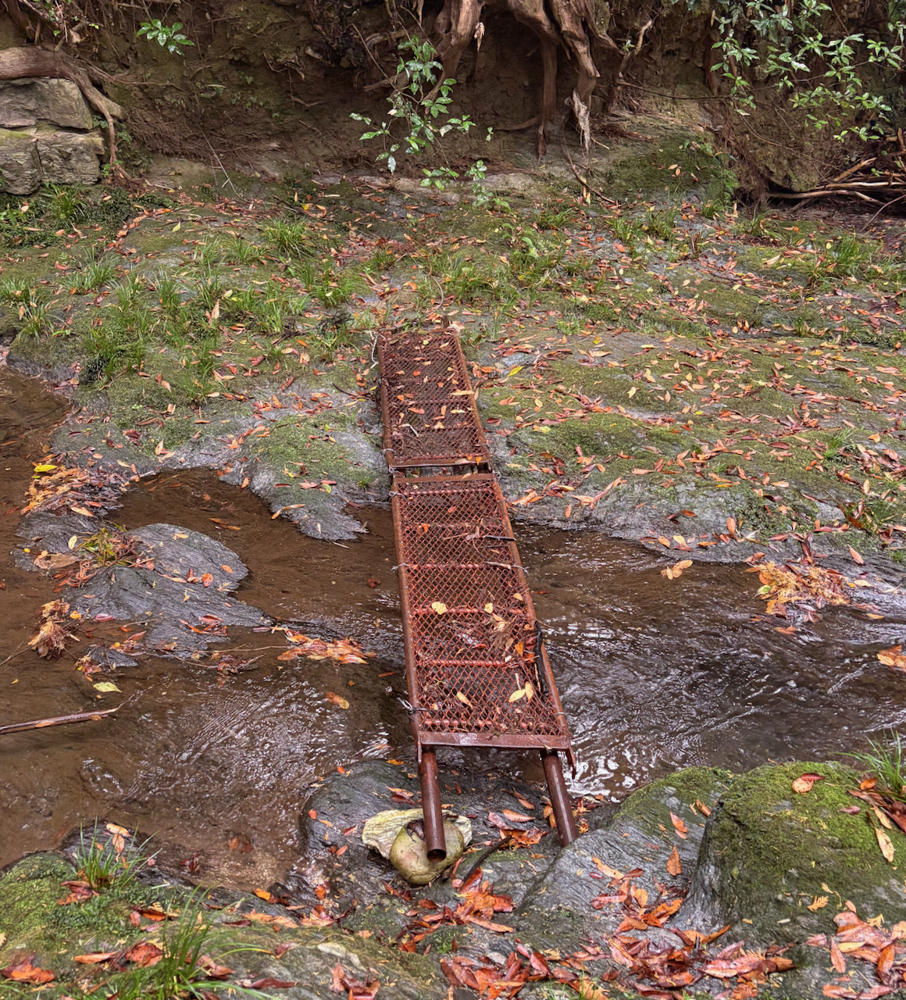

Then I pass through a bamboo forest the likes of which I only know from movies. It's dense, imposing and makes this detour from my detour well worth it.

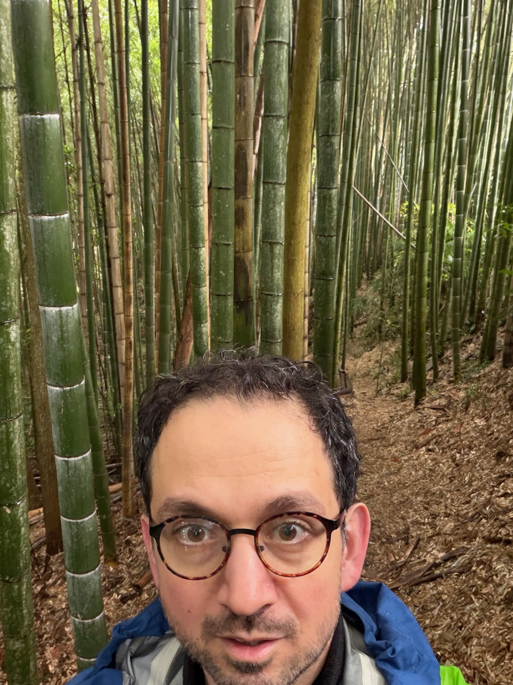

A brief stop at [bread and coffee](https://maps.app.goo.gl/D8LdNdqDX481cjyP8) in Kawazoe which true to its name sells bread and coffee, and children's toys. From that point on the walk is an incessant plod along the road. My painful feet and the fading light sap my morale. Official sundown is at 16:45 but that doesn't mean much if there's a huge mountain between you and the sun.

I pass a bunch of derelict buildings and [a very weird one](https://maps.app.goo.gl/Dj9Woz13B7wyxJFP9) which turns out to be a church/cult.

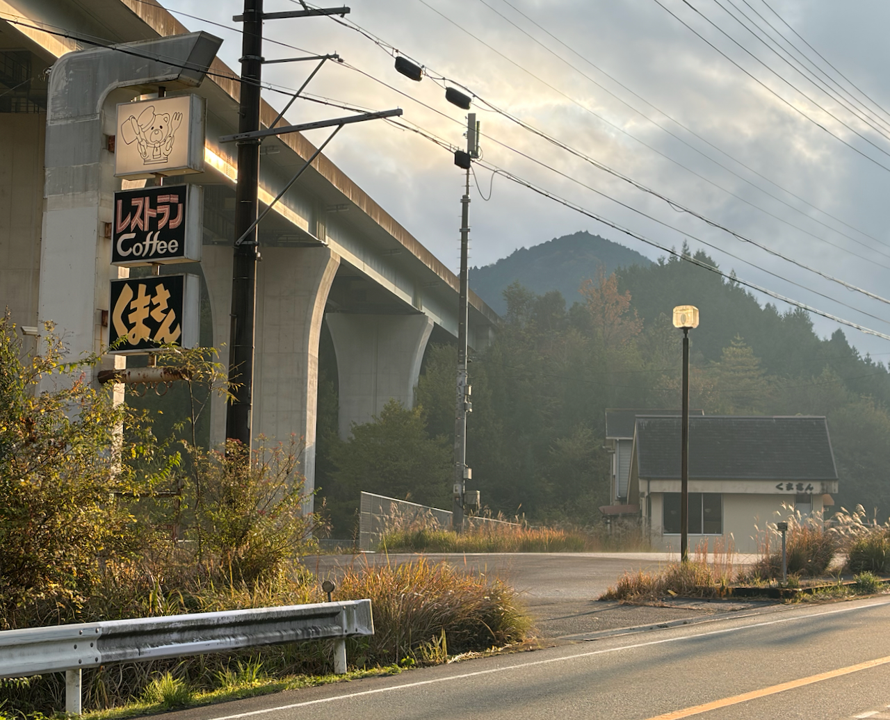

Mr Bear, the roadside stop pictured above, didn't make it unfortunately. It's one of many shuttered businesses along the road here.

The stretches of this walk along the road will not be appreciated much by hiking purists. In my treks through the Alps, any route that takes you on more than the absolutely necessary amount of tarmac—noticeable by the click-clack-ing of your hiking poles—is considered to be unacceptable.

By now I've walked for more than an hour along the road and will have at least another half hour ahead of me. My legs are increasingly feeling the weight of the 9+ hours I've been underway. I see on Google Maps that there will be a bus passing by in five minutes. Not giving it a second thought, I get on at the [Shimo-Mise bus stop](https://maps.app.goo.gl/zKAc8JarjvusDUbu6). The entirely empty bus takes me the rest of the way to Misedani station. I hobble the final steps into my hotel.

I'm staying at the [Fairfield](https://maps.app.goo.gl/dttDrTfEW37QCdwU8) which is bougie and has a continuous stream of foreigners passing through. My shower today will not be in a communal ofuro. In town there aren't that many restaurants open during the week. Many places are open during the weekend when there are more people in town.

I find a bowl of ramen and alcohol free Kirin at a ["famous" ramen place](https://maps.app.goo.gl/VEqWbiDQkmJoi3sc6) where lots of kids with their parents eat. The ramen is nothing to write home about but the electrolytes and vegetables are very welcome. My legs come back to life.

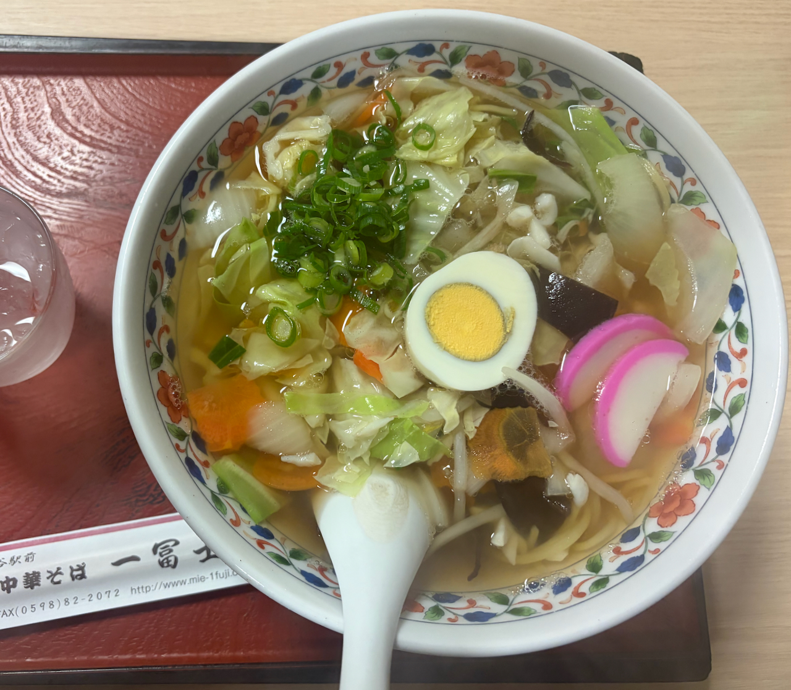

The stats for the day say 33,53km and some 42k steps ([strava](https://www.strava.com/activities/16558960888)).

Today was brutal but it established what the upper limit of my output can be. Walking here needs to have an exit plan at around 3pm before dusk sets in. It's obvious now that I'll not be able to walk to Shingu in five days. I retire to my hotel room and plan the next day's steps.