Another day and yet another short night. Getting up at all is not easy, let alone getting up early.

My host offers to refund me the money (a trifle) for dinner because she felt she was too pushy. Of course I don't accept. The food was plentiful, home cooked and she saved my legs. I eat the standard Japanese breakfast and get on my way.

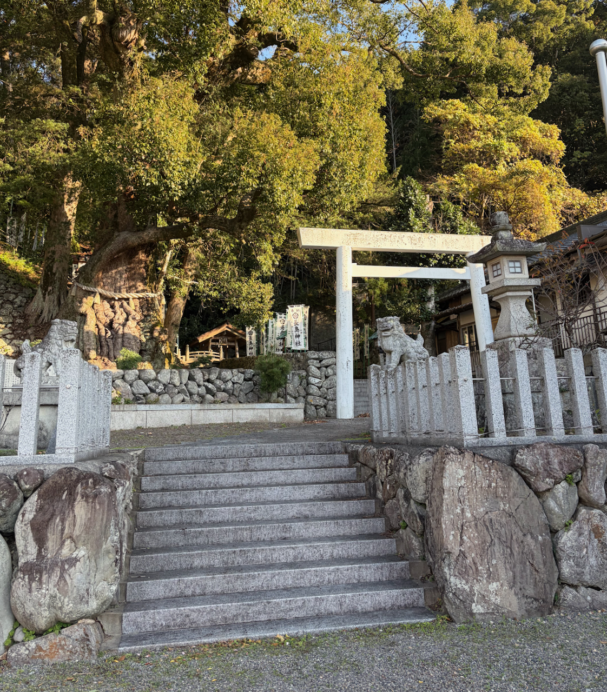

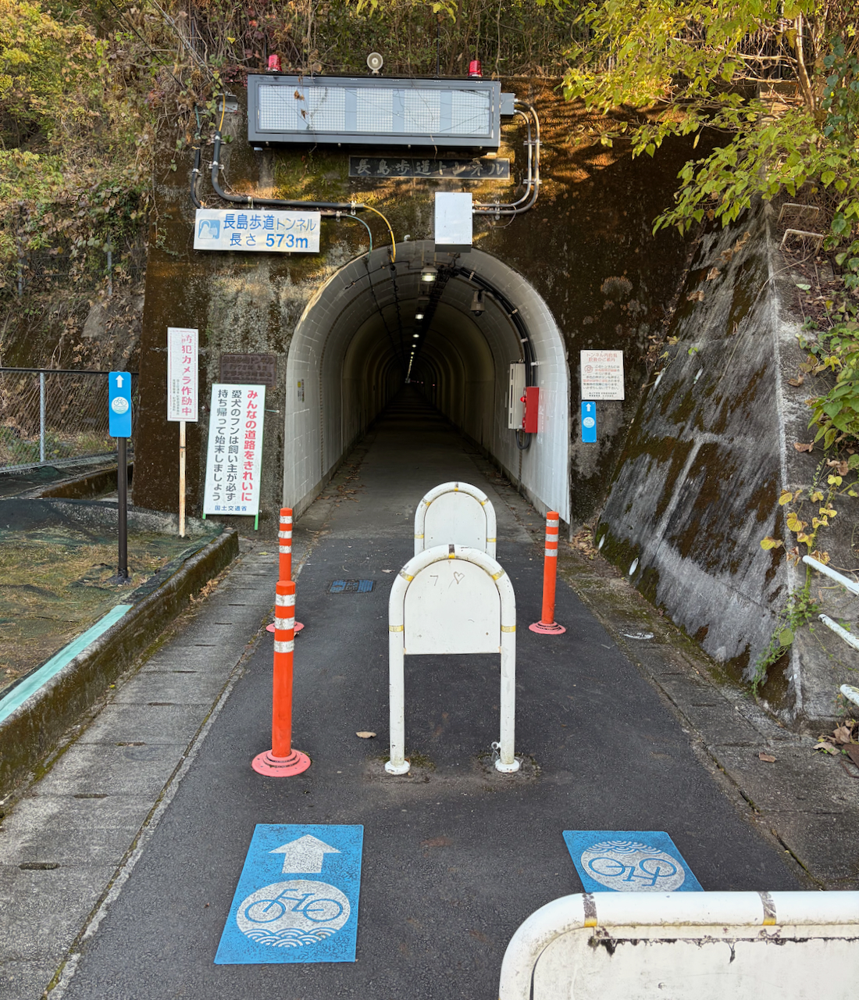

The first segment is a stroll over a light pass with a sea view and then circle around the harbour, the coast and some of the local beaches.

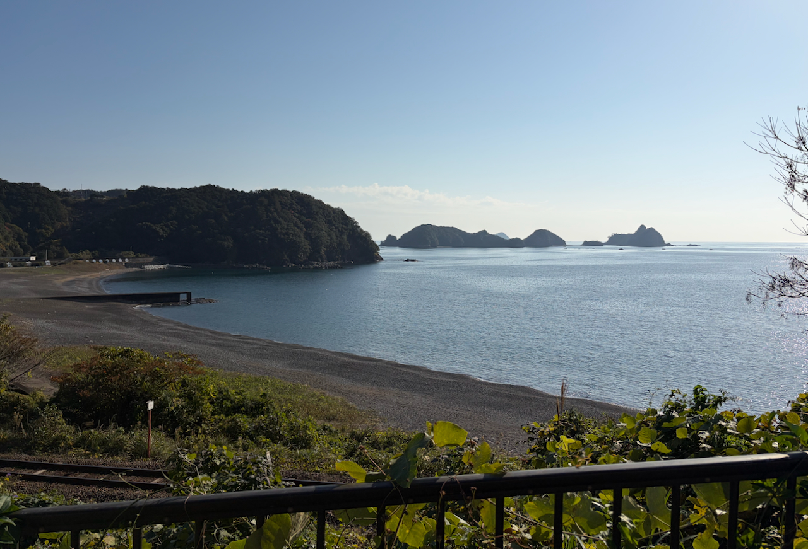

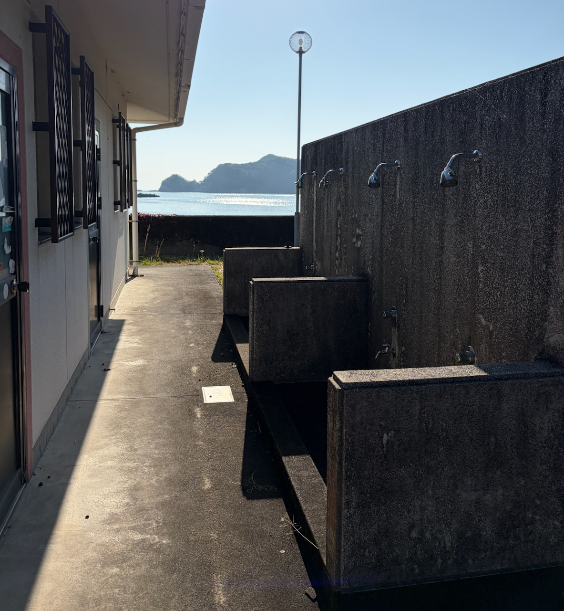

The seaside here looks like it could be lovely. My Berlin barista told me he would come to Mie to surf back in the day. It looks like that could be amazing though it seems to happen more on the Eastern coast like at Koushirahama.

The passes themselves, [Ikkoku-toge, Hirakata-toge and Miura-toge](https://www.kodo.pref.mie.lg.jp/en/course/06.html) are short work but it is where I meet the first other people on trail so far. Two old geezers have driven here and are doing their morning _sanpo_ (stroll) up the pass and back down to the car. The pass itself is short work with maybe 3-4 switchbacks.

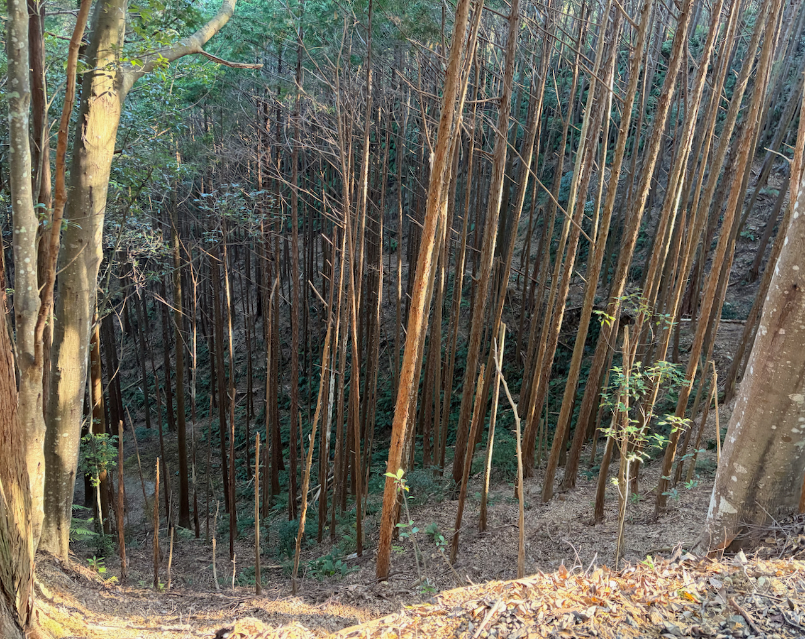

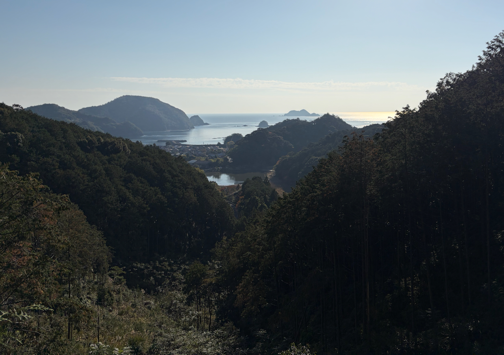

In [Craig Mod's account](https://walkkumano.com/iseji/#day4) it says the walking from Minose to Aiga is relatively miserable, so that's a perfect excuse for me to skip it and take the 11:37 train. Catching that is essential because it lines me up nicely for Magose. Missing it would mean the rest of the day would be a loss.

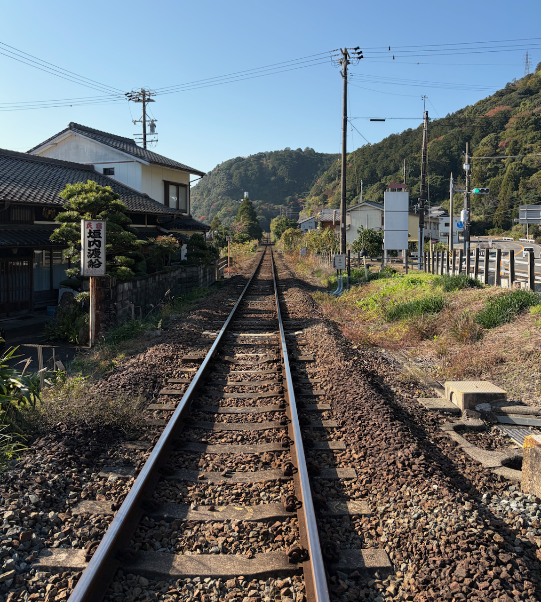

At the Minose train station a team is re-roofing the shack. Nice to see infrastructure investment like that even in the most rural of places.

During the train ride I see some fellow hikers (also a first!). One Japanese woman in the train going alone and a Western couple at Funatsu station who don't board. It looks like they are walking the entire thing.

Aiga has quite some stuff going on for it in gastronomy. I'm not very hungry so I stop quickly behind the train station at [Cafe do Selecao](https://maps.app.goo.gl/k2mJFPubxJwdLdUi7) for a strengthening coffee before the climb ahead. The coffee is good but the owner keeps trying to convince me bears are super dangerous around here. I'm not a bear denialist, but there's no reason to be stressed about them in this part of Japan.

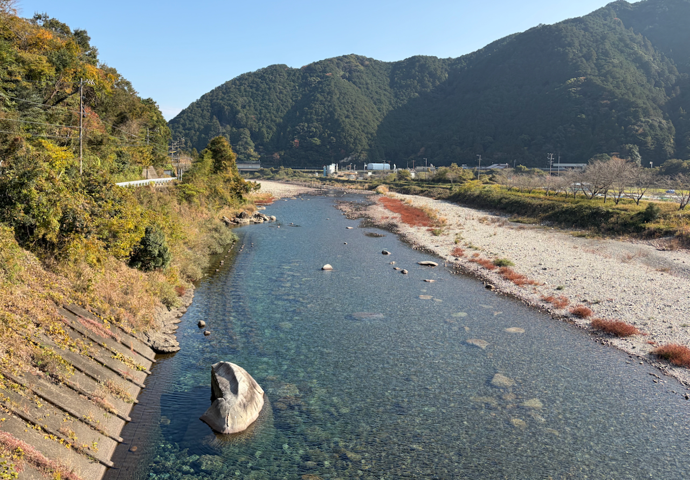

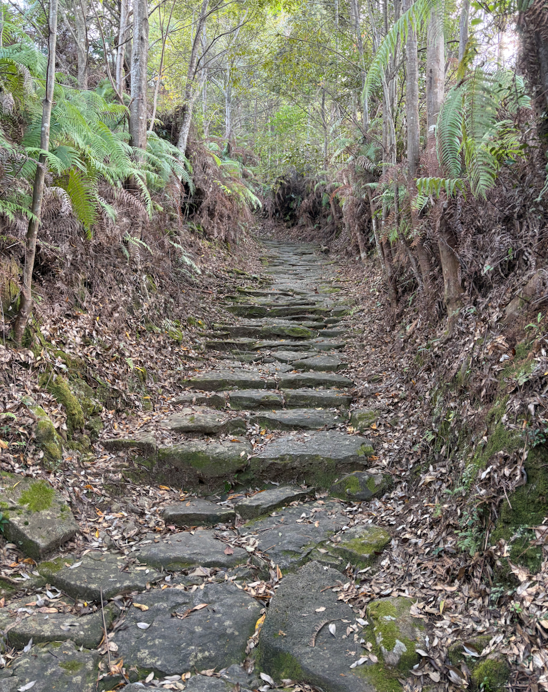

It's a bit of a walk to get to the climb and walking up the stone path is somewhat strenuous. Still no rain which is good since according to the cafe owner Mie is the rainiest part of Japan. Even in the best conditions I clock at around 15 minutes for 100m of elevation. The 330m here takes the better part of an hour.

At the pass I catch some summit fever and make the ‘fantastic’ decision to push for the top. The trail consists of stairs but of the kind that make an Amsterdam apartment staircase look reasonable. Going up I catch myself thinking: "That's steep! I wonder how I'll get down.", then I think to myself: "Can't worry about that now! That's a problem for future Alper to figure out."

I go up and encounter a Western couple absolutely balling it down from the summit. To my amazement the man has a baby in a front carrier. I admire the show of confidence here but one misstep and that baby is toast. It is acceptable to carry kids up and down a mountain, but we'd only consider doing it using a [kraxe](https://www.alpenverein.de/artikel/kinderkraxen_c98fcd75-3e52-43e6-9cae-ac1c41512895), not an ergo baby.

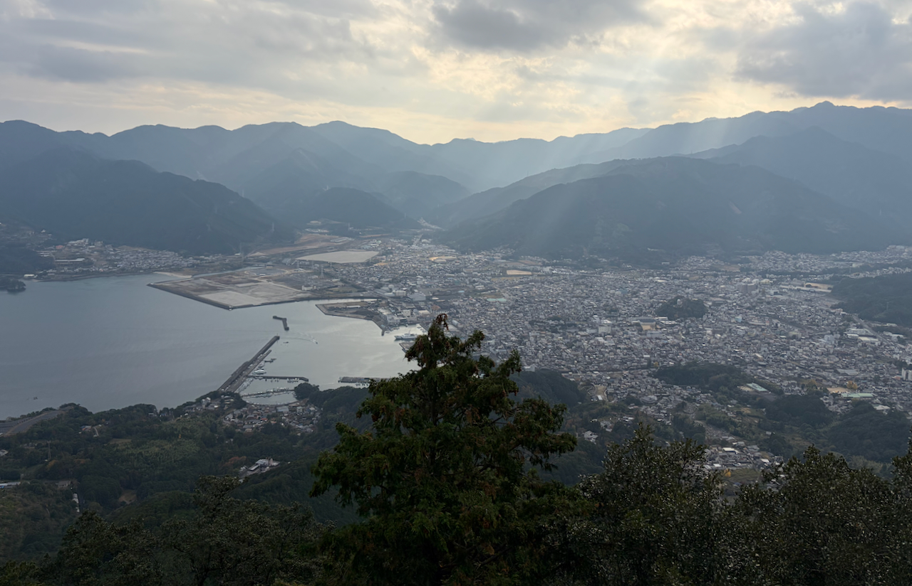

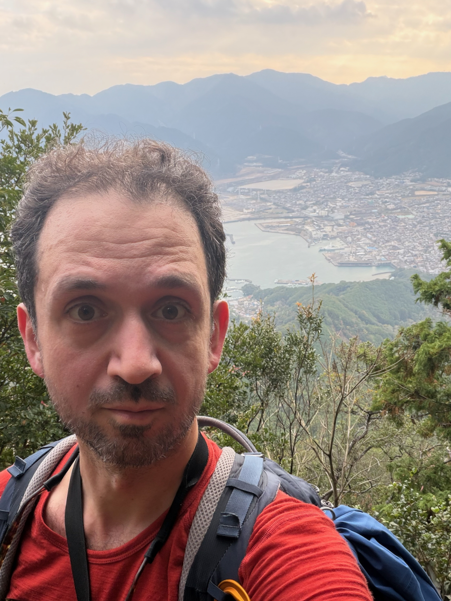

The summit itself has a small clearing with a shrine enveloped by a bunch of huge boulders. Scrambling on top of one, I can look down on the entire city and look out over the bay. The view is as spectacular as the vertigo.

The true summit is the top of a huge boulder accessible through a very rickety metal ladder. I decide to save that for another day.

Going down I have to really take the descent step by step. My knee is definitely not happy with all of this and starts radiating heat. Back at the pass, a group of eight or so Japanese hikers are doing the Magose as well. They are fully decked out in outdoor kit and have a guide with them. Shouts of amazement greet me coming down that I'm doing this _hitori_ (alone) when another guy comes jogging up from the Owase side and makes straight for the summit. He says he does this every day.

That's more people on the trail today than I saw in the previous days combined.

The walk down is uneventful and leads me through a large and active cemetery. Walking into Owase proper I try to hunt down a bite and a coffee before checking in to my accommodation. It's hard to find anything. Many stores are not up to date in either Google Maps or tabélog.

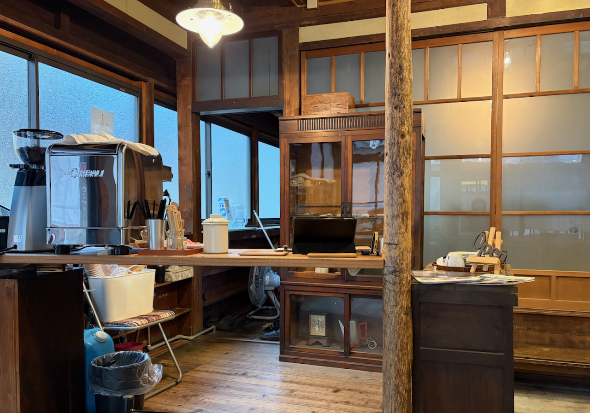

What does help me find a nice place, is just walking and looking around. I stumble on [a coffee and wine place](https://maps.app.goo.gl/hXRiQb1qs9rEERzE9) with a proper espresso machine. An “Apotheke” sign on the building betrays that this used to be the pharmacy and the inside has been repurposed to be modern and open. I get my cappuccino and see the young and creative people of Owase gather in the place.

People are doing interesting things, even in Owase, and it remains true that “new ideas, need old buildings”. I see a general theme of repurposing happening all over anyway. From the sento turned museum, to plots of land now being used as solar farms, to new semi-temporary restaurants and cafes popping up.

I check in without talking to a human into an empty family house in a residential area. The entire house, both floors, is mine for the night for a song.

For dinner I go to a place called [Inaka](https://maps.app.goo.gl/66DQ7zMBXf26izMp8) which has a reputation as a fantastic family-run [kappou](https://guide.michelin.com/en/article/dining-out/what-is-japanese-kappo-cuisine) restaurant. I have some trouble trying to figure out what to order, but fortunately they have a summary of their menu in English. After a long day of hiking I don't have the mental fortitude to deal with very complicated food situations.

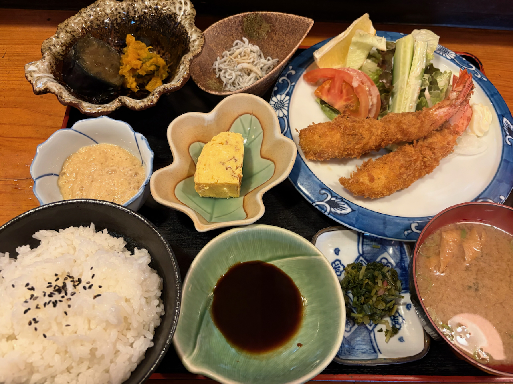

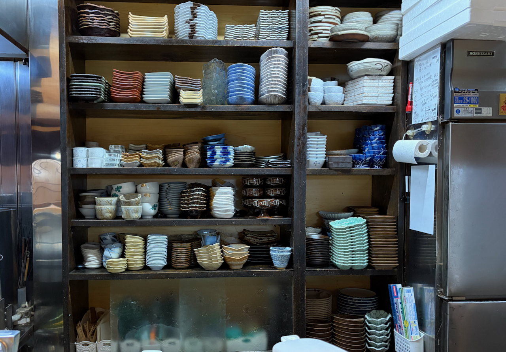

What they delivered is absolute art. Probably the best meal I've had so far. The variety, the care, the detail and the different platings are out of the world. You can see the people cooking are related in the familiar home-cooking way they do their work behind the counter. It's somewhat pricey but I'm happy to pay for the food and the experience.

After dinner I make a tour of the city and Owase does not look at all dead to me. During the afternoon I saw lots of kids running around freely. Now the streets are empty, but it looks like every izakaya is more or less full and people are getting ready for a night of drinking at the local karaoke, sunakku, bar or ‘nightclub’.

Fun as that sounds, that's an amount of being awake and drinking which my current schedule does not allow, so off to bed it is for me.

The stats for the day say 19.94km and some 34k steps ([strava1](https://www.strava.com/activities/16578124601), [strava2](https://www.strava.com/activities/16578971811)).

For tomorrow I'm doing some more drastic replanning. I only have two days left and an awful lot of walk ahead of me. I figure that [tomorrow's mountain](https://www.kodo.pref.mie.lg.jp/en/course/10.html) will be my _Angstgegner_ as it was for many people before me. The time indications can be trusted and 5h would eat up my entire day for not that much distance gained[^1].

[^1]: As a rule of thumb, every 1km of altitude is equivalent in effort to 10km of distance.

Reading [the end of Craig Mod's report](https://walkkumano.com/iseji/#day6) it seems both that assessment is true and that it's possible to do the chunk after the mountain in two days. That would make it an obvious choice to skip it. I'm going to see exactly how to do that over breakfast tomorrow which I'll take after sleeping in. The lack of sleep is wearing on me.
