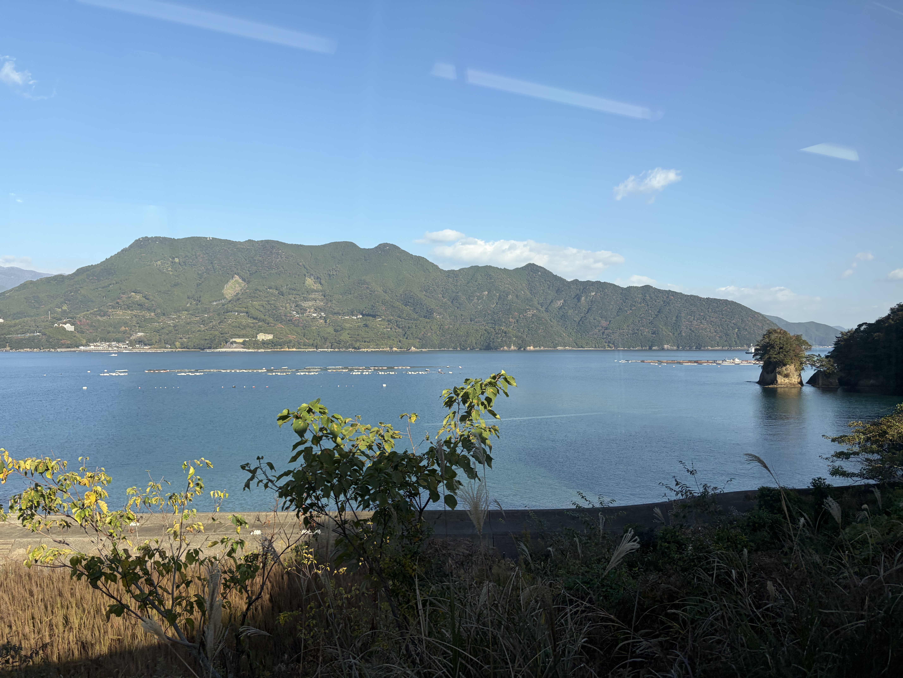
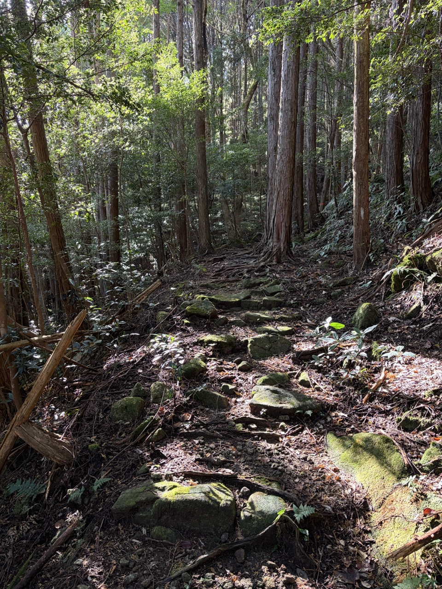

The train I had to catch this morning only ran after 9am so I thought I'd take the opportunity to get a real breakfast for the first time. [Scale](https://maps.app.goo.gl/TpzjiXTJikwasuqc9) is as good as mentioned and people were lining up before opening time to get in on the action. I attacked the plate I got like a wild animal and was well underway to the FamilyMart and the train station by 08:30.

The train to Mikisato it was. I could read it even without romanization because it's just ‘three’ 三 ‘tree’ 木 ‘village’ 里. That means there's probably two- and four- tree villages out there as well.[^1]

At Mikisato I saw a man with a baby and his parents struggling to get on the train. On these single driver operated carriages, there's only one door that opens to regulate the flow of passengers. After pointing out where to get on, I called out: "How did you guys end up here?"
He said he lived there and the train took off. How do you live somewhere and not know how the trains work?

The goal today was to get to Kumano since I [read that it could be done](https://walkkumano.com/iseji/#day7).

From Mikisato quickly the double whammy of [Miki-toge/Hago-toge](https://www.kodo.pref.mie.lg.jp/en/course/11.html). It rained a lot last night, so everything was slippery. On the trailhead they thoughtfully provided sticks again to ward off the bears.

I'm regretting not bringing my hiking poles *a lot*. I think calling this a ‘walk’ really threw me off. This is very much a hike and a fairly strenuous one at that.

I didn't really see very many shrines today. I was getting a bit worried until I finally found one.

There was another book and the people there also reported zero bears but say they did see monkeys. I'm sad that I didn't see any monkeys.

Then it was down already to Kata. The problem with walking from coastal town to coastal town is that you're going down to 0 altimeters every time.

Kata didn't have fishing rights historically. Weird how one town next to the sea would be able to get them and the next wouldn't. It looked like they're getting a new bridge. More infrastructure investment that is impossible to find in Germany.

I sit down and eat some of the snacks I brought. There is no convenience store on this entire stretch which tells you something about how remote it is.

The next pass, [Hobo-toge](https://www.kodo.pref.mie.lg.jp/en/course/12.html) went all the way up to 350m of altitude. Just as much as the mountain pass yesterday. It did feel a bunch easier though.

After hitting the pass proper, every time I thought it was going to go down, another section of climbing followed. So up and down it went for a while after which I had to drop the entire 300m in a very short distance to get down to Nigishima.

On the way down it became obvious that my knee wasn't really feeling it and it took about as long to get down as it took to get up. With that, the three hours in the description for the pass remained accurate. At that point it also was after 2pm so it was clear that I wasn't going to do anoter one of those, let alone walk a bunch more and go all the way to Kumano.

So I cancelled my plan to push and stuck with my already booked accommodation in Atashika. I confirmed dinner and breakfast with the host (because there's absolutely nothing out here) and then waited for the train.

There are worse ways to spend two hours than sitting in a gazebo in a tiny port town watching the people drop by to use the public toilet while drinking hot beverages from the vending machine.

Not being high in the mountains and walking along the train line gives this kind of flexibility. It's possible to change plans and reschedule accordingly and there still being 4-5 trains coming through even this tiny place.

The train came at 16:18 as promised and after a short hop to Atashika I walked up to my lodgings. I phoned my kids while walking and by the time I got there the sun had set well and proper. You don't really want to be stuck outside on the backroads after dark here.

The guesthouse was run by a lovely septuagenarian retired woman who's studying English and has traveled all over the world. I wondered why people would live in these towns but they moved here after retirement and from up on the hill her living room has a stellar sea view. I think I understand.

My host cooked me a stellar nabe meal which probably was the best thing I could have eaten.

[^1] Turns out that there aren't.