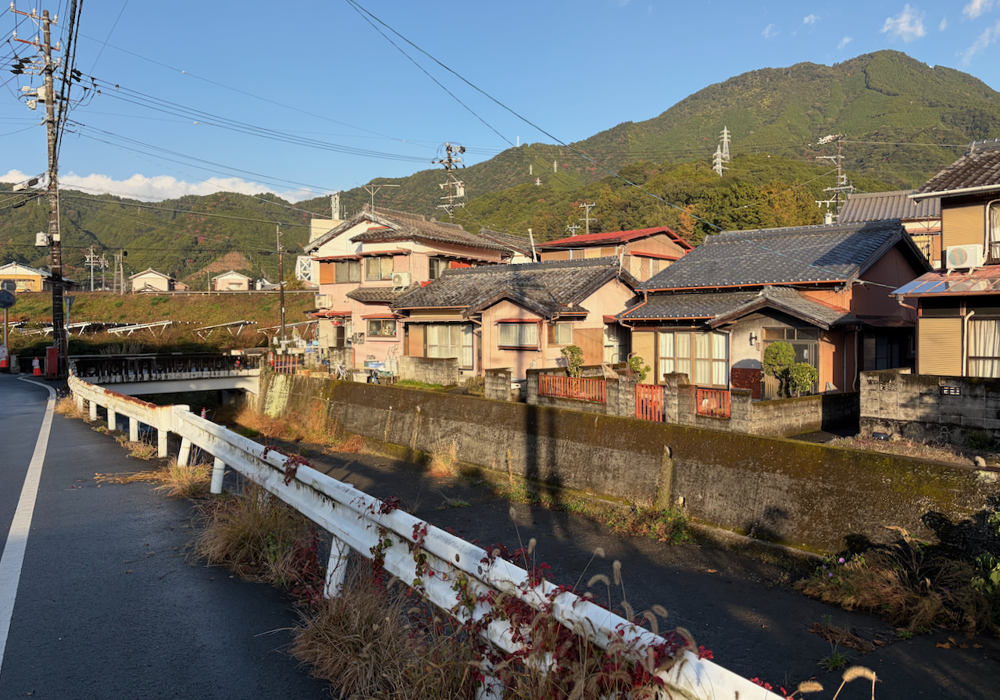
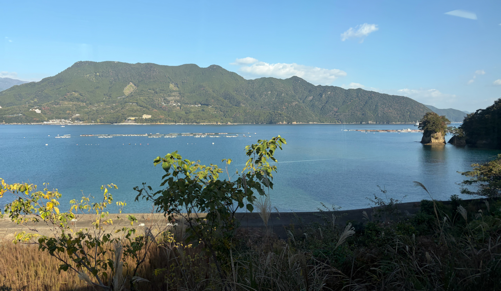
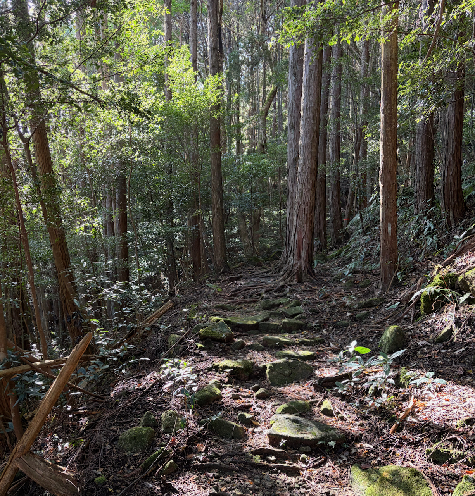
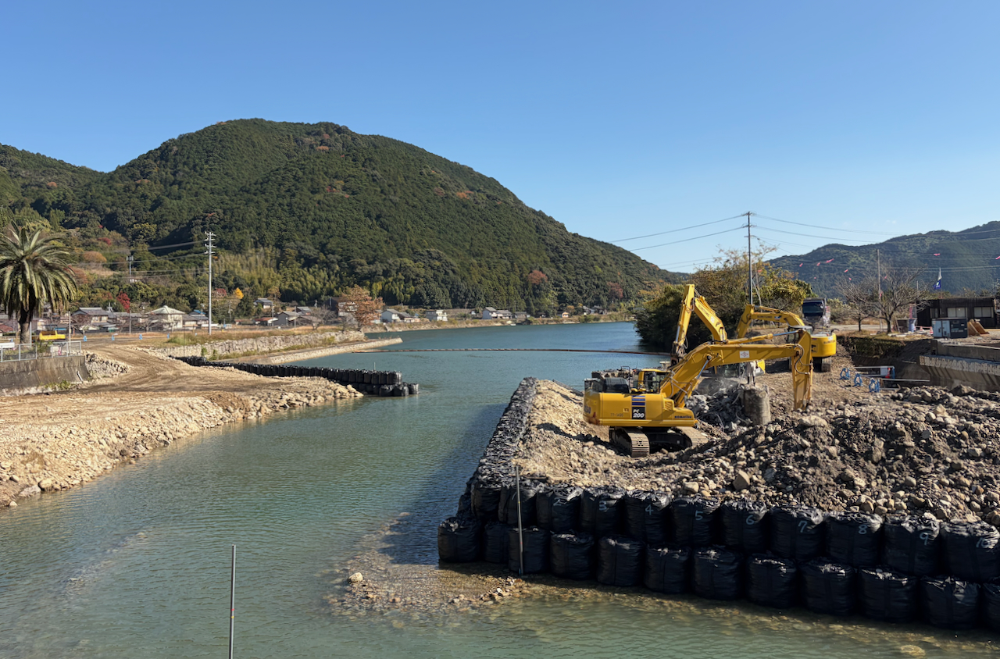
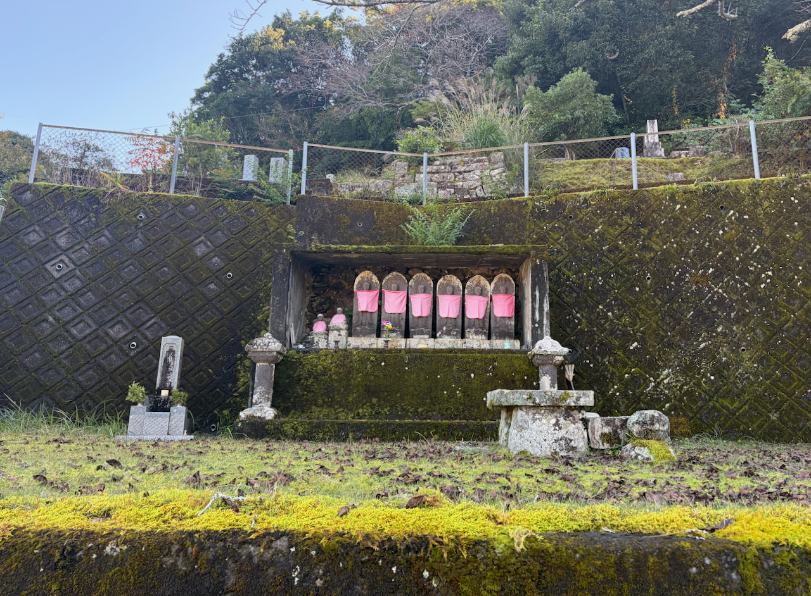
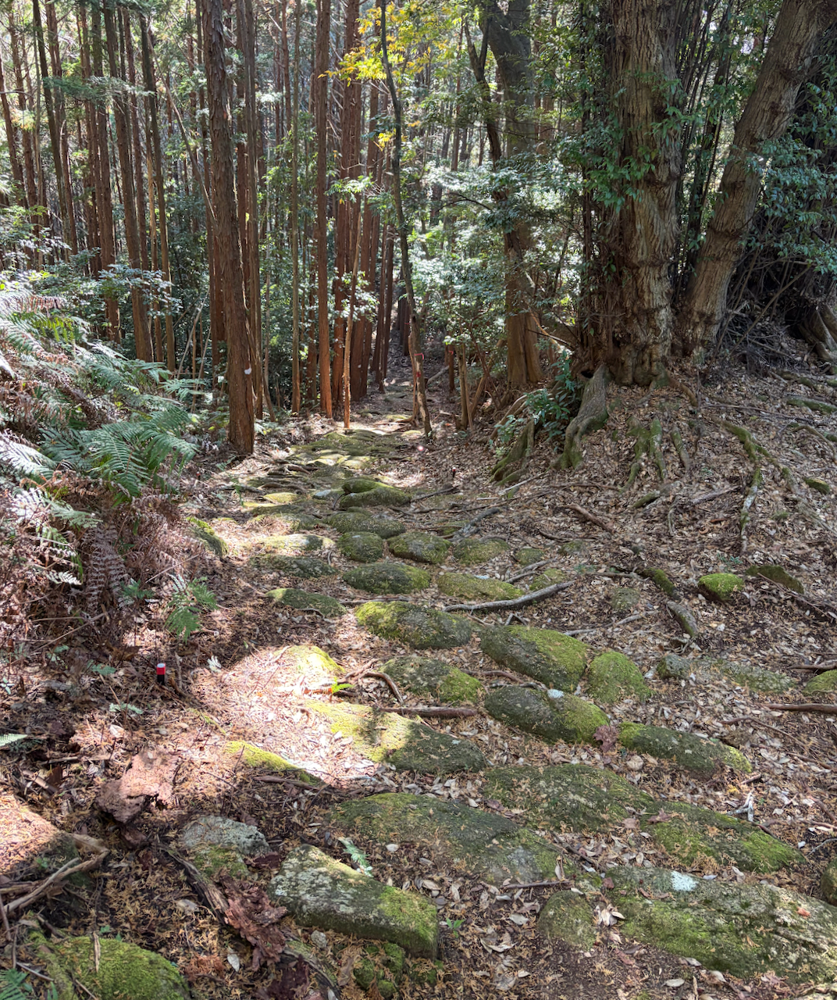
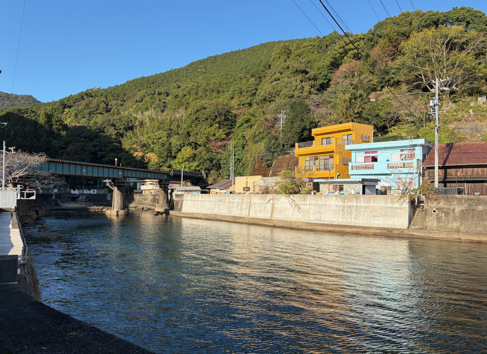
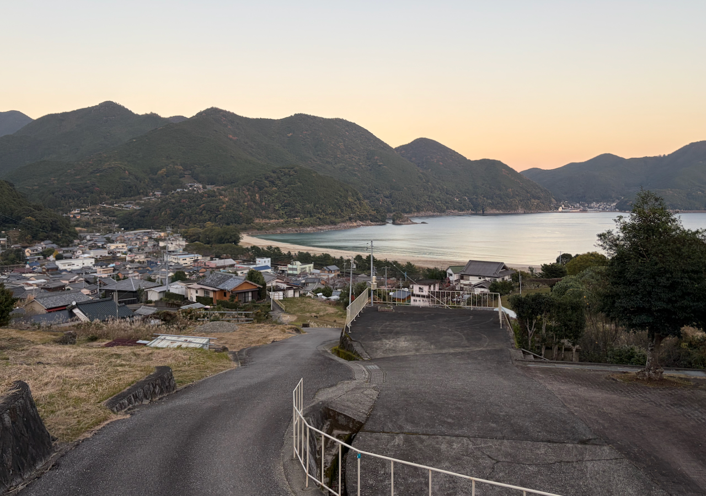
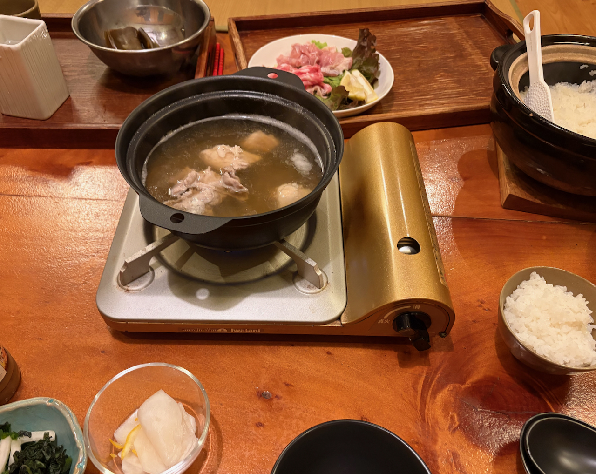

The train I have to catch this morning only runs after 9am so I take the opportunity to get a real breakfast for a change. [Scale](https://maps.app.goo.gl/TpzjiXTJikwasuqc9) is as good as expected. People are lining up before opening time to get in on the action. I attack my plate like a wild animal and am well underway to the FamilyMart and the train station by 08:30.

The train to Mikisato it is. I can read it even without romanization because it's just ‘three’ 三 ‘tree’ 木 ‘village’ 里. That means there's probably two- and four- tree villages out there as well.[^1]

At Mikisato I see a man with a baby and his parents struggling to get on the train. On these single driver operated carriages, there's only one door that opens to regulate the flow of passengers. After pointing out where to get on, I call out: "How did you guys end up here?"
He says “he lives there” and the train takes off. How do you live somewhere and not know how the trains work?

The goal today is to get to Kumano since I [read that it could be done](https://walkkumano.com/iseji/#day7) in one day.

From Mikisato quickly I completely the double whammy of [Miki-toge/Hago-toge](https://www.kodo.pref.mie.lg.jp/en/course/11.html). It rained a lot last night, so everything is quite slippery. On the trailhead they thoughtfully provide sticks again to ward off the bears.

I'm regretting not bringing my hiking poles an awful lot. I think calling this a ‘walk’ really threw me off[^2]. This is very much a hike and a fairly strenuous one at that.

[^2]: Even though trekking poles are on [Craig Mod's gear list](https://walkkumano.com/iseji/#gear) I omitted them to travel very lightly on this one pack trip to Japan.

I don't really see very many shrines today which is worrisome. Their constant presence is a reassuring touch point on these walks.

I find another trail booklet and the people there also report zero bears but they do say they saw monkeys. I'm sad that I didn't see any monkeys.

Then it's down to Kata.

Kata didn't have fishing rights historically. Weird how one town next to the sea would be able to fish and the next wouldn't. Staying on the theme of rural infrastructure investment, they're having a new bridge built here.

I take a break and eat some of the snacks I brought. There is no convenience store on this entire stretch which tells you something about how remote it is.

The next pass, [Hobo-toge](https://www.kodo.pref.mie.lg.jp/en/course/12.html) goes all the way up to 350m of altitude. That's about as much as the mountain pass yesterday but it does feel a lot easier.

After hitting the pass, every time I think it's going to go down, another section of climbing follows. Up and down it goes for a while after which I have to drop the entire 300m in very short order to get down to Nigishima.

On the way down it becomes obvious that my knee isn't really having it and it takes about as long to get down as it took to get up. This knee had a new ACL grafted into it a couple of years ago. It's healed well which is why I didn't give it much thought, but now I don't want to take any chances.

Timing myself, the three hours in the description for the pass are accurate. It's after 2pm now so it becomes clear that doing another pass will only complete after dark and then there's no way I'll be able to push on to Kumano.

I drop that plan and stick with my already booked accommodation in Atashika. I confirm dinner and breakfast with the host—remember there's absolutely nothing out here—and then wait for the train out.

There are worse ways to spend two hours than sitting in a gazebo in a tiny port town. Sitting around doing nothing is a welcome change from having to keep pushing on all the time. I buy some hot beverages from the vending machine, eat my snacks and chat with the people stopping by to use the facilities.

Not being high up in the mountains and walking along the train line allows this kind of flexibility. It's possible to completely change plans and reschedule because there are 4-5 trains still stopping at even this super tiny place.

The train comes at 16:18 as promised and after a short hop to Atashika I make my way back up the hills to my lodgings. The sun has long disappeared and dusk is setting in. I FaceTime my kids while walking and by the time I arrive it's really starting to get dark. Not a time when you want to be stuck on a trail or even a backroad here.

The guesthouse is run by a lovely septuagenarian retired woman who's studying English and has traveled all over the world with her husband. I wondered why people would live in these tiny remote towns. She says they have moved here after retirement and from the hill her living room has a stellar sea view. I think I understand it.

My host cooks me a delicious *nabe* meal. The hot brorth and rice are great already for somebody who's cold and has been walking all day. But she fills up the pot with an unbelievable amount of vegetables, mushrooms and meat. That's the best meal I could've had right now.

The stats for the day say 15.94km and some 25.5k steps ([strava1](https://www.strava.com/activities/16588324121), [strava2](https://www.strava.com/activities/16588916093)).

I turn in and spend way too long sitting on my room's balcony taking in the view of the bay.

[^1]: Turns out that there aren't.