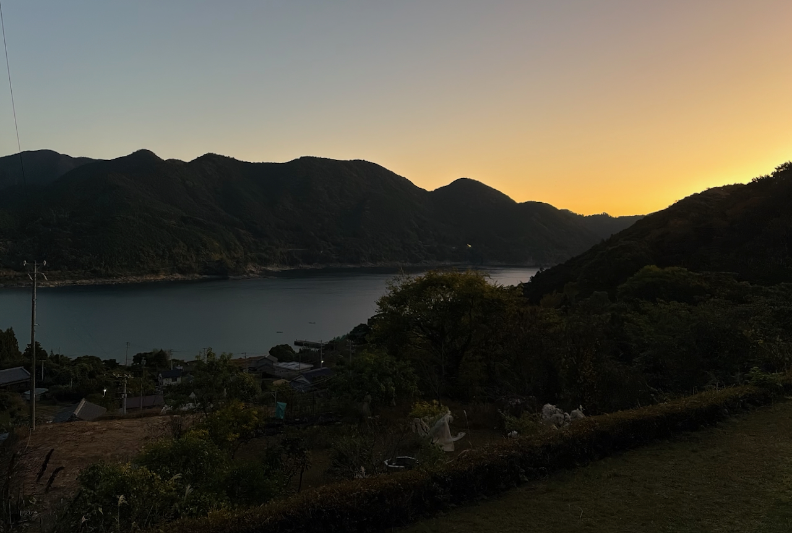

The last day and the final bit of hiking. After that, instead of walking along the beach for 25km, I'll take a quick train ride to Shingu. It's been an amazing couple of days but it's time to wrap this thing up.

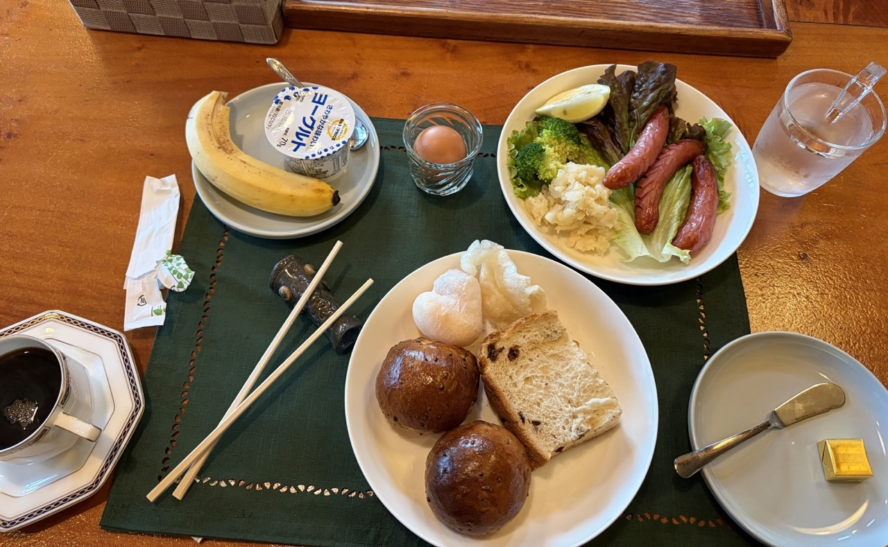

My host makes me a lovely and scrumptious breakfast with self-baked rolls and gives me rice and fruit for on the trail.

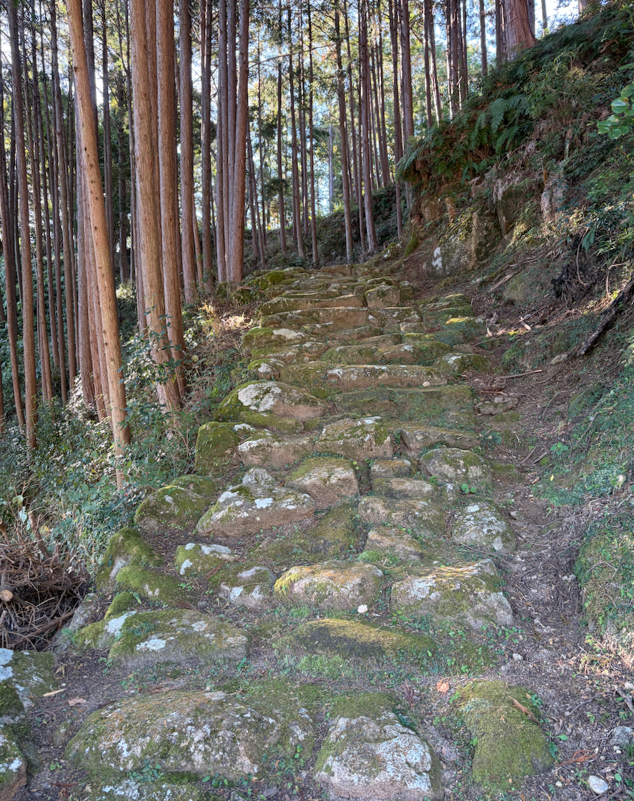

The first part is [Hadasu-no-michi](https://www.kodo.pref.mie.lg.jp/en/course/14.html), the road to Hadasu, and it's a breeze. At the top of a hill some animals come running at me which startles me until I realize it's just a chicken coop. I almost miss the exit to Hadasu which features the oldest Kamakura era stone path.

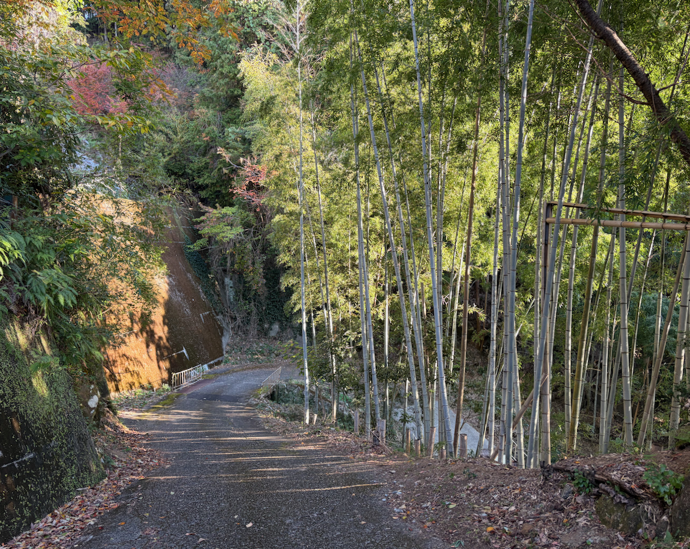

Then the next bit, [Obuki-toge](https://www.kodo.pref.mie.lg.jp/en/course/15.html), will be the real deal. The last ‘high’ pass with 300m of elevation. Not a huge amount, but still the equivalent of 1000 steps on the stairmaster.

The signage is scant here and the path is barely visible. I track along the stream trying to keep the GPS bearing. Down here between the trees it isn't that accurate but I manage to find something of a path going up.

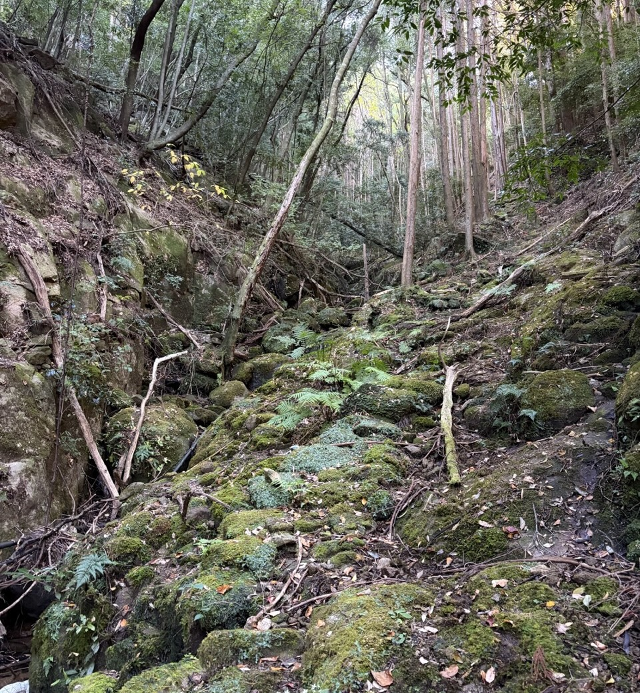

Then the overgrowth takes over and everything is covered by high ferns. I can't even see the rocks on the ground two steps further, let alone anything that at some point of time may have been a path. I don't know what else to do other than push in the general direction and bushwhack my way to the top. There the path picks up again and I see signs pointing to the pass.

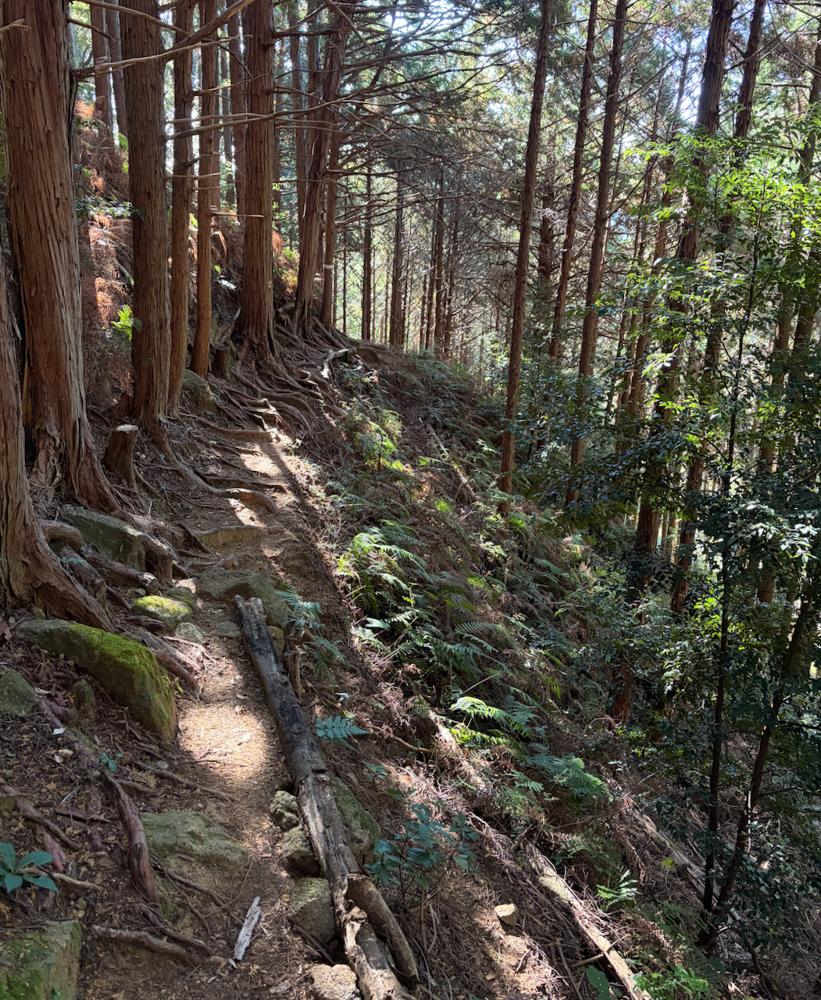

From then on it's a quick romp along a wall meant to fend off wild boars. This seems an odd place to do agriculture but otherwise these walls would not be there.

Walking is pretty easy by now. The trouble with hiking is that your body becomes conditioned after 5-7 days and from that point you want to do more and more of it. But usually the trip is over at that point and normal life kicks back in.

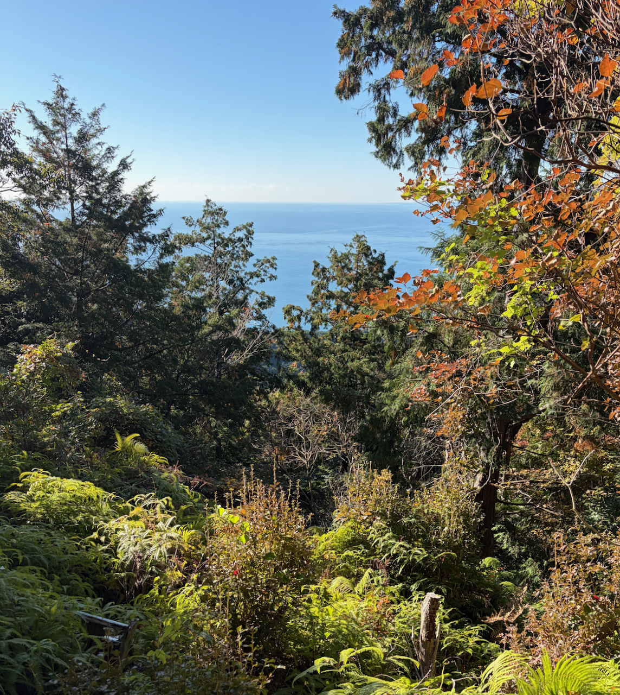

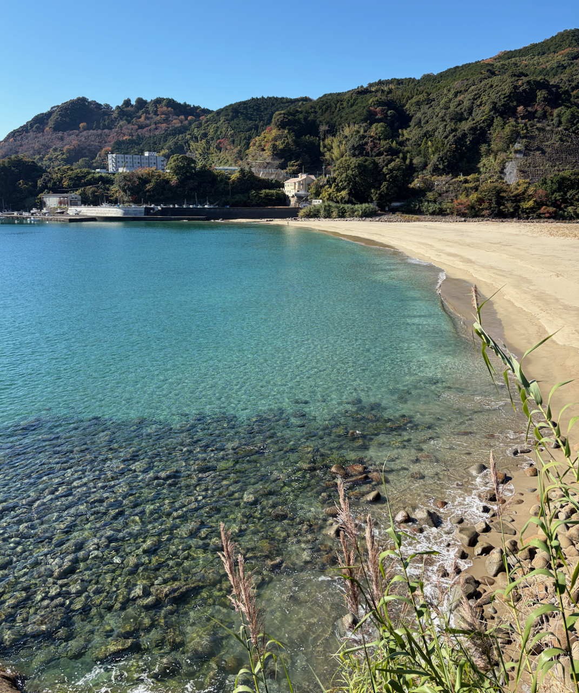

I come down at Odomari and am met by another amazing sight. The beach here is lovely and a dip in the ocean is a must. I strip and change into my swimming clothes on an entirely empty beach and plunge into the water. I brought my swimming trunks and a tiny towel specifically for this moment.

The water isn't even that cold and the first waves hitting my poor feet feel divine. The waves are strong and pull at me but I don't have time to go swimming.

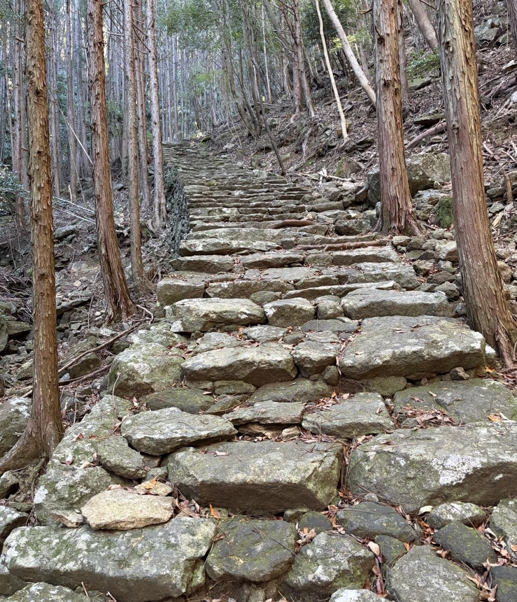

I dry up, circle around town and get ready for the last trailhead and the [Matsumoto-toge](https://www.kodo.pref.mie.lg.jp/en/course/17.html). This pass has 135m of elevation and no switchbacks. It will be over very quickly now.

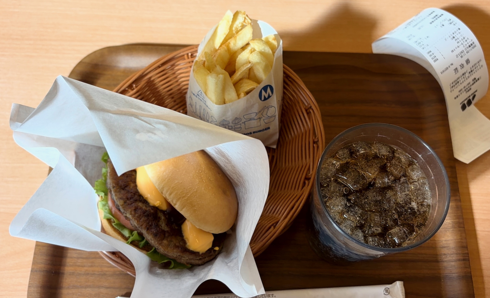

I go up and down and before I know it, I'm in Kumano pushing along a grim—not even beachfront—straight road. I shimmy to the Mos Burger for my lunch, then to [Chikotto](https://www.instagram.com/chikotto___) in front of the station for a coffee. It's a lovely place that has opened very recently.

Lovely that so many young people are trying new things here.

My train leaves and I get out at Shingu so I can already buy the train ticket for the last fast train to Nagoya at 17:31. There are more than a few foreigners here, mostly from the other Kumano Kodo routes, and station staff to help them work the ticket machines.

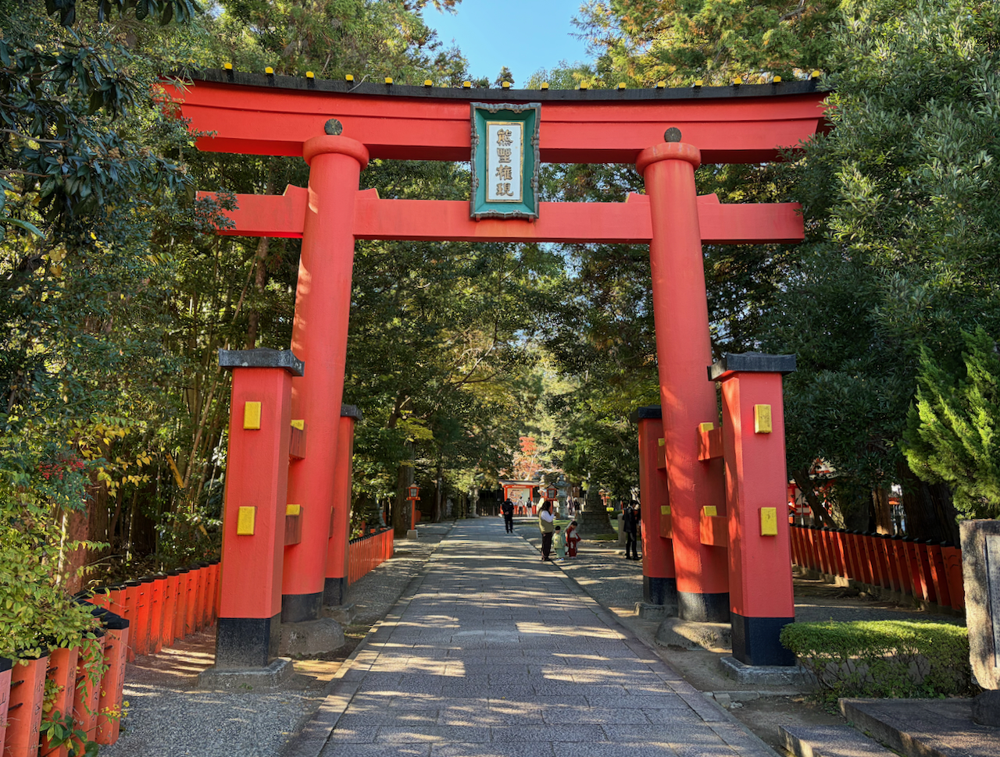

I quickly walk to the shrine, stand in line to clap my hands and buy an [ema](https://en.wikipedia.org/wiki/Ema_(Shinto)) with Yatagarasu on it. This shrine is big and very busy with people coming here from all over for all kinds of reasons. A family with children is dressed in traditional clothes receiving a blessing from the priest. Some Japanese people make a point of praying at each of the shrines. Tourists gather here to get their stamps and buy their souvenirs. But me, I'm done. Done!

Arriving in front of the shrine is a mixed feeling of accomplishment, being tired and somewhat elated and also of not really knowing what to do now. Walking here was something of a purpose and now that purpose is gone.

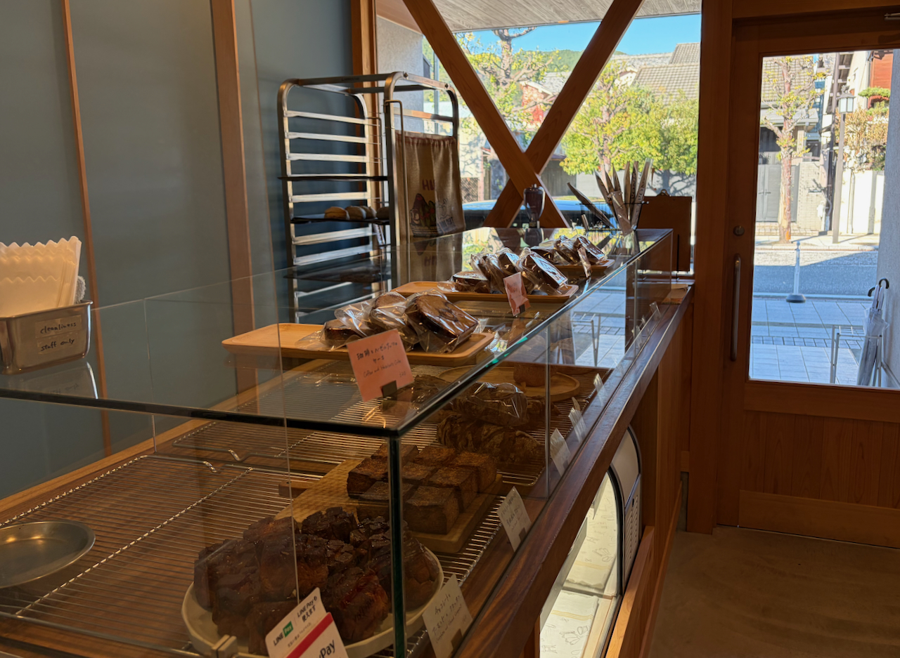

I walk around town a bunch but I'm not that hungry. I find a bakery, [Megane](https://maps.app.goo.gl/SbKTtgA7QKHSRqEN6), where they have a Marzocco machine and know how to use it. They serve me the best coffee I had so far on this trip and an incredible pastry. This place can stand the test with the best anywhere.

I try to find interesting souvenirs or a store where I can buy some fresh clothes, but come up empty on both counts. What is open is very sleepy and I'm done with walking. I find a cute takoyaki place, [Paso](https://maps.app.goo.gl/77EZtyYNwGEF7T2x7), on the other side of the tracks and I call it a day.

The stats for the day say 14.32km and some 30k steps ([strava1](https://www.strava.com/activities/16596439572), [strava2](https://www.strava.com/activities/16596642134)).

Sitting in the train to Nagoya then and seeing all those stations pass by that I walked through: Owase, Kiinagashima, Misedani. It makes for a weird mood. I've been at all of them over the course of days and now we roll the entire thing back in the span of a couple of hours.

The walk is done. I'm going on to Tokyo to complete this trip but I will be back. There is so much more Japan to be walked in my future.