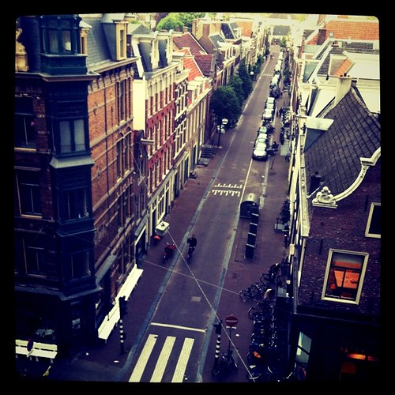
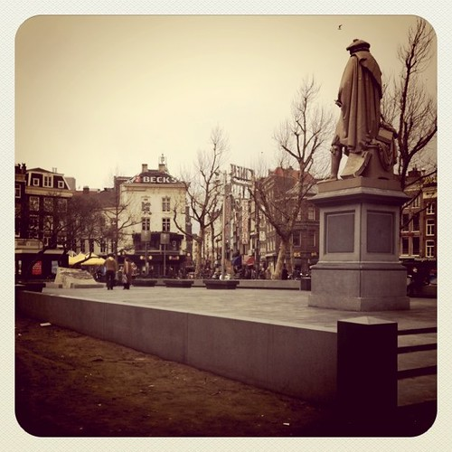
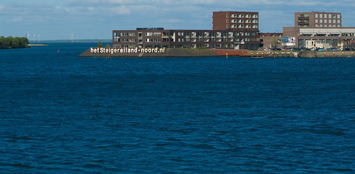

I'm right now reading [The Death and Life of Great American Cities](http://en.wikipedia.org/wiki/The_Death_and_Life_of_Great_American_Cities), the seminal volume on city planning by Jane Jacobs, for the first time.

The experience is a warm bath unlike any other. Reading the first part on ‘The Peculiar Nature of Cities’ I could not help notice the urban fabric everywhere around me realized by the people that make up the streets here in Westerpark, Amsterdam.

Then reading the second part ‘The Conditions for City Diversity’ brought home how and where those conditions are lacking currently in Amsterdam.

Reading this book was long overdue for me. So many of my own ideas about city planning and urbanism are mirrored, most probably from the osmosis and inspiration I have gotten from friends over the years. It is quite uncanny. But there is still a lot to learn from Jacobs's book and it should be compulsory reading for all council members of Amsterdam and other cities.

Two issues that are particularly striking right now:

### 1.

In chapter 13, ‘The Self-destruction of Diversity’, Jacobs talks about how when an area becomes diverse enough that it starts to attract people, the attraction and the increasing prices that generates may price out the very factors that made it attractive in the first place.

This is taking place right now in the central areas of Amsterdam. Most apartments are affordable only for the high double incomes or they are split up into rooms and let out to students and young professionals at a high markup. Along with the pressure that tourism puts on the city center and the lack of attractive areas outside of the A10 perimeter, this makes for high pressure on real estate prices. Where house prices are on the decline pretty much everywhere in the Netherlands, they are sharply on the increase in Amsterdam.

The issue as it is identified by Jacobs is that there is a high influx of people looking to live in Amsterdam but there are not enough attractive quarters for those people to choose from. This puts all the pressure on the city center, whereas vast spaces outside of the A10 perimeter are (rightly) considered unattractive. This is a blatant failing of city government to create a supply of attractive living quarters to service demand.

### 2.

Jacobs talks about ‘the need for primary mixed uses’ and ‘the need for aged buildings’ to create diversity. Those two needs make it abundantly clear why a city development such as [IJburg](http://en.wikipedia.org/wiki/IJburg) cannot be a worthwhile place to settle for the next thirty years.

First IJburg contains no necessity for people to go there except to leave the island for work in the morning and to go back home in the evening. Footfall is near zero. I myself have only been there three times maybe in the last two years (and that still is three times more often than most people in Amsterdam). That makes it dead and unattractive for stores and other facilities to open. Those that try, cannot make ends meet and usually close down again quickly making for a rapid succession of tenants and lots of empty storefronts.

Secondly, because it is all new development, rents are too high for many essential neighborhood facilities to take root. IJburg will not have a Turkish grocer or a coffee house because those kind of stores need older, more run down (and therefore cheaper) buildings to settle in. Moving there means giving up access to those tiny neighborhood stores and in fact on lively neighborhood life altogether.

One has to wonder, what were the architects, the council and the developers thinking (if at all)?

**Update:** Read more playful reflections on the pertinence of Jane Jacobs to the Dutch urban fabric over at Hubbub: [New ideas must use old buildings](http://whatsthehubbub.nl/blog/2011/07/new-ideas-must-use-old-buildings/)
