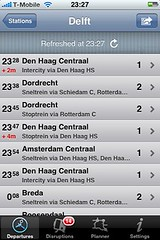

Ik was [gisteren dus op Radio Online](http://www.radio-online.nl/pivot/entry.php?id=1836) [^1] ( [audio](http://cgi.omroep.nl/cgi-bin/streams?/radio1/tros/radioonline/20090321-17.wma?start=25:21)) waar ik [een kritiek](/dingen/2009/03/de-ns-spant-het-paard-achter-de-trein/) mocht uiten tegen de strategie van de [NS](http://www.ns.nl) van het niet vrijgeven van de vervoersgegevens.

Corine van Drunen van de NS laat het na om in te gaan op de vragen die gesteld werden en maak zich er daarna van af door te verwijzen naar het feit dat de NS haar planmatige gegevens ter beschikking stelt aan 9292ov. 9292 is een gezamenlijke site van de vervoerders waar de gegevens in een bepaalde vorm worden ontsloten maar die niet een herbruikbare toegang tot vervoersgegevens biedt. Daarnaast zou het handig zijn om de dynamische reisgegevens (de actuele posities van vervoersmiddelen) te hebben maar in eerste instantie zouden we al blij zijn met de planmatige gegevens.

De tijd in de uitzending was te kort om tot de crux van het argument te komen en om de halve waarheden waar de NS zich ermee van afmaakt te weerspreken [^2], dus daarom schrijf ik hieronder het geheel uit. Misschien handig als je vervoerders tegenkomt en je wilt ze overtuigen van het belang van open reisgegevens.

### Open reisinformatie voor iedereen

Ik ben [webontwikkelaar](http://aardverschuiving.com/) en ik (en velen met mij) erger me al jaren aan de geslotenheid van de reisgegevens in Nederland. Wanneer we mensen erop aanspreken dan worden we meestal afgeserveerd met vage uitvluchten en halve waarheden. Ik vind dat onacceptabel en ik hoop dat meer mensen met me dat vinden en zich willen uitspreken.

Openbaar vervoer is een essentiele publieke dienst die de inrichting van onze leefomgeving kwalitatief beïnvloedt [^3]. Ik denk dat het belangrijk is dat de reisgegevens van het openbaar vervoer in Nederland vrij te gebruiken zijn en dat de huidige gesloten monopolistische situatie slecht en schadelijk zijn voor het innovatie- en leefklimaat in Nederland.

Aanleiding voor dit item was de [nieuwe reisplanner “Reisplanner Extra”](http://www.marketingfacts.nl/berichten/20090318_ns_reisinformatie_nieuwe_stijl_met_videoreview/) die de NS heeft laten ontwikkelen. Dit is een een mobiele Java-applicatie waarmee je de actuele reisgegevens op je mobiele telefoon kan opvragen.
Ik heb de Reisplanner Extra niet geprobeerd omdat deze niet werkt op mijn iPhone [^4] en dat is meteen ook het probleem.

**Probleem:** De NS kan niet voor elk platform en voor elk denkbaar gebruiksdoel toepassingen aanbieden.

Dit is ten eerste al ondoenlijk omdat de hoeveelheid tijd en geld die het de NS kost om één toepassing te maken redelijk groot zijn. Het schijnt dat de ontwikkeling van de Reisplanner Extra [een jaar heeft gekost](http://www.marketingfacts.nl/berichten/20090318_ns_reisinformatie_nieuwe_stijl_met_videoreview/#comment_box_105549) en ik wil niet eens weten hoeveel geld ermee gemoeid is geweest. Hierdoor kan de NS alleen maar voldoen aan de wensen van de grootst mogelijke groepen gebruikers.
En dan nog: als het een jaar duurt voor we ook een iPhone (en Windows CE, Blackberry, Palm Pre etc.) versie mogen verwachten dan schiet het niet echt op.

Daarnaast zijn er meer gebruiksdoelen dan we op dit moment ook maar kunnen beginnen te verzinnen. Misschien wil je op je eigen website een reis kunnen plannen of in [iGoogle](http://www.google.com/ig), of misschien wil je op je desktop een Gadget met daarop de volgende 5 treinen die vertrekken vanaf jouw station, misschien wil je een deel van het schema projecteren op een scherm in de publieke ruimte of misschien wil je de planner doorlichten om te zoeken naar scheve verhoudingen [^5].

Ik verzin deze gebruiksdoelen net zelf in vijf minuten maar de hoeveelheid creativiteit die mensen hierop los kunnen laten als de gegevens vrij zijn is potentieel gigantisch. De meeste toepassingen zullen niet de moeite waard zijn voor de NS om te bouwen, maar als een kleine groep mensen het zinnig vindt en het zelf wil doen, waarom niet?

**Oplossing:** Het vrijgeven van de reisgegevens (in eerste instantie planmatig maar daarna ook dynamisch) in een herbruikbaar helder formaat onder redelijke en vrije voorwaarden. En als problemen dat in de weg staan, duidelijk maken welke problemen dat zijn en hoe we kunnen samenwerken om deze op te lossen.

Het is nu al mogelijk om toepassingen te bouwen op de site van de NS (zie [Trein.app](http://www.naquah.net/trein/)) maar de moeite die je moet doen is te hoog en de onderhoudbaarheid is laag. Er is op dit moment teveel toewijding nodig om applicaties te bouwen.

Het vrijgeven van de gegevens zou de barrière om iets te maken bijzonder verlagen. Ik ken een [hele groep mobiele ontwikkelaars](http://amsterdam.mobiledevcamp.eu/) die zitten te springen om deze gegevens [^6] en er zijn nog veel meer mensen die nog niet eens weten wat voor coole dingen ze zouden kunnen doen.

Vaak noemen de vervoerders het kosten-argument waar het de reisgegevens betreft. Ze spreken ook vaak hun teleurstelling uit toen bleek dat reizigers niet bereid waren te betalen voor vervoersinformatie toen ze wat initiatieven lanceerden op [9292ov](http://www.9292ov.nl/). Nu is dat niet zo gek. Reizigers betalen al voor hun kaartje [^7] en ze zouden wel gek zijn als de dan ook nog eens gaan betalen om te weten waar en wanneer hun vervoersmiddel vertrekt. In elke redelijk opvatting hoort reisinformatie een integrale bij een reis horende dienst te zijn.

Het vrijgeven van vervoersinformatie is goed zijn voor iedereen.

**Voor ontwikkelaars**, omdat ze makkelijker toepassingen kunnen ontwikkelen en daar bekendheid en/of geld mee kunnen verdienen. De NS zou het niet erg moeten vinden als derde partijen met hun gegevens geld verdienen op bijvoorbeeld de [App Store](http://www.apple.com/iphone/appstore/). Het maken van een goede applicatie en het onderhouden ervan kosten tijd en moeite waar best een serieuze financiele vergoeding tegenover mag staan.

**Voor gebruikers**, omdat ze potentieel makkelijker en op meer manieren toegang kunnen krijgen tot vervoersinformatie dan dat nu het geval is.

**Voor de NS**, omdat ze zonder veel extra moeite veel meer mensen kunnen bedienen van vervoersinformatie waardoor de reiservaring verbetert en ze meer kaartjes verkopen en meer treinreizigers behouden.

In de huidige situatie waarin de NS de vervoersgegevens voor zichzelf houdt verliest iedereen [^8]. Kunnen we daar geen verandering in brengen?

[^1]: Ik mocht het van tevoren niet echt Twitteren wat ik toch een beetje gek vind.
[^2]: Geef me een half uur met één van die mensen…
[^3]: Zie ook [The Streets](http://streetsblog.net/) blog.
[^4]: De iPhone heeft geen Java Runtime Environment en het ziet er niet naar uit dat deze in de nabije toekomst erop zal komen.
[^5]: Waarom stoppen intercity's hier en niet daar? Wat heeft dat voor gevolgen voor de reistijden? En meer van dat soort vragen.
[^6]: We keken ook bijvoorbeeld naar [Google Transit](http://www.google.com/transit) waar ze met plezier one reisgegevens op een gebruiksvriendelijke manier zouden ontsluiten. Als je kijkt op hun dekkingskaart zie je dat er Noord-Afrikaanse landen zijn die op ons voorlopen en dat wij samen met Oost-Europa één van de weinigen in Europa zijn die nog geen dekking hebben.
[^7]: En alle vervoerders zijn toch gesubsidieerd door de overheid? Dat zou betekenen dat we al dubbel betalen (belastingen én kaartjes) aan de vervoerders en ze nog meer geld willen zien.
[^8]: Als ik dan toch in de toekomst moet kijken dan weet ik zeker dat over 10 jaar of desnoods over 50 jaar deze gegevens wél vrij zullen zijn. Waarom dan nog wachten en in de tussentijd onze innovatiepositie laten verslechteren en iedereen die met openbaar vervoer te maken heeft in Nederland benadelen?
