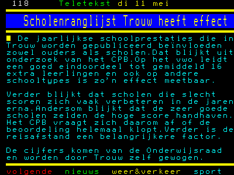

Last week we had this piece of news in the Netherlands: [“Scholenranglijst van Trouw heeft effect”](http://nos.nl/artikel/156731-scholenranglijst-van-trouw-heeft-effect.html) (School ranking by Dutch newspaper Trouw sorts effect):
[Trouw](http://www.trouw.nl) has a database on their website with the statistics from our board of education which they editorialize and republish on their [Schoolprestaties](http://www.trouwcommunities.nl/onderwijs/schoolprestaties.html) site. The news piece reports on research that shows this ranking has a real effect both in prospective school choice and in school improvement.

This week [BERG](http://www.berglondon.com) release their [Schooloscope](http://www.schooloscope.com/) (formerly [Ashdown](http://berglondon.com/blog/tag/ashdown/)) site that makes statistics about school quality accessible. The [story about how it works](http://hello.schooloscope.com/howitworks/) is particularly worth reading. The entire thing is a beautiful work of insight.

The Guardian has [a profile of BERG's work and about Schooloscope](http://www.guardian.co.uk/media/pda/2010/may/13/schools-data-schooloscope-design) and it raises the question if there is no end to the goodness that will come from [the 4ip funds](http://www.guardian.co.uk/media/pda/2009/jun/01/channel4-research).

The [Trouw school site](http://www.trouwcommunities.nl/onderwijs/schoolprestaties.html) we have, though it could have been more beautiful, more legible and more open, does get the job done quite well.

But I'm reminded of the concept we made for a school search engine using government data: [Schoolvinder](http://www.schoolvinder.nl/) (with [many similar goals](http://www.schoolvinder.nl/over/): to remove jargon and to make school information accessible and beautiful). We applied for a grant to further improve that site, but that was awarded to another party from whom we have not seen any results since.
