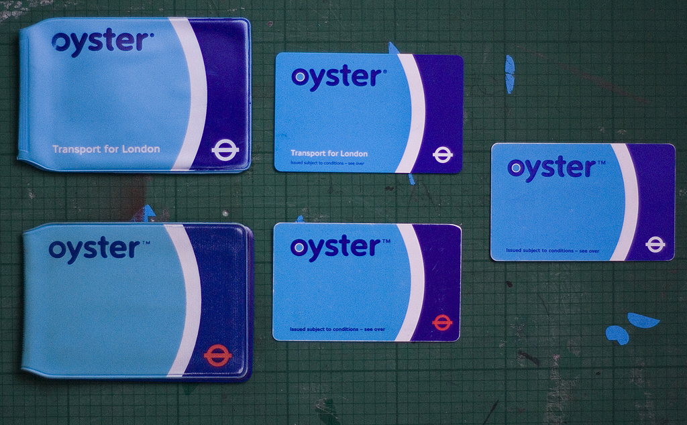
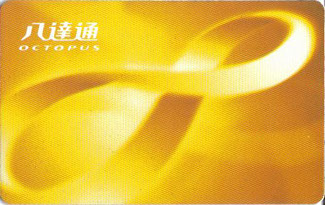

Just saw this picture of the Wellington RFID farecard system at [Adam Greenfield's Flickr stream](http://www.flickr.com/photos/studies_and_observations/) ( [CC-by-nc-sa](http://creativecommons.org/licenses/by-nc-sa/2.0/deed.en_GB) photograph):

It's called a [Snapper card](http://en.wikipedia.org/wiki/Snapper_card).

Compare this to the London based [Oyster card](http://en.wikipedia.org/wiki/Oyster_card):

And the Hong Kong [Octopus card](http://en.wikipedia.org/wiki/Octopus_card):

This international sea food theme makes me think that we have definitely missed a branding opportunity here (and this for a country of fishermen). Our entire [OV-chipkaart system](http://en.wikipedia.org/wiki/OV-chipkaart) [^1] has been grossly underdesigned on all fronts, so no surprises there [^2].

So I've got two proposed alternative names for our low countries farecard system:

- **Herring card** ( _Haringkaart_)

or
 - **Mussel card** ( _Mosselkaart_)

How do we get this change implemented? And anybody care to mockup a concept?

[^1]: How stupid is it to put the implementation detail of the ‘chip’ in the name?
[^2]: You currently have the messages in the tram: “Don't forget to check out with your public transport chip card.”These are a bit awkward.
