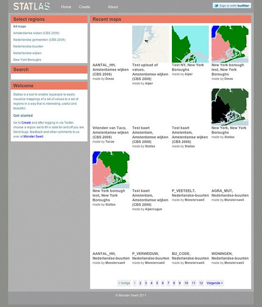

We zijn al een tijdje bezig met [Statlas](http://statlas.nl) en het is de hoogste tijd dat een eerste versie het daglicht ziet om te laten zien wat voor iets tofs we hebben gemaakt en te horen wat jullie ervan vinden. Dus voor jullie ogen: [Statlas](http://statlas.nl)

Statlas is een gereedschap voor iedereen die makkelijk kaarten wil kunnen maken, en verspreiden. Voor een verzameling regio's kun je waarden invullen (cijfers, kleuren, labels) en er wordt dan een kaart gemaakt die je vervolgens kunt delen, embedden en afdrukken. Een persoonlijk kartografisch platform waar er al meerdere van zijn maar volgens ons nog niet één die zo makkelijk is in het gebruik als deze.

We hebben Statlas gemaakt naar aanleiding van [experimenten vorig](http://monsterswell.com/blog/category/projects/dutchstats/) jaar om geografische gegevens op het internet weer te geven. Die ideeën maar dan generieker en simpeler (en bedoeld als gereedschap) hebben geculmineerd in Statlas. Dit past tegelijkertijd ook in de [NoGIS](http://blog.geoiq.com/2011/03/29/what-does-nogis-mean/) trend om traditioneel moeilijke technologie zoals [GIS](http://nl.wikipedia.org/wiki/Geografisch_informatiesysteem) te ontsluiten via het internet.

Verder praten we met [Hack de Overheid](http://hackdeoverheid.nl) geregeld over data-journalistiek, maar waar we steeds tegenaan lopen is dat er niet genoeg gereedschappen zijn waarmee journalisten en andere niet-techneuten uit de voeten kunnen. Wij zeggen dan telkens dat die gereedschappen er gaan komen maar de beste manier om dat voor elkaar te krijgen is uiteraard om ze zelf te bouwen.

Statlas is gebouwd met financiering van het [Stimuleringsfonds voor de Pers](http://www.stimuleringsfondspers.nl/), in samenwerking met Fluxility en Alexander Zeh en is uiteraard [open source](https://github.com/MonsterSwell/Statlas). Voor volledige credits, zie [het colofon](http://statlas.nl/about).

### En verder

Deze versie voldoet aan alles wat je zou willen hebben van een simpel stuk gereedschap. We hebben natuurlijk allerlei ideeën om dit technisch voortreffelijker en functioneel spectaculairder te maken maar dit is het fundament. Laten we eerst maar zien welke van onze ideeën het contact met de werkelijkheid overleven en dan wordt vanzelf de richting voor verdere ontwikkeling duidelijk.

Wat er in ieder geval aan toegevoegd gaat worden zijn meer regio's. Er zitten er nu een handjevol in en meer staan er gepland. Verzoeken voor nieuwe gebieden (het liefst met een idee ook waar we de geometrie kunnen vinden) maar ook andere ideeën, bugs enz. zijn welkom [bij ons op Monster Swell](http://monsterswell.com/blog/contact/).
