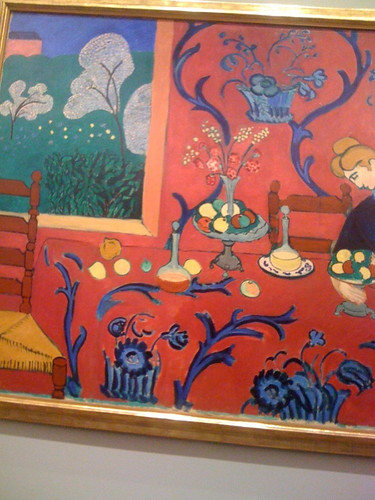

I went to the penultimate day of the [Matisse to Malevich exposition](http://www.hermitage.nl/en/) in the Amsterdam Hermitage for some visual inspiration.

Stunning works by Matisse, especially his red room:

Not much a fan of the inbetweenist fauvist works on display, though most of them looked nice. The various Picassos strewn about were a welcome distraction.

Like [I tweeted](http://twitter.com/alper/status/24657058159), you have all this colour and style and visual artistry, and then you get: [Malevich](http://en.wikipedia.org/wiki/Suprematism). [Black Square](http://en.wikipedia.org/wiki/File:Malevich.black-square.jpg); game, set and match.

Hard to imagine a bigger “Fuck you!”
