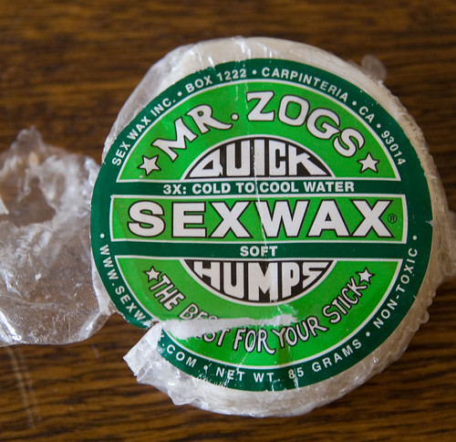

We had an excellent summer last year surfing on and off on Scheveningen as the waves allowed. This year has been mostly flat, but we had some waves a week ago and end of this week promises some nice swell, so surf is up.

It's nice to have a surf spot this easily accessible, but I'm curious how surfing in real waves is [^1]. So this July we'll be headed off to Aquitaine or Basque country for a week to check the waves over there.

[^1]: I started out on the North coast of Spain.
