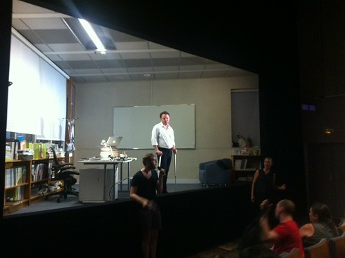

In the performance [“Ten Billion”](http://www.festival-avignon.com/en/Spectacle/3366) at La Chartreuse de Villeneuve-lès-Avignon Stephen Emmott, a scientist, performed a soliloquy about the state of the world and the environment. He took a message we already have known since the [Club of Rome](http://en.wikipedia.org/wiki/Club_of_Rome) and rehashed that in front of a theater audience over the course of ninety minutes.

Standing in a reproduction of a contemporary scientist's office, Emmott did a reasonable [Al Gore](http://en.wikipedia.org/wiki/An_Inconvenient_Truth) impersonation. He monotoned a large barrage of numbers supplemented by custom projections with moving graphics and graphs. The entire thing was put together to a high standard but that did not prevent it from devolving into a standard university lecture. Emmott stood there saying mostly: “Look at me. Aren't my numbers big!?”

The performer started by disclaiming that he is not an actor but a scientist. That needn't be a big problem. For this kind of non-fiction presentation having actual knowledge about the topic is much more valuable than any kind of acting skills you could bring to the table. The piece then only came alive in those moments where Emmott made some off the cuff remarks or recounted a personal experience. Techniques from page zero of [Presentation Zen](http://www.presentationzen.com/) that weren't used (intentionally?).

Targeting this kind of broad audience, it turns out it is altogether too easy to fall into the trap of patronization. ‘We may not have heard’ some things, discounting that we may have and simply reached different conclusions about them. I'm not detracting from the truth or importance of the message presented. In the Q&A afterwards some people influenced by Russian propaganda in fact disagreed. This is a message that bears repeating, but for those that already know it, this play does not offer anything new. Scaremongering does not seem the best way to get people to act where earlier scaremongering has failed.

I have been thinking about the possibilities of collapse and [thrivability](http://thrivable.net/) myself recently and I came upon [this model by Venkatesh Rao](http://www.ribbonfarm.com/2012/03/22/can-hydras-eat-unknown-unknowns-for-lunch/) that I think very effectively captures many of the things we are trying to do with society. Faced with uncertainty, the most rational outcome is to create social/economic structures that feed on that uncertainty to become more resilient. I agree with Emmott that many of the global systems currently are too fragile, but that is a solvable problem.

Emmott himself discussed the two solutions in the top quadrants: behaviour change (the Spore narrative) and technological progress (the Hydra narrative). He dismissed both rather summarily. So the play consists of presenting an audience somewhat convincingly with a well-known fact and then not giving them an actionable solution. All this in the hope that people will be so disconcerted that they will become wholesale activists when they get home.

This seems something of a leap of faith to me stemming from a partial understanding of the underlying problems. Emmott said that he did not know why people faced with these insurmountable truths do nothing. Current thinking on cognitive theory, communications and behavioural economics quite competently explains this behaviour. If you ignore that, you may well throw up your hands into the air and reach the conclusion Emmott reaches (the Dark Euphoria narrative): that anything we attempt right now will either not work or be too late.

I'm an optimist myself out of necessity, but not a ‘rational optimist’ as described by Emmott. I count on the pools of irrational illegibility both in the world's systems and future developments to work together cushioned by social measures and capitalist balancing of supply and demand. When talking about Hydras we are not talking about purely technological solutions (that are indeed easy to dismiss), but about a complex set of systems in media, politics, science, technology and the arts that work together in blind concert to deal with system problems. It may not be pleasant, but it is too early for despair.
