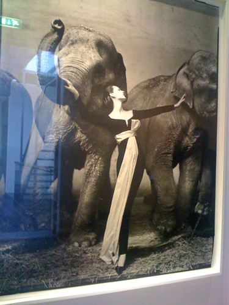
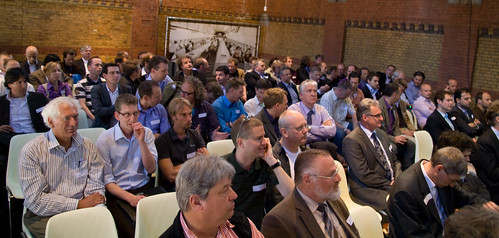
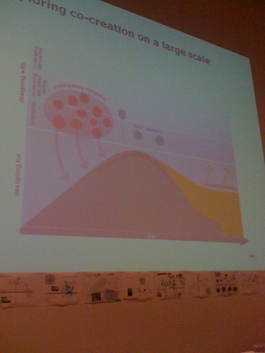
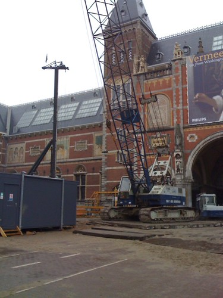
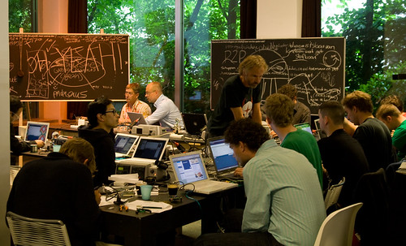

Tuesday morning I went to [foam](http://www.foam.nl/) to see the last couple of days of the [Avedon exhibit](http://www.foam.nl/index.php?pageId=11&tentoonId=153) and I'm glad I did. Spectacular work! The exhibit is done in Amsterdam, but maybe you can catch it somewhere else ( [tweet](http://twitter.com/alper/status/1772542875)) [^1]? It is very much worth it.

Then I went to report on an event about practical applications of OpenID. The event was heavily suit oriented which struck me as interesting. My [report in Dutch](http://www.frankwatching.com/archive/2009/05/16/openid-nu-eindelijk-in-de-praktijk/) is posted on Frankwatching ( [tweet](http://twitter.com/alper/status/1795626014)).

Wednesday morning was filled with a symposium on Context Mapping at the local faculty of Industrial Design ( [tweet](http://twitter.com/alper/status/1782532481)). Interesting collection of people and great content on the topic ( [tweet](http://twitter.com/alper/status/1782671090), [tweet](http://twitter.com/alper/status/1782780565)). I picked up the thesis [“Brining the every day life of people into design”](http://www.contextqueen.nl/23/thesis.html) by [Froukje Sleeswijk Visser](http://www.contextqueen.nl/) ( [tweet](http://twitter.com/alper/status/1783191640)).

Friday morning had a ridiculously early start ( [tweet](http://twitter.com/alper/status/1803311886)) at the Rijksmuseum for a [‘hard hat tour’](http://www.rijksmuseum.nl/hardhattours?lang=nl). It is interesting enough to see the construction and reconstruction from the inside. The reconstructed artwork is quite beautiful and I'm anxious to see the end result. For some of my friends this was the first time they had ever set foot in the building at all (which is a shame), and this will stay the only opportunity for the following year or five.

After more coffee (like I said, it was an early start), it was off to the soldering irons at [Mediamatic](http://www.mediamatic.net/) for [the RFIDuino workshop](http://www.mediamatic.net/page/77611/en) given by [Marc Boon](http://marcboon.com/). After a lot of fidgeting and my first real soldering experience in I think 15 years, some of us managed to build a working RFID shield for their [Arduinos](http://arduino.cc). Lots of unpredictable behaviour ( [tweet](http://twitter.com/alper/status/1806211435)) though [^2].)). Where is that post-mortem debugger with hot code replace for your hardware setup?

[^1]:  [At the SF MOMA](http://www.sfmoma.org/exhibitions/384) from July 11th until November 29th.
[^2]: Mine still doesn't work reliably which we attribute to the weak USB power supply coming from my Macbook ( [tweet](http://twitter.com/alper/status/1806369202
