Here are my notes from a couple of weeks of drinking coffee in Tokyo on a fact finding mission for [Cuppings](http://www.cuppin.gs/). With Cuppings we try to give you a guide of the best coffee places around the world based on our personal tastings. Some notable locales are still not as well represented as they should be. London and New York have their own excellent guides for coffee with [Oliver Strand's Coffee App](http://www.nytimes.com/interactive/2010/03/09/dining/20100309-new-york-coffee-map.html) and [the London Coffee Map](http://www.thelondoncoffeemap.com/). Tokyo is one place that I thought we should fill in.

I had picked my hotel to be on the right side of the city to be off to a running start so I could visit places right from the very first day. So landed at Narita, got my Mifi and while waiting to checkin I made my way to.

### Little Nap Coffee Stand

I had a quick lunch and walked to the Little Nap Coffee Stand ( [checkin](https://foursquare.com/alper/checkin/5226bc7911d26db929daa653), [tip](https://foursquare.com/item/523f317911d2a15c3f2021b5)) which I had seen a video of over at [My First Coffee](http://myfirstcoffee.com/daisuke-hamada/) and was totally smitten with. As promised the store was beautiful and the coffee was excellent.

[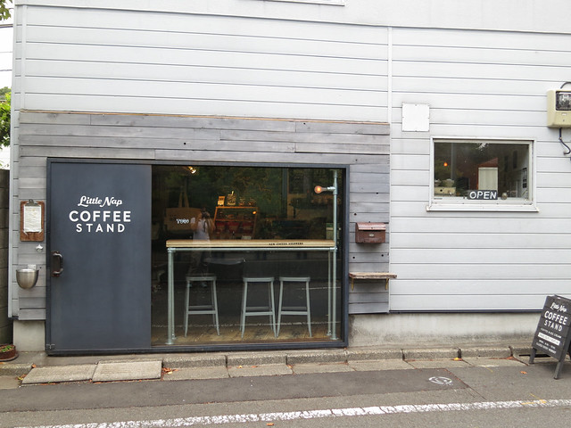](http://www.flickr.com/photos/alper/9691207407/ "Store by illustir, on Flickr") [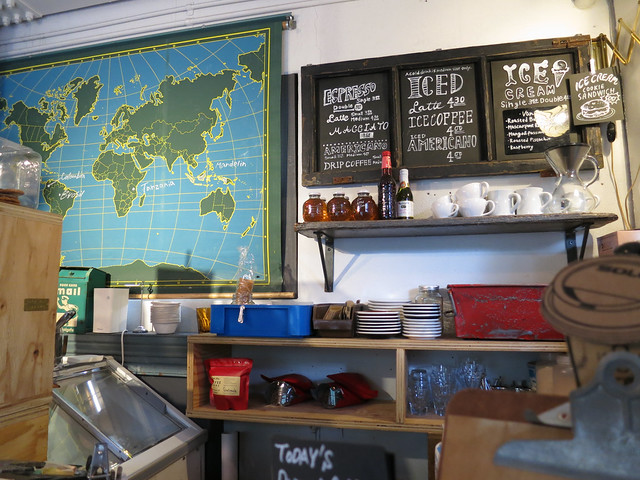](http://www.flickr.com/photos/alper/9691198097/ "Little Nap by illustir, on Flickr")

### Fuglen Tokyo

Then I walked over to this place recommended to me by Companion Coffee. This Fuglen ( [checkin](https://foursquare.com/alper/checkin/5226c45a498edd87cbb2af6d), [tip](https://foursquare.com/item/5226c9aa11d2bbf43d897e3c)) is a sister to a store by the same name in Oslo [^1]. This place turned out to be more of a cafe with an event program and cocktails in the evening and a diverse group of Japanese people and expats hanging around with laptops during the day.

[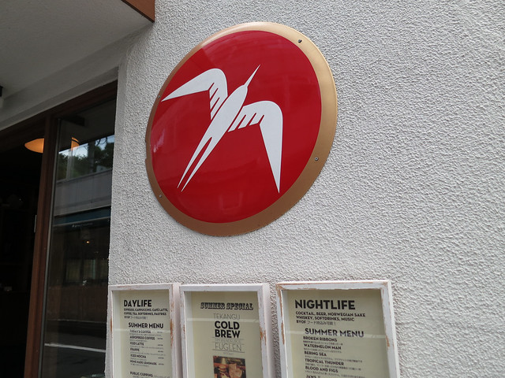](http://www.flickr.com/photos/alper/9694445418/ "Fuglen by illustir, on Flickr")

The decorations are lush Nordic wood and the [Kalita Wave](http://prima-coffee.com/kalita/wave-dripper) pour over that I had was terrific.

[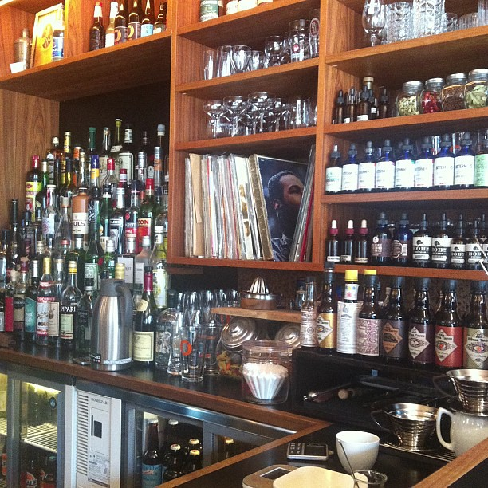](http://www.flickr.com/photos/alper/9670929250/ "Mixology and coffee makes a good combination here in Fuglen. Just had my first Kalita Wave. by illustir, on Flickr")

### Omotesando Koffee

 [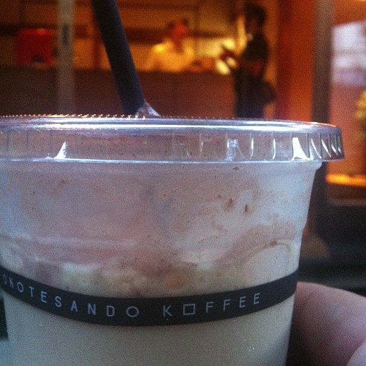](http://www.flickr.com/photos/alper/9671786162/ "I think I am going to cry. No kidding. by illustir, on Flickr")

Then after some more walking around at the end of the day I finally hit the promised place: [Omotesando Koffee](http://ooo-koffee.com/) ( [checkin](https://foursquare.com/alper/checkin/5226f2b511d230f590992b0f), [tip](https://foursquare.com/item/5226f9ff498e2e7b0a2fd217)) which had been recommended to me by countless people and where [Eiichi Kunimoto](http://myfirstcoffee.com/eiichi-kunitomo/) practices his craft. I had an iced cappuccino here because —what I hadn't counted on— the weather was extremely pressing and it was rainy humid and very warm all day. It stayed that way for most of my stay.

[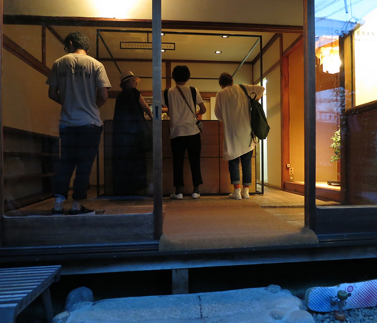](http://www.flickr.com/photos/alper/9694505602/ "Omotesando Koffee by illustir, on Flickr")

The iced cappuccino at Omotesando is more of a milkshake like concoction with the espresso shot put into a blender along with some ice and milk, the result is poured out into your cup and sprinkled with —I think— cinnamon. Drinking this at that moment in the idyllic garden of Omotesando was a near religious experience and felt like the best coffee I have ever had. I returned to Omotesando a number of times during my visit for the coffee, the amicable staff and the quiet ambiance of its garden.

[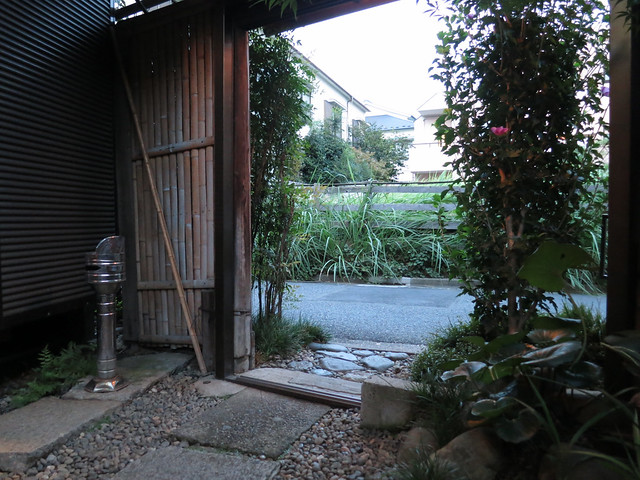](http://www.flickr.com/photos/alper/9691275023/ "Omotesando Garden by illustir, on Flickr")

### Bear Pond Espresso

The next day I walked from my hotel to Shimokitazawa, a 20 minute saunter in the heat through the quiet residential area of Hatagaya. I don't have any pictures of Bear Pond ( [checkin](https://foursquare.com/alper/checkin/5227f3dc11d210c7f3f1f6dc), [tip](https://foursquare.com/item/5227f87711d299a9583770c2)) because of their policy but this was the other summit of my Tokyo coffee experience.

Katsuyuki Tanaka (and Eiichi Kunimoto of Omotesando) are very different and have a totally different style of coffee and shop but both elevate making coffee to a level which can only be called artistry.

The ambiance at Bear Pond is slightly forbidding but with the American radio playing it is rather easy to unwind on one of the stools and wait for your espresso to be served. That espresso when it comes out is one of the shortest shots you have ever drunk and probably also one of the most intense.

I ordered an espresso on an empty stomach which I normally never do because it gives me problems. But this espresso was so smooth that not only did my stomach not get upset, it was so delicious that I chased it with another one. With the reduced quantity it becomes something of an effort to get every last bit of taste out of the cup.

I brought back a bag of Bear Pond's house blend ‘Flower Child’ and even when made in Berlin (by the heroes of [Companion Coffee](http://www.companioncoffee.com/)) after two weeks, it still had that characteristic deep chocolate like flavour.

### Cafe Obscura

 [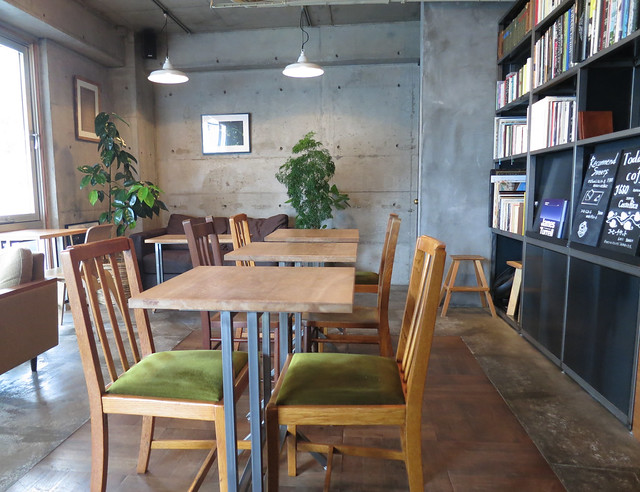](http://www.flickr.com/photos/alper/9715525281/ "Cafe Obscura by illustir, on Flickr")

The next stop was Cafe Obscura ( [checkin](https://foursquare.com/alper/checkin/52280a9711d2e907a32e54c5), [tip](https://foursquare.com/item/523f33a111d2cd495848f022)), a somewhat out of the way place with lots of nice leather sofas and good siphons on offer. Obscura also have a laboratory which I skipped in favor of this place. The siphon coffee is expertly made and really good.

[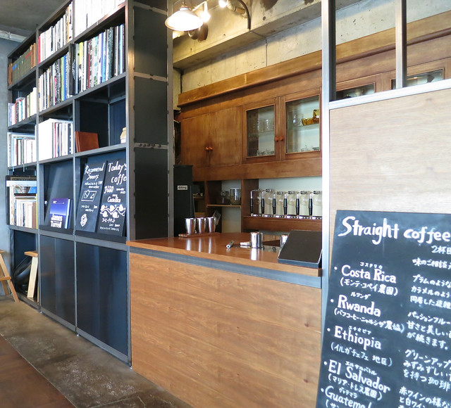](http://www.flickr.com/photos/alper/9715527617/ "Siphon Bar by illustir, on Flickr")

### Nozy Coffee

Then it was a quick visit to Nozy Coffee ( [checkin](https://foursquare.com/alper/checkin/52281c8911d299a9592c843d), [tip](https://foursquare.com/item/523f33d411d2c579dc6734dd)) which is a small but very nice looking coffee place. I had a solid cappuccino and saw that they have lots of beans on offer. Unfortunately I had no time to come back and bring some of these with me, but this place is one to look out for.

[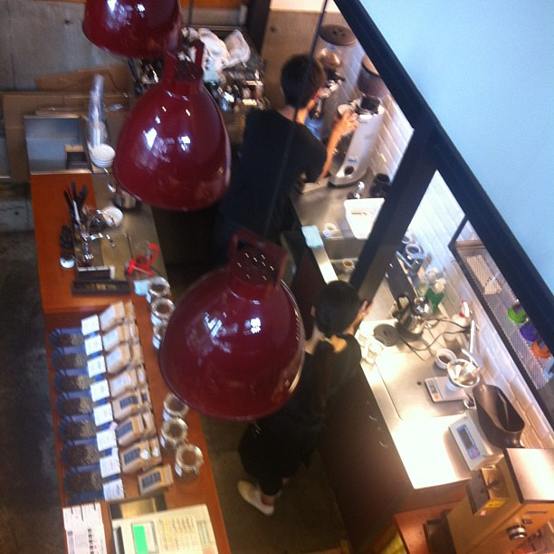](http://www.flickr.com/photos/alper/9678558916/ "Nozy Coffee has a terrific selection of beans by illustir, on Flickr")

### Be A Good Neighbor (Sendagaya)

 [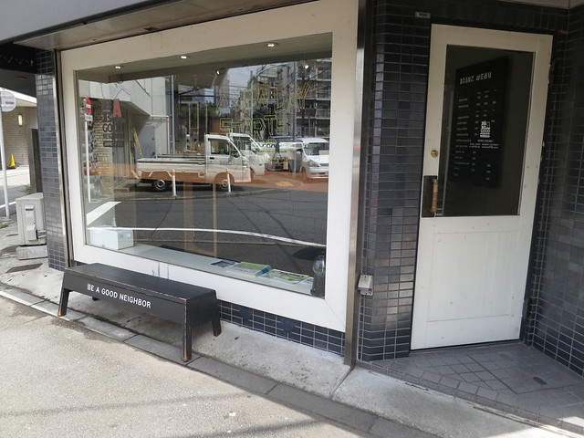](http://www.flickr.com/photos/alper/9720770031/ "Be A Good Neighbor by illustir, on Flickr")

The following day started out at the tiny [Be A Good Neighbor](http://beagoodneighbor.net/) ( [checkin](https://foursquare.com/alper/checkin/52295f2511d28d28674dabe6), [tip](https://foursquare.com/item/523f3469498e8f61b10103b6)) store in Sendagaya. The cappuccino and the cake were both excellent and the barista was very helpful in offering tips about where to get more coffee. Especially useful was his pointer to Paddlers which I started the next day with.

[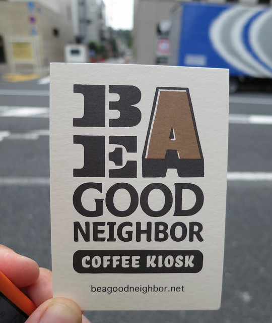](http://www.flickr.com/photos/alper/9720778045/ "Be A Good Neighbor by illustir, on Flickr")

### Streamer Coffee Company Shibuya

 [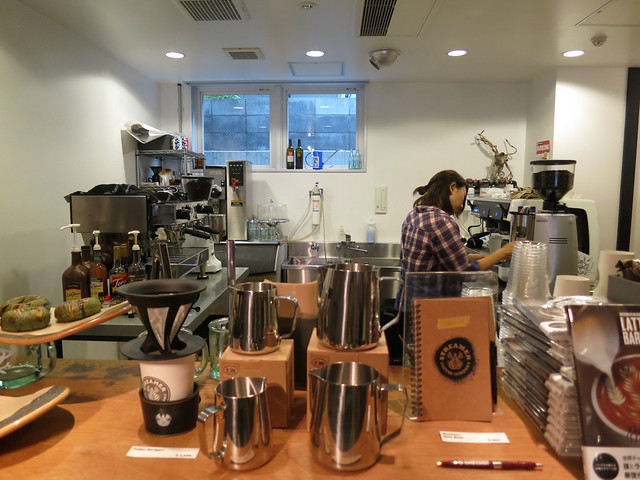](http://www.flickr.com/photos/alper/9720786157/ "Streamer by illustir, on Flickr")

I then walked on to Shibuya to try the coffee at Streamer ( [checkin](https://foursquare.com/alper/checkin/5229663e11d239b5df0b298f), [tip](https://foursquare.com/item/523f34b4498edcd763cdb902)). The type of coffee which they serve here and which I had is a latte. I normally don't drink them but in the light of trying out the coffee as it is being served locally I had one. Shockingly this was the first place in Tokyo I encountered where the coffee was not fantastic.

[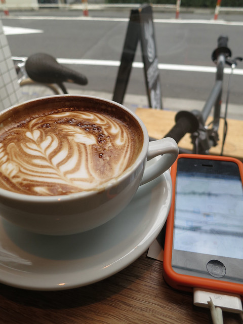](http://www.flickr.com/photos/alper/9720800227/ "Charging by illustir, on Flickr")

What Streamer does do really well is to be a nice place to hangout. There were lots of people in the store with and without laptops having a great time and relaxing which is exactly what I did as well.

[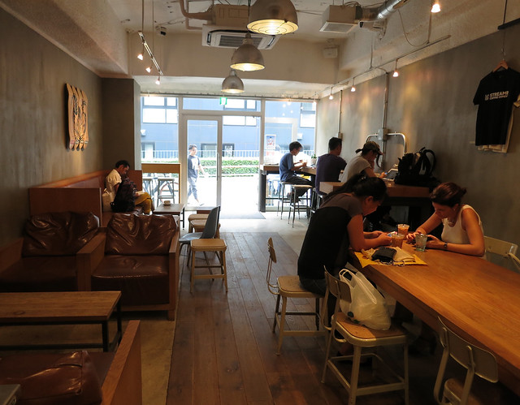](http://www.flickr.com/photos/alper/9720793547/ "Streamer lounge by illustir, on Flickr")

### On the Corner No. 8 Bear Pond

 [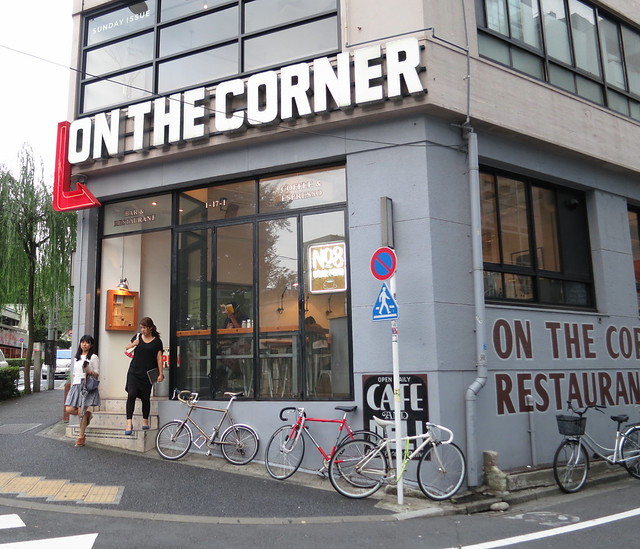](http://www.flickr.com/photos/alper/9724062436/ "On the Corner by illustir, on Flickr")

The last stop this day was the Shibuya On the Corner Bear Pond No. 8 ( [checkin](https://foursquare.com/alper/checkin/5229a575498e4ba40dd33173), [tip](https://foursquare.com/item/523f360f11d2626ef8372b35)) take-out bar which is a beautiful store front with attached coffee bar where you can sit on a handful of stools and recharge your phone or as it seems to be the intention: take out your coffee. You get an expertly drawn coffee with milk in it and a no photo policy is in effect here as well, so I can show you the cup I drank it from:

[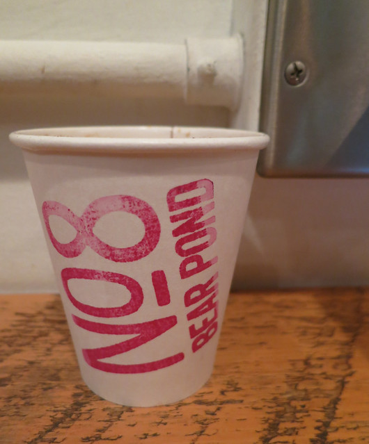](http://www.flickr.com/photos/alper/9724085178/ "Bear Pond No. 8 by illustir, on Flickr")

I did not visit the restaurant and instead had [an awesome burger](http://www.flickr.com/photos/alper/9724075674/in/set-72157635626861055) around the corner at Whoopie Gold Burger.

### Paddler's Coffee

 [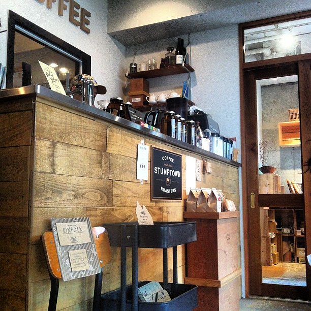](http://www.flickr.com/photos/alper/9687828965/ "Iced Stumptown at paddlers coffee by illustir, on Flickr")

The next day I trekked to the area around Sangubashi station in the morning and had a terrific start of the day at Paddlers Coffee ( [checkin](https://foursquare.com/alper/checkin/522a845211d2e386494e84a1), [tip](https://foursquare.com/item/523f36c011d25f1135716a91)) a brilliant setup lunch place with Stumptown coffee on offer. I had a spectacular iced coffee in the stifling heat.

[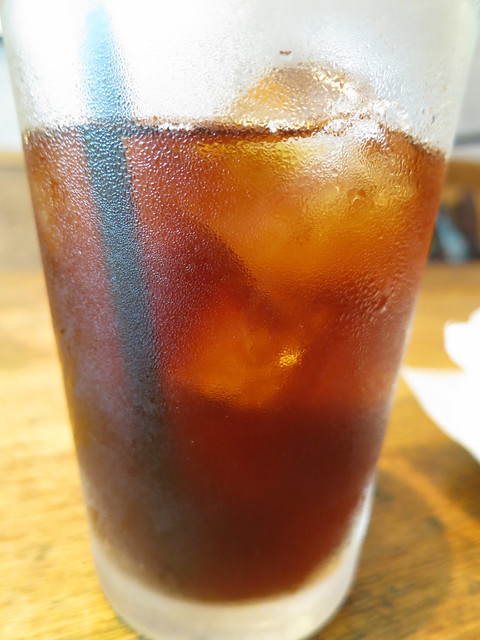](http://www.flickr.com/photos/alper/9725867626/ "Iced Stumptown by illustir, on Flickr")

### Cafe Kitsune

 [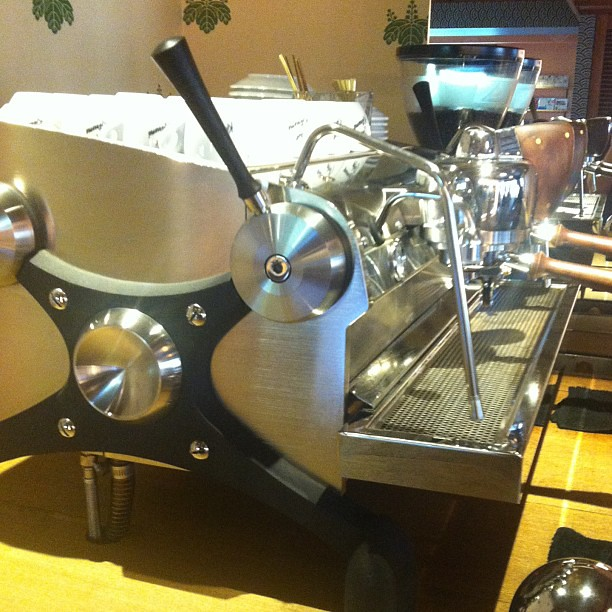](http://www.flickr.com/photos/alper/9688692191/ "My first double espresso from a Slayer espresso machine at Cafe Kitsune. by illustir, on Flickr")

I then made it out to Cafe Kitsune ( [checkin](https://foursquare.com/alper/checkin/522ab13211d25f695f67e7d5), [tip](https://foursquare.com/item/523f371711d23025b70660b5)) whose presence I had just been alerted to. This is a fashion store in Omotesando where they have a fabled Slayer Espresso machine.

[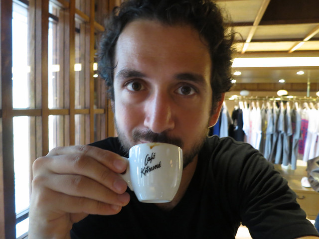](http://www.flickr.com/photos/alper/9722800959/ "Espresso selfie by illustir, on Flickr")

Then it was off to Kyoto to see some sights and sample the coffee outside of Tokyo. This was something of a disappointment, but we'll get to that in a bit.

### Specialty Coffee Unir

In Kyoto I found it rather hard to get a coffee that I would term drinkable. Most of the local brews are very dark roasted and ridiculously over extracted to a point that I can hardly drink them even with milk and sugar (or gum syrup).

[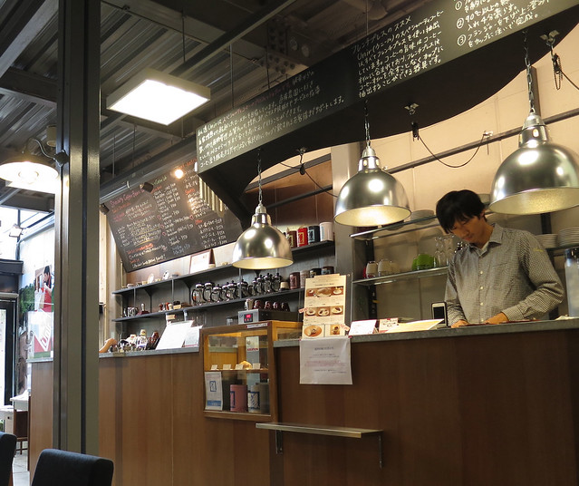](http://www.flickr.com/photos/alper/9802668646/ "Unir by illustir, on Flickr")

One exception to his in Kyoto was Unir ( [checkin](https://foursquare.com/alper/checkin/522c0a5311d2a641367a8943), [tip](https://foursquare.com/v/specialty-coffee-beans-unir-%E4%BA%AC%E9%83%BD%E5%BE%A1%E5%B9%B8%E7%94%BA%E5%BA%97/50050f2de4b0de12a3c2f630)) where they make a very nice cappuccino and which I visited a couple of times because of this.

### アカツキコーヒー (Akatsuki Coffee)

 [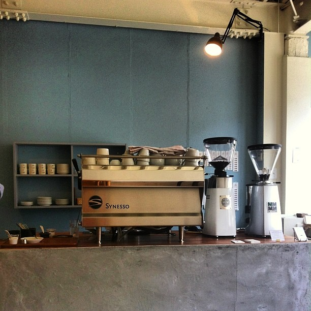](http://www.flickr.com/photos/alper/9707367312/ "Real deal by illustir, on Flickr")

Based on some research I found Akatsuki ( [checkin](https://foursquare.com/user/2421/checkin/522d31d811d2b2f9c18c87c0), [tip](https://foursquare.com/item/52507401498e183494ff368f)) which is a nice place in a different part of town. This place gets the filter brew almost right and the shop itself looks beautiful.

### Omotesando Koffee

 

What I didn't know until my last day in Kyoto and after my camera broke down is that they have a branch of Omotesando ( [checkin](https://foursquare.com/alper/checkin/522d907511d286c041980d32), [tip](https://foursquare.com/item/522d948211d26284e0da72b9))in the city on the main shopping street in a fashion store of United Arrows. The same impeccable Omotesando branding and the same fantastic coffee. I'm half glad that I didn't know of it before because given the Kyoto coffee scene I would have been at this place all the time.

### Hood Cafe

 [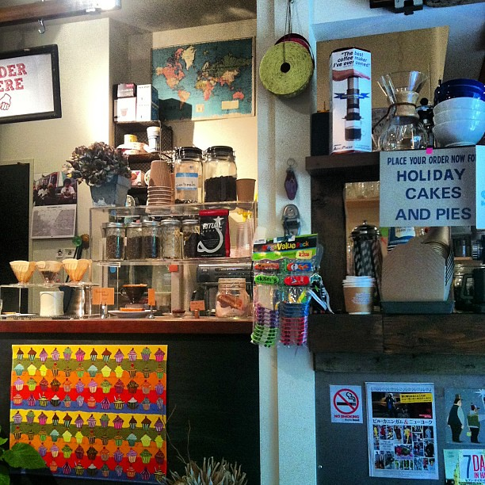](http://www.flickr.com/photos/alper/9715740306/ "Well designed and just saw somebody in a Phil&Sebastian t-shirt. This bodes well. by illustir, on Flickr")

Then it was off to Osaka to do the same. My experience here was a bit better than in Kyoto but not much. Hood ( [checkin](https://foursquare.com/alper/checkin/522e9c9011d208a7f9cbeaa2), [tip](https://foursquare.com/item/5250793111d2a446a27c529f)) is a very nice coffee shop which manages to hit all of the cultural paraphernalia associated with third wave coffee and also serves a bunch of different beans and methods but still it does not seem to hit the level of Tokyo. Still they serve very good coffee even without comparing it to the stuff on offer in the rest of the city.

[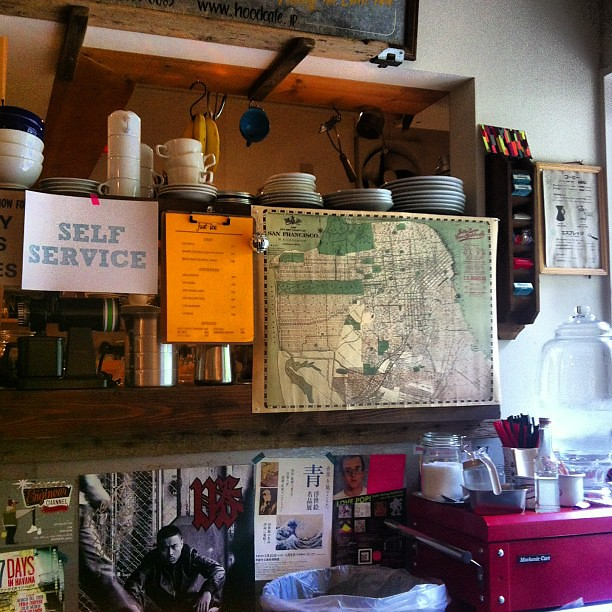](http://www.flickr.com/photos/alper/9712512669/ "Right side of the store to stitch together. by illustir, on Flickr")

### Espresso Bar Millpour

 [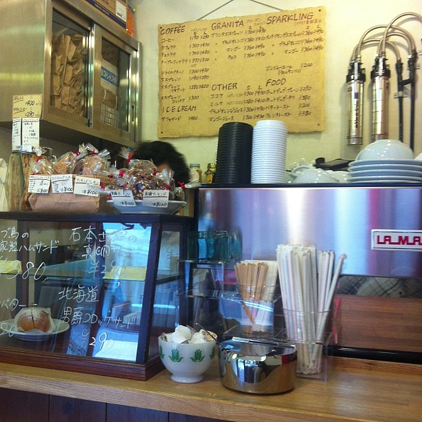](http://www.flickr.com/photos/alper/9713060765/ "Seeing what the coffee here is like by illustir, on Flickr")

Next up was Millpour ( [checkin](https://foursquare.com/alper/checkin/522eb75e11d2a414bf1d6148), [tip](https://foursquare.com/item/52507990498e2dc1980ecf6f)) which is a tiny place in the city where they make a near perfect cappuccino.

After that detour it was time to get back to Tokyo and to finish this visit.

### The Monocle Cafe

 [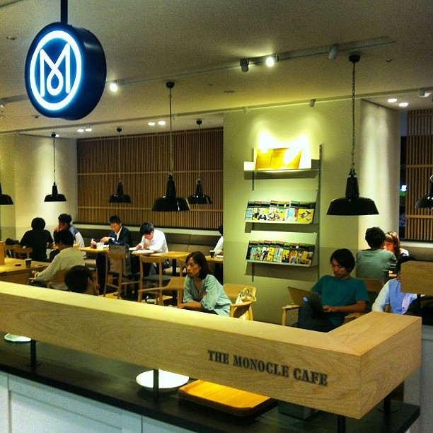](http://www.flickr.com/photos/alper/9721007427/ "Good coffee. Don't know about the better living. by illustir, on Flickr")

I dropped by the Monocle Cafe ( [checkin](https://foursquare.com/alper/checkin/52301c4b11d2e0728faa3b44), [tip](https://foursquare.com/item/52507a2f11d29b8198b4d3b5)) in the basement of a clothing store and was disappointed by the coffee though the food was rather ok. The coffee is not terrible, but it does not have the quality that you would expect from Monocle which is more or less the same for the rest of the store.

### Be A Good Neighbor Skytree

 [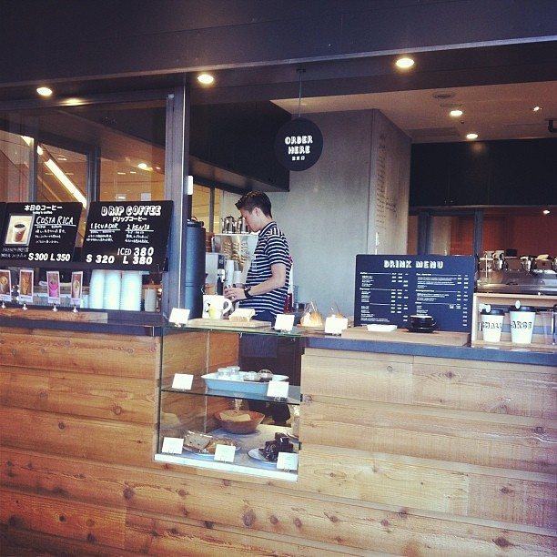](http://www.flickr.com/photos/alper/9726333959/ "Deep in the Skytree by illustir, on Flickr")

Then I made my way over to the Be A Good Neighbor ( [checkin](https://foursquare.com/alper/checkin/52312505498eb066617b0efe), [tip](https://foursquare.com/item/52507a8e498e5a821a7c48bc)) store in the [Skytree](http://www.tokyo-skytree.jp/en/). The Skytree itself is a pandemonium of commerce where people are screaming at you all the time to buy something. Finding your way through the mall to the exact location of Be A Good Neighbor is no mean feat, but finally having arrived there the coffee is as excellent as in their other store. I would only recommend going here if you're already in the area or god forbid entering the Skytree but then it is a welcome place to rest.

[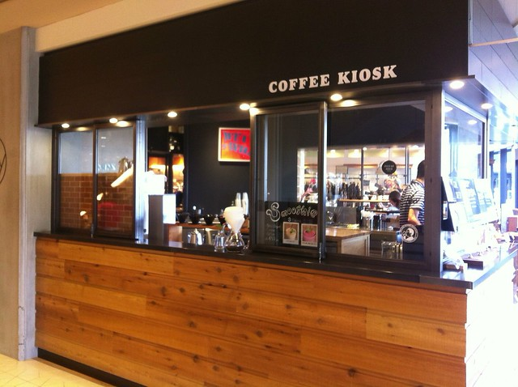](http://www.flickr.com/photos/alper/9729603334/ "Be A Good Neighbor by illustir, on Flickr")

### Sarutahiko Coffee

 [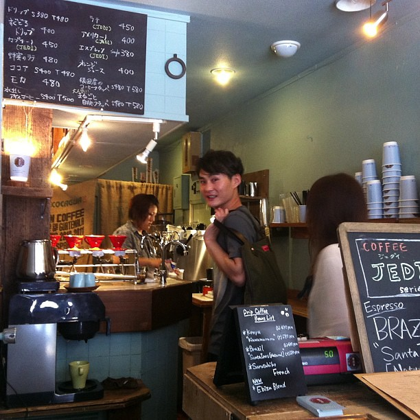](http://www.flickr.com/photos/alper/9729913808/ "Charming little cafe in Ebisu by illustir, on Flickr")

I also did a round of Ebisu and found two very nice coffee places in that part of town. Sarutahiko ( [checkin](https://foursquare.com/alper/checkin/52313fdc11d240039af6d852)) is a small shop but it seems to have everything necessary and made a very nice coffee. Definitely worth a visit.

### Hitinui Espresso Bar

 

A bit further on is Hitinui ( [checkin](https://foursquare.com/alper/checkin/5231488711d2873dda09916f), [tip](https://foursquare.com/item/52507c80498e6215f6345710)) which is a tiny place and also doubles as a Tahitian dance school. I couldn't check out the dance, but the cappuccino was excellent and the barista very friendly.

[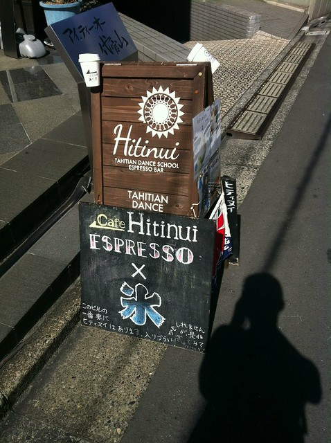](http://www.flickr.com/photos/alper/9730115018/ "Hitinui by illustir, on Flickr")

### Identity Coffee Bar+Gallery

Identity Coffee Bar+ Gallery ( [checkin](https://foursquare.com/alper/checkin/5232d10511d280725ac66477), [tip](https://foursquare.com/item/52507d2d498e6215f63c9910)) also in Omotesando is a rather nice store and has an excellent selection of both Intelligentsia and Handsome beans which they prefer perfectly.

That was the roundup from my Tokyo coffee experience. I visited a couple of the places several times and brought back some bags of coffee but I am extremely impressed with the coffee culture and I'll definitely be back.

[^1]: And Oslo with its coffee scene is still very high on my to visit list.
