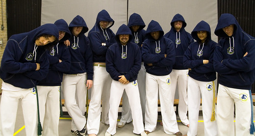
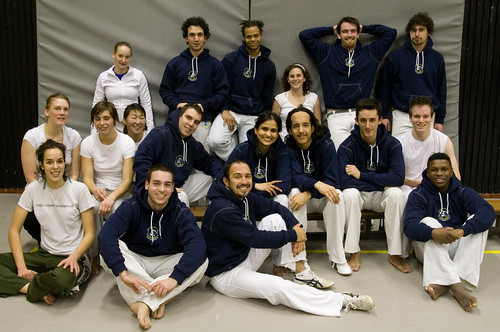
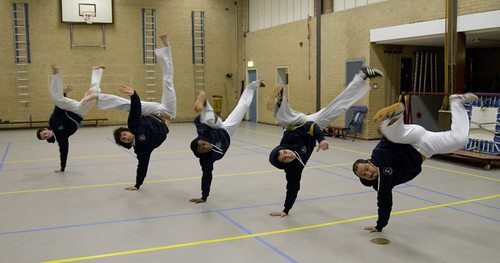

De shoot van afgelopen maandag was ter gelegenheid van onze mooie nieuwe capoeiratruien die uit Brazilië geïmporteerd zijn.

De groep die er maandag was:

Het is leuk om te vergelijken met [een groepsfoto december 2006](http://www.flickr.com/photos/alper/317407354/in/set-72157594411529226/) die toch ook redelijk sprankelend [^1] was. Flickr maakt het erg makkelijk om per persoon te bladeren door de tijd. Klik door op de notities bij [deze foto](http://www.flickr.com/photos/alper/2247148416/in/set-72157603864161925/) en bij [deze foto](http://www.flickr.com/photos/alper/2247172416/). Ik denk erover om [deze serie](http://www.flickr.com/photos/alper/sets/72157594412872600/) portretten [^2] te hernemen, al zijn de meesten niet erg veranderd.

Deze feature lijkt me een belangrijke reden om niet snel (if ever) over te stappen van Flickr; zelfs met een [vijandige overname](http://www.flickr.com/groups/microsoft-keep-your-evil-grubby-hands-off-our-flickr/) van Microsoft.

En wat actie:

Hier kunnen we er nogal wat meer van ensceneren, maar dan liever ergens buiten als de zon schijnt [^3].

[^1]: Behalve ik.
[^2]: Pas publiek sinds vandaag om uiteenlopende redenen.
[^3]: Waar het vandaag al aardig op leek.
