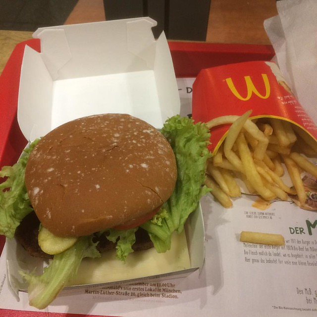

I finally got the chance of trying out the [McB](http://www.mcdonalds.de/produkte/mcb), McDonald's new ecological burger tonight after [a visit to the opera](/dingen/2015/10/les-contes-dhoffmann/).

First I think it's great that McDonald's is doing this. It would be nice if they switched all their meat to what is at least a nominally biologically produced variety. I've seen people hating on it but large food producers having to shift over is a sign of victory. Read this Fortune [article about the war on Big Food](http://fortune.com/2015/05/21/the-war-on-big-food/).

Second I don't think McDonald's understands why it is that people eat organical food. I and many others eat it because it tastes better than the other stuff. There are other reasons to eat organically but if those were the only ones then it would be nowhere near as popular as it is now. The problem with the McB is that it's just as bad a hamburger as you are used to eating from McDonald's but now with a bio patty.

This makes it a great burger for the staunch McDonald's customer who was thinking of switching away because they started worrying about meat quality. For Berlin's actual burger lovers this is irrelevant and you should just keep going to [Tommi](http://www.burgerjoint.de/).
