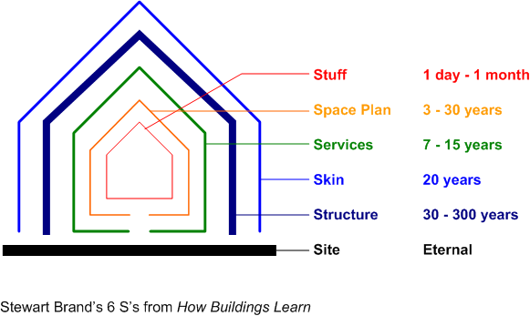

The great [Peter](http://peterbihr.com/) and [Michelle](http://michellethorne.cc/) have written a book called [“Understanding the Connected Home”](http://theconnectedhome.org/) based on current developments around the topic and both of their professional interests.

I talked about the topic with Peter a bit and thought it to be a natural extension of his work in the connected devices spaces and their recent [visit to Casa Jasmina](http://www.thewavingcat.com/2015/07/22/visiting-casa-jasmina/) in Torino.

I hope to get around to reading it soon since right now I have no desire or opportunity to live in a connected home. The housing stock in Berlin is old and does not lend itself well to connectivity. Our current house has a central water heater but even then most faucets are heated locally using electricity. Internet connectivity (let alone Fiber to the Home) is hard to find in many houses and you can count yourself lucky if you can get a [Kabel Deutschland](http://www.kabeldeutschland.de/) connection.

I think I would like to take the best of what these technologies can bring but they probably only make sense if you innovate in the other layers of a house as well as in what is built and the way it is built.

If you look at the six Ss, connectivity consists of things at the manufactured level of Stuff (cheap consumer grade electronics from China). It latches onto the Space Plan and I would guess it has considerable effects on that and would benefit from changes in that plan. More problematically it pierces these layers and as such deteriorates the structural integrity of the house further. Connected things need to either interface with the Services layer or call for new Services to be deployed throughout the house. These move from the inside out but also from the outside —Skin layer— in when it comes to things like solar power and geothermal connectivity.

It seems an interesting though complicated time to be an architect. The API and expectation surface of a house is exploding while the margins and expertise of your average architecture practice leave a lot to be desired.

What would then seem obvious is that we need systematic and generative ways of creating our dwellings in which the inhabitants of a house are participants as much as the traditional experts are. It seems like connected homes will make more sense and sense made of them when you consider the movements of [self-built buildings](http://www.theguardian.com/cities/2015/sep/16/anarchism-community-walter-segal-self-build-south-london-estate) and [open source dwellings](http://www.wikihouse.cc/).
