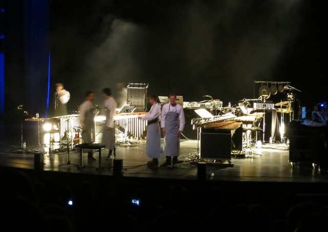

On Saturday evening I was in the Volksbühne for [Stargaze](http://www.we-are-stargaze.com/) among others to see [Cantus Domus](http://www.cantusdomus.de/) perform a set with an odd German band called 1000 Robota. After that there was an intermission and the main performance of the evening by Pantha du Prince and The Bell Laboratory.

The artistic mandate of the evening bordered a bit on the odd. [1000 Robota](http://1000robota.com/) is more or less a lunatic act part of the melodramatic German singer-songwriter movement. Pantha du Prince & The Bell Laboratory were forced to interpret [Terry Riley's](http://en.wikipedia.org/wiki/Terry_Riley) in C as part of the program. Of course they said it was a great inspiration to them and they did quite a good job of it. After the official part of the program they started making some real music and the entire Volksbühne got to its feet [^1]. I asked myself: ‘What the fuck were we doing up until this point?’

I realize that the evening wasn't supposed to be a club night, but if the unofficial part of the program is so much more vibrant that should be a clear signal.

[^1]: I had a similar experience in the same venue where [a performance by Apparat was mired by a boring play](/dingen/2013/05/war-and-peace-under-the-shadow-of-the-apparat/) about Russian nobility.
