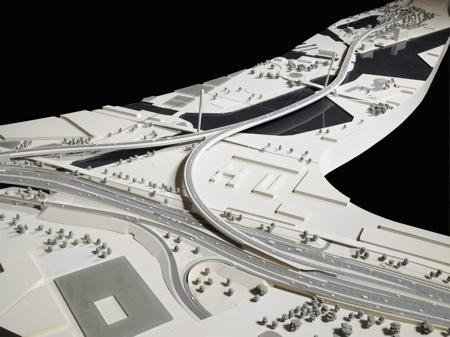
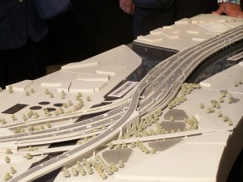
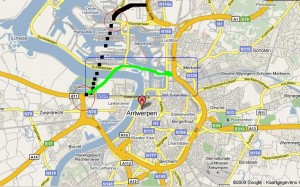

De laatste paar dagen meer en meer op [StuBru](http://www.stubru.be) berichten over BAM ((Beheersmaatschappij Antwerpen Mobiel)) en dat schijnt te maken te hebben met de voorgenomen sluiting van de ring R1 rond Antwerpen. Vandaag lees ik [de stellingname van Pietel](http://www.pietel.be/delangewapper) die me heel terecht lijkt, kiezen voor leefbaarheid en geen verkeerschaos over de stad trekken.

Veel onbekende termen en rare Vlaamse namen. Interessant om eens rond te kijken op Wikipedia en Google waar het nu eigenlijk over gaat. De [R1](http://nl.wikipedia.org/wiki/R1_(België)) is de open kleine ring rond Antwerpen. De meeste Nederlanders zullen er weleens overheen zijn gereden of erop vast gestaan (wat een redelijk normale gebeurtenis is). Nu wil men de ring aan de noordwest-kant sluiten via de zogenaamde [“Oosterweelverbinding”](http://nl.wikipedia.org/wiki/Oosterweelverbinding) en de vraag staat open hoe dat moet gebeuren. BAM heeft voorgesteld om daar een forse brug over de Schelde tegen de stad aan te schurken de [“Lange Wapperbrug”](http://nl.wikipedia.org/wiki/Lange_Wapperbrug). Als alternatief van een actiegroep de stRaten-Generaal en van ARUP/SUM is er het voorstel om een tunnel te maken onder de haven ((Geen idee hoe je dat zou doen.)) en die op de [A12](http://nl.wikipedia.org/wiki/A12_(België)) aan te sluiten.

De brug ziet er mooi uit maar in de uiteindelijke uitwerking zouden er veel concessies gedaan worden volgens [dit bericht bij ArchiNed](http://www.archined.nl/en/forum/de-lange-wapper-een-aannemersbrug/).

\[caption id="attachment\_1280" align="aligncenter" width="450" caption="Knooppunt en Lange Wapper brug"\]\[/caption\]

En wie weleens op de ringen bij Antwerpen en Brussel gereden heeft, kan dit soort chaotische knooppunten wel voor de ogen halen. Het lijkt erop dat het er niet simpeler op gaat worden (het idee was eerst ook om er een dubbeldeksbrug van te maken):

\[caption id="attachment\_1282" align="aligncenter" width="300" caption="Wirwar van wegen voor de brug"\] \[/caption\]

Het lijkt me in ieder geval onhandig om met een grote berg beton een grote stroom verkeer je stad in te halen en de boel te splitsen. De alternatieve tunnels zijn moeilijker maar lijken wel de voorkeur te hebben zeker ook omdat twee van die voorstellen de verbinding naar het Noorden trekken. De Standaard zet de [voor- en nadelen op een rijtje](http://www.standaard.be/Artikel/Detail.aspx?artikelId=nh2cg3ft) en heeft ook [een serie kaartjes met de alternatieven](http://www.standaard.be/Nieuws/Foto/FotoDetail.aspx?ShowId=1517).

\[caption id="attachment\_1281" align="aligncenter" width="300" caption="De twee hoofdzakelijke tracés, brug en tunnel"\] \[/caption\]
